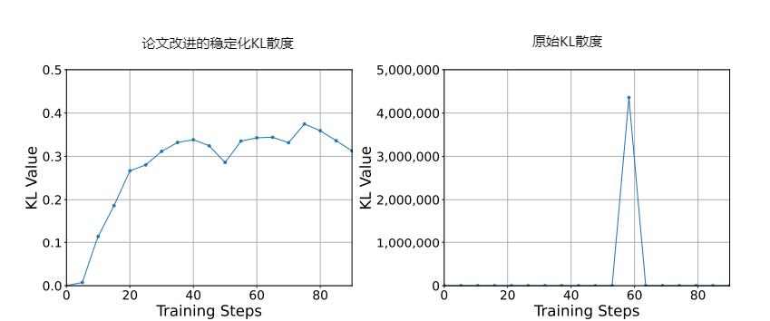

# Effective and Transparent RAG: Adaptive-Reward Reinforcement Learning for Decision Traceability
高效且透明的 RAG：面向决策可追溯性的自适应奖励强化学习

- **Authors**: Jingyi Ren, Yekun Xu, Xiaolong Wang, Weitao Li, Weizhi Ma, Yang Liu
- **Venue & Year**: arXiv, 2025 
- **URL / DOI**: https://arxiv.org/abs/2505.13258

---

## 1. 动机

- **研究问题**  `   `解决当前RAG系统中LLM存在的两大核心问题：1) **有效性不足**：如何增强模型利用检索信息进行复杂推理的能力；2) **透明性缺失**：如何让模型的决策过程（即依赖哪些证据得出结论）变得可见且可解释。
- **背景与意义**  `   `RAG 已被证明能显著提升 LLM 在知识密集型任务上的性能。然而，现有研究大多聚焦于改进检索器，而忽略了生成器的能力瓶颈。一个强大的生成器不仅能提高答案的准确性，其决策过程的透明性对于在金融、法律、医疗等高风险领域的应用至关重要，是构建可信赖 AI 系统的关键一环。

## 2. 核心贡献

- **提出了 ARENA 框架**: 设计了一个名为 ARENA (Adaptive-Rewarded Evidence Navigation Agent) 的新颖框架，通过强化学习系统性地提升 RAG 生成器的有效性和透明性。
- **设计了创新的奖励机制与稳定训练策略**: 提出了一套包含格式、准确率、相关性和额外奖励的多维度自适应奖励函数，并改进了 KL 散度计算以稳定训练过程，有效解决了传统 RL 在 RAG 任务中的应用难题。
- **取得了 SOTA 级别的性能**: 实验证明，ARENA 能使 7B 规模的开源模型在多个多跳问答数据集上性能提升 10-30%，达到与顶尖商业闭源模型（如 GPT-4o）相媲美的水平，并展现了良好的泛化能力。

## 3. 方法论

- **核心思想概述**: ARENA 的核心思想是利用RL来训练 RAG 生成器。不直接生成答案，而是强制模型遵循一个“**结构化生成**”范式：首先明确列出其引用的证据（`<relevance>`），然后展示基于这些证据的推理过程（`<analysis>`），最后给出简洁的答案（`<answer>`）。为了引导模型学会这种行为，ARENA 设计了一套精细的“**自适应奖励**”函数，从格式、准确率、证据相关性等多个维度对模型的输出进行评分，并通过 GRPO不断优化模型策略。
- **奖励函数与公式优化**:
    - **总奖励函数**: 最终奖励是四个子奖励的加权和（权重默认为1），用于全面评估生成质量。
      `r_i = R_format + R_accuracy + R_relevance + R_bonus`
        - `R_format`: 输出是否遵循 `<relevance>`, `<analysis>`, `<answer>` 的结构。
        - `R_accuracy`: 最终答案是否精确匹配标准答案。
        - `R_relevance`: 模型选择的证据来源是否与真实标签匹配（完全匹配得1分，部分匹配得0.5分，不匹配得0分）。
        - `R_bonus`: 仅当以上三项全部满分时，才给予一个高额（10分）的额外奖励，激励模型追求完美输出。
    - **稳定 KL 散度**: 在GRPO里面由KL散度这一项，为解决标准 KL 散度在训练中可能出现的数值爆炸问题，采用了更平滑的替代公式。
      `KL_stable(θ) = 1/2 * (log r)²`
      其中 `r` 是参考模型与当前策略模型对同一输出的概率比值。
- **流程说明**:
  
    1.  **结构化生成 (Structured Generation)**:策略模型接收问题和参考文档后，生成包含 `<relevance>`, `<analysis>`, `<answer>` 三个部分的结构化文本。
    2.  **自适应奖励计算 (Adaptive Reward Calculation)**: 作为评估模块，它接收模型的输出，并根据上述四个奖励函数（格式、准确率、相关性、额外奖励）计算出一个总分。
    3.  **KL 稳定化的强化学习 (RL with KL Stabilization)**: 它利用 GRPO 算法和计算出的奖励信号，来更新策略模型的参数。其中，稳定化的 KL 散度项确保了训练过程的平稳进行，避免模型过度偏离其初始状态。

## 4. 实验与数据

- **数据集 & 任务设置**:
    - **数据集**: HotpotQA, 2WikiMultiHopQA, MuSiQue。这三个都是具有挑战性的多跳问答（Multi-hop QA）数据集，要求模型整合多个文档中的信息才能回答问题。
    - **任务设置**: 在给定问题和一组检索到的参考文档的情况下，模型需要生成准确且可溯源的答案。
- **对比方法 & 评价指标**:
    - **对比方法 (Baselines)**:
        - **基于提示的模型**: DeepSeek-R1, Qwen3-8B 等 SOTA 开源模型及 SuRe, self-ask 等提示工程方法。
        - **基于 SFT 的模型**: 直接微调和基于思维链微调的两种监督学习基线。
        - **基于 RL 的模型**: Naive GRPO, R1-Searcher 等其他 RL 推理框架。
        - **商业闭源模型**: GPT-4o, OpenAI-01, DeepSeek-R1。
    - **评价指标 (Metrics)**:
        - **Exact Match (EM)**: 精确匹配率。
        - **F1 Score**: F1 分数，衡量词元级别的重叠。
        - **LLM-as-a-Judge (LJ)**: 使用 GPT-4o 作为裁判来评估答案的语义正确性。

## 5. 实验结果

- **性能指标对比表**:
  
    - **主要发现**: ARENA-Qwen-7B 在所有三个数据集和所有评价指标上均显著优于所有同等规模的开源基线模型。相较于其原始骨干模型，ARENA 带来了 10-30% 的性能提升。
  
    - **与 SOTA 对比**: 在 HotpotQA 数据集上，7B 规模的 ARENA-Qwen-7B 性能（EM 62.8%）已经非常接近甚至在一些指标上超过了强大的商业模型 GPT-4o（EM 62.8%）和 DeepSeek-R1（EM 61.8%）。
- **消融研究要点**:
  
    - **KL 稳定化的重要性**: 移除稳定化的 KL 散度项后，模型的训练过程会出现剧烈的梯度尖峰，性能也随之下降，证明了其对于稳定训练至关重要。
  
    - **自适应奖励的有效性**: 与仅使用格式和准确率奖励的 Naive GRPO 基线相比，ARENA 的多维度奖励机制（特别是相关性奖励）能显著提升模型的性能和输出的可解释性（如 relevance score）。
  
   
  (上图是HotpotQA，下图是2WikiMultiHopQA)
    - **答案准确性奖励信号消融**：对比了使用 EM（精确匹配）、F1 和 GPT-4o 判断 作为奖励信号的效果，在 HotpotQA 和 2WikiMultiHopQA 数据集上，使用最严格、最简单的 EM 奖励 反而取得了最佳的最终评测结果

## 6. 优缺点分析

- **优势**:
    1.  **兼顾有效性与透明性**: ARENA 同时系统性地解决 RAG 有效性和透明性问题的框架，实现了性能与可解释性的双赢。
    2.  **方法创新且实用**: 提出的多维度自适应奖励和 KL 稳定化策略设计巧妙，有效解决了 RL 在复杂 RAG 任务中应用不稳定的痛点。
    3.  **性能强大**: 能够以较小的模型规模（7B）实现与顶尖商业大模型相媲美的性能，具有很高的性价比和应用价值。
- **局限性**:
    1.  **对标注数据的依赖**: 训练过程需要带有“支持事实”标注的数据来计算相关性奖励，这在一定程度上限制了其在无此类标注的新领域的应用。

## 7. 个人思考

- **灵感与疑问**:
    - **奖励的动态调整**: 论文中所有奖励的权重都设为 1。在训练的不同阶段，模型面临的挑战可能不同（例如，初期学习格式，后期优化推理）。可以动态调整一下吗？
  

## 8.本论文分类Tag（个人观点）

- **标签**: RAG,RL, 证据可追溯性
## 9. 本论文笔记知乎链接

* 敬请期待

