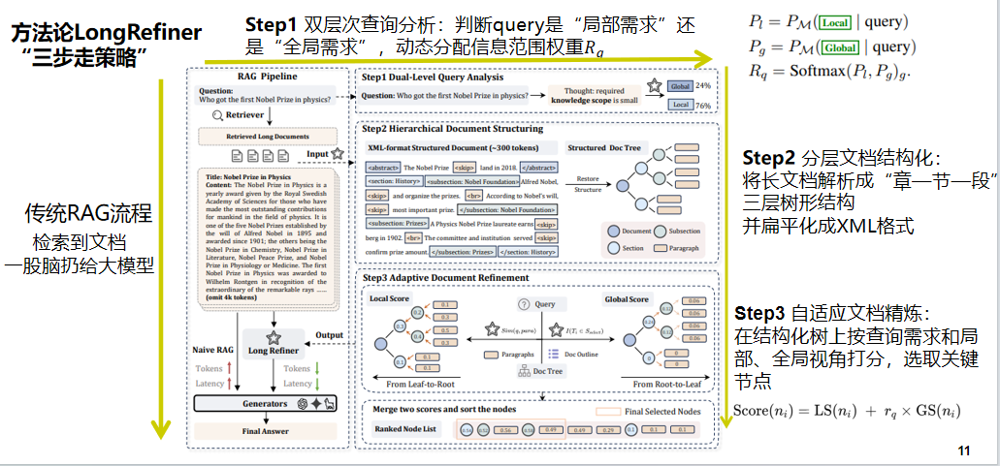
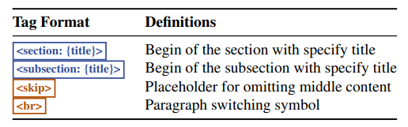
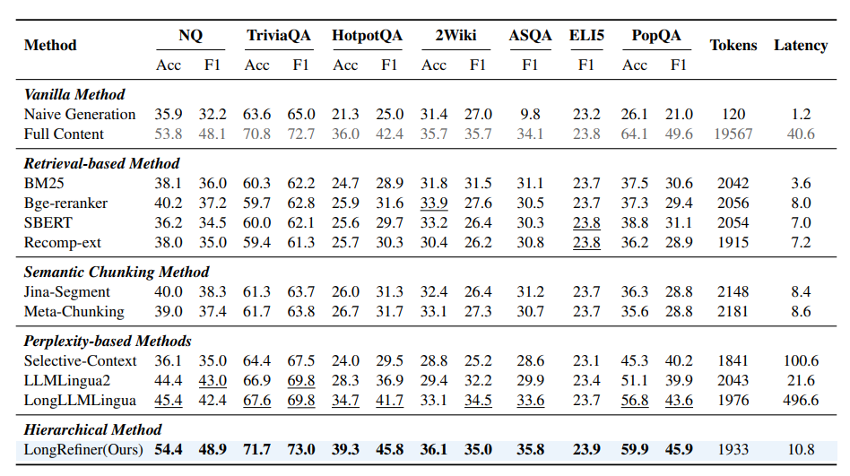
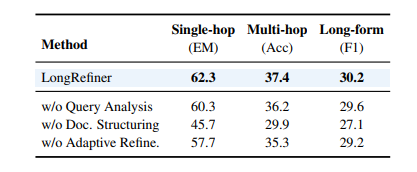

# 长上下文层次化文档精炼
Hierarchical Document Refinement for Long-context Retrieval-augmented Generation 

- **Authors**: Jiajie Jin¹, Xiaoxi Li¹, Guanting Dong¹, Yuyao Zhang¹, Yutao Zhu¹, Yongkang Wu², Zhonghua Li², Qi Ye², Zhicheng Dou¹*
- **Venue & Year**: arXiv , 2025
- **URL / DOI**: https://arxiv.org/abs/2505.10413

---

## 1. 动机

* **研究问题**  `   `在RAG应用中，当检索到的文档很长时，如何有效地精炼这些文档，在降低推理成本和延迟的同时，提升生成答案的质量和准确性呢？
* **背景与意义**  `   `现实中RAG经常从搜索引擎等来源获取包含大量冗余信息和噪声的长文档。直接将这些长文档输入LLM会带来两大问题：(1) **低信噪比**：无关信息干扰模型对关键细节的关注。(2) **高计算开销**：过长的上下文会显著增加计算成本和推理延迟。 `   `然而，现有精炼方法要么只适用于短文本块，要么依赖于困惑度等粗糙指标，无法充分利用长文档固有的层次化结构信息，导致性能和效率不佳。因此，设计一个能够理解并利用文档结构进行高效精炼的模块具有重要的应用价值。

## 2. 核心贡献

- 提出了一个名为 **LongRefiner** 的通用文档级精炼框架，它通过利用文本的层次化结构信息，实现了高效、低延迟的长文本精炼。
- 引入了一个包含三个关键步骤的精炼流程：**双层级查询分析** 、**层次化文档结构化**  和 **自适应文档精炼** ，显著优化RAG的成本和响应延迟。

- 实验证明，该方法在仅使用约10%的Token预算的情况下，性能优于现有的文本压缩方法，并且延迟远低于后者，在多个QA数据集上取得了SOTA表现。

## 3. 方法论

* **模型、算法概述**
  `   ` LongRefiner的核心思想是将无结构的长文档首先转化为具有层次结构的树状表示，然后根据用户查询的意图（局部性或全局性），自适应地从这棵“文档树”中剪枝并选取最相关的节点（文本块），最终将这些精选的内容组合起来送入模型。整个过程分为以下三个阶段：
    * **双层级查询分析** `   `首先分析用户查询，判断其信息需求是“局部（Local）”的（如寻找特定事实）还是“全局（Global）”的（如需要总结），并生成一个连续（就是非布尔值）的权重`Rq`来表示全局性需求的程度。
    * **层次化文档结构化** `   `使用一个经过微调的LLM，将原始的长篇纯文本文档转换为一种简化的、带自定义标签的XML格式。这种格式明确地表示了文档的章节、子章节和段落等层次结构。然后，这个XML文本可以被解析成一个文档树。重要的一点是，为了降低训练目标的长度，该方法在生成XML时使用`<skip>`标签省略了段落的中间部分。
    * **自适应文档精炼** `   `对文档树中的每个节点，从局部和全局两个角度计算得分。**局部得分(LS)** 从叶子节点（段落）开始，基于其与查询的语义相似度计算，并向上传播。**全局得分(GS)** 从根节点开始，基于文档大纲（摘要和章节标题）与查询的相关性，将得分向下分配。最后，使用第一步得到的权重`Rq`加权融合两种得分（`Score = LS + Rq * GS`），并根据最终得分高低选择节点，直到达到预设的Token预算。
     `   `三步走流程如下所示
    

- **关键公式**:
    - **查询信息范围表示**:
      `Rq = Softmax(Pl, Pg)g`
      其中，`Pl`和`Pg`分别是模型生成`[Local]`和`[Global]`这两个特殊token的概率。`Rq`作为一个连续值，量化了查询对全局信息的需求程度。
    - **节点最终得分**:
      `Score(ni) = LS(ni) + Rq * GS(ni)`
      其中，`ni`是文档树中的一个节点。`LS(ni)`是该节点的局部得分，`GS(ni)`是全局得分，`Rq`是查询的全局性权重。这个公式将局部相关性和全局重要性自适应地结合起来。

- **上述流程图详解** :
    1.  **输入**: 用户问题（Query）和检索到的长文档。
    2.  **步骤1: 双层级查询分析**: 模型分析Query，输出其是“Local”还是“Global”的概率分布，如图中示例为76% Local, 24% Global。
    3.  **步骤2: 层次化文档结构化**:
        -   原始长文档（如图中4k+ tokens）被输入一个LLM。
        -   该LLM输出一个压缩后的XML格式文档（~300 tokens），其中包含`<section>`, `<subsection>`, ` `, `<skip>`等标签。
  
        -   这个XML文本被解析成一个结构化的文档树（Doc Tree）。
    4.  **步骤3: 自适应文档精炼**:
        -   **计算局部得分 (Local Score)**: 从叶子节点（段落）开始，计算每个段落与Query的相似度得分，然后将分数向上聚合到父节点（自底向上）。
        -   **计算全局得分 (Global Score)**: 基于Query和文档大纲，模型判断哪些章节是重要的，并将分数自上而下分配给相应的子节点。
        -   **合并得分**: 使用步骤1的`Rq`作为权重，合并局部和全局得分。
        -   **节点选择**: 根据最终得分对所有节点进行排序，并选择排名靠前的节点及其所有子节点，直到满足Token预算，形成最终的精炼上下文（Final Selected Nodes）。
    5.  **输出**: 将精炼后的上下文和原始问题送入生成器LLM，得到最终答案。

## 4. 实验与数据 

- **数据集 & 任务设置**:
    -   实验在7个开放域问答（QA）数据集上进行，涵盖三种类型：
        -   **单跳QA**: NQ, TriviaQA, PopQA
        -   **多跳QA**: HotpotQA, 2WikiMultiHopQA
        -   **长文本生成QA**: ASQA, ELI5
    -   **任务设置**: 对于每个问题，首先从维基百科语料库中检索Top-8的长文档，然后使用不同的精炼方法将这些文档压缩到设定好的预算内，最后送入生成模型（Llama3.1-8B-Instruct）生成答案。

- **对比方法 & 评价指标**:
    -   **对比方法 (Baselines)**:
        1.  **基于检索的方法**: BM25, Bge-reranker, SBERT等，对文档分块后进行排序选择。
        2.  **语义分块方法**: Jina-Segment, Meta-Chunking，使用更智能的方式对文本进行分块。
        3.  **基于困惑度的方法**: Selective-Context, LongLLMLingua, LLMLingua2，通过语言模型的困惑度来评估和压缩文本。
    -   **评价指标**: Accuracy 和 F1 Score。此外，还记录了输入生成器的Token数量和在线推理延迟。

## 5. 实验结果

- **性能指标对比表** 
  
    -   在所有7个数据集上，**LongRefiner**在2k Token的限制下，其QA性能（Acc/F1）全面超越了所有基线方法。例如，在NQ数据集上，LongRefiner的Acc达到54.4，而最强的基线LongLLMLingua为45.4。
    -   在效率方面，LongRefiner的延迟（10.8ms）远低于性能次优的基于困惑度的方法（如LongLLMLingua为496.6ms），与简单的基于检索的方法（如Bge-reranker为8.0ms）在同一数量级。
    -   与使用完整文档（Full Content）相比，LongRefiner在多数数据集上取得了更优或相当的性能，但使用的Token数量减少了约10倍（1933 vs 19567），延迟降低了约4倍（10.8ms vs 40.6ms）。

- **消融研究要点** 
  
    -   消融实验证明了框架中三个关键模块的必要性。移除任何一个模块都会导致所有类型QA任务的性能显著下降。
    -   **移除“层次化文档结构化”模块对性能的损害最大**，导致性能下降近20%。这表明将文档从扁平文本转换为结构化表示是该方法成功的基石，否则模型会退化为基本的块选择。
    -   移除“查询分析”或“自适应精炼”模块同样会降低性能，验证了从局部和全局双重角度评估信息重要性的有效性。

## 6. 优缺点分析 

- **优势**:

    -   **性能与效率兼备**: 在大幅压缩上下文（减少10倍Token）的同时，实现了比基线方法更好、甚至比使用全文更好的QA性能，并且保持了非常低的推理延迟。
    -   **可解释性与适应性**: 通过双层级分析和自适应打分，模型能够根据问题类型动态调整信息抽取的策略，具有一定的可解释性。

- **局限性**:
    -   **数据类型支持有限**: 当前方法仅能处理纯文本文档，对于现实世界中常见的包含表格、图片、超链接等复杂信息结构的内容，该模型尚不支持。
    -   **领域泛化性挑战**: 模型目前完全依赖于通用领域的维基百科语料进行训练，直接迁移到金融、法律等垂直领域时可能会遇到困难，因为这些领域的文档结构和特征可能存在显著差异。

## 7. 个人思考 

* ​**点子🤓👆**
 `   `能不能设计新的tag来表示表格（`<table>`）、图片（``）等元素，并利用多模态模型来处理这些内容，从而构建一个能处理更复杂文档的精炼器。
* **疑惑👀**
 `   `论文中“双层级查询分析”将问题分为“Local”和“Global”两类。这种二元划分是否过于简化？现实中的问题可能兼具两种属性，或者存在更复杂的意图。有没有一些更细粒度的查询意图分类体系呢？
    

## 8.本论文分类Tag（个人观点）

- **标签**: RAG, 长上下文, 文档精炼, 层次化结构

## 9. 本论文笔记知乎链接
* https://zhuanlan.zhihu.com/p/1936465311260979335
