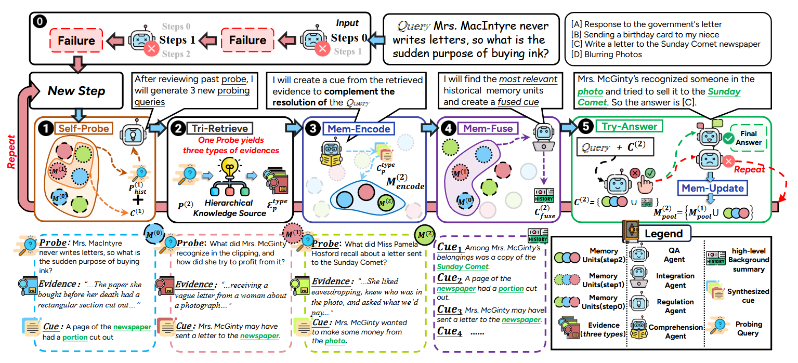
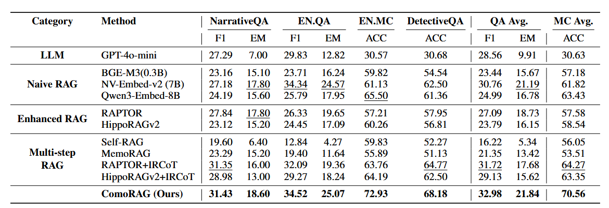
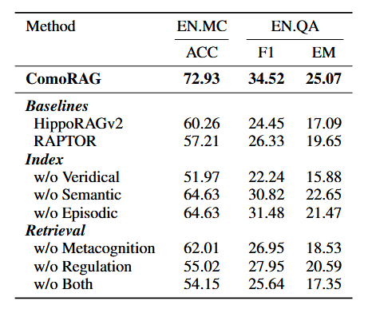

# ComoRAG: A Cognitive-Inspired Memory-Organized RAG for Stateful Long Narrative Reasoning

ComoRAG: 一种用于有状态长篇叙事推理的认知启发式记忆组织RAG

- **Authors**: Juyuan Wang, Rongchen Zhao, Wei Wei, Yufeng Wang, Mo Yu, Jie Zhou, Jin Xu, Liyan Xu
- **Venue & Year**: arXiv, 2025
- **URL / DOI**: https://arxiv.org/abs/2508.10419

---

## 1. 动机

- **研究问题**
  `   `解决传统RAG方法在处理长篇叙事文本时，因其“无状态”和“单步”的检索过程，导致无法有效捕捉动态、复杂的上下文关系，从而在需要全局理解和深度推理的任务上表现不佳的问题。

- **背景与意义**
  `   `长篇叙事（如小说）的理解要求模型能像人一样，持续构建和修正对情节、人物动机的全局心智模型，这被称为“有状态推理”。现有RAG方法大多是无状态的，难以整合矛盾或跨度较长的证据链，导致理解肤浅。因此，开发一种能模拟人类认知过程、进行动态和迭代推理的RAG框架，对于提升模型在长文本理解领域的深度和准确性至关重要。

## 2. 核心贡献

- 提出了一种名为ComoRAG的新型RAG框架，模仿人脑前额叶皮层的元认知调控机制，通过动态记忆工作空间和迭代推理循环实现有状态的长篇叙事理解。
- 设计了一个层级化的知识源，从事实、语义和情景三个互补的认知维度对文本进行建模，为深度推理提供丰富的、多层次的上下文信息。
- 引入了一个元认知控制循环，该循环能够主动生成探索性查询、整合新旧证据，并在遇到推理瓶颈时动态调整策略，从而将静态的知识库转变为动态的推理引擎。
- 在多个长文本叙事理解基准上验证了方法的有效性，尤其在需要全局情节理解的复杂问题上，性能显著优于现有强基线模型。

## 3. 方法论

- **架构概述**  `   `ComoRAG的核心思想是模拟人类侦探破案式的推理过程。它首先将原始文本构建成一个三层的“智能资料库”（层级化知识源），包含事实细节、主题摘要和情节时间线。当接到一个复杂问题时，它启动一个“元认知控制循环”。在这个循环中，模型会像侦探一样：1) **自我探查**：反思当前已知线索，规划下一步要调查什么（生成新的探索性查询）；2) **三重检索**：去三层资料库中搜集新证据；3) **记忆编码与融合**：将新证据制作成“线索卡片”并与旧线索整合，形成新的洞察；4) **尝试回答**：基于更新后的全局理解尝试回答问题。这个循环不断迭代，直到形成一个完整、无矛盾的证据链，最终解决问题。
- **（补充）核心模块**：
  **层级化知识源**：作为系统的长期记忆库。
    - **事实层**: 提供精确的、可追溯的原始文本片段和知识三元组。
    - **语义层**: 提供文本的宏观主题和概念性摘要。
    - **情景层**: 提供故事按时间顺序发展的叙事流和因果链。

  **核心工作流程**:
  
  1. **初始化**: 接收初始问题 `q_init`，进行一次初步的“三重检索”和“尝试回答”。
  2. **失败触发循环**: 如果初步尝试失败，则启动元认知循环。
  3. **元认知循环**:  `   `
     ①. **Self-Probe**: 根据历史信息和当前困境，生成新的探索性查询 `P(t)`。  `   `
     ②. **Tri-Retrieve**: 使用 `P(t)` 在三层知识源中检索新证据 `E(t)`。  `   `
     ③. **Mem-Encode**: 将新证据 `E(t)` 转化为结构化的“记忆单元” `M_encode^(t)`。  `   `
     ④. **Mem-Fuse**: 融合历史记忆和新记忆，生成一个全局性的背景摘要 `C_fuse^(t)`。  `   `
     ⑤. **Try-Answer**: 结合新证据和全局摘要，再次尝试回答 `q_init`。如果成功，则返回答案并终止。
     如果失败则进行**Mem-Update**: 将新生成的记忆单元更新到全局记忆池中，为下一轮循环做准备。

  

## 4. 实验与数据 

- **数据集 & 任务设置**：
  - **数据集**: NarrativeQA, EN.QA (from ∞BENCH), EN.MC (from ∞BENCH), DetectiveQA。这些都是长篇叙事理解数据集，上下文长度从58k到超过200k词元不等。
  - **任务设置**: 包含两种任务类型：生成式问答 (QA) 和多项选择问答 (MC)。
- **对比方法 & 评价指标**：
  - **对比方法 (Baselines)**:
    - **LLM**: 直接将长文本输入大模型（如GPT-4o-mini）。
    - **朴素RAG (Naive RAG)**: 标准的分块检索RAG。
    - **增强RAG (Enhanced RAG)**: 包括RAPTOR和HippoRAGv2等结构化索引方法。
    - **多步RAG (Multi-step RAG)**: 包括Self-RAG, MemoRAG, 以及IRCoT等迭代检索方法。
  - **评价指标 (Metrics)**: QA任务使用F1和精确匹配(EM)分数；MC任务使用准确率(ACC)。

## 5. 实验结果

- **性能指标对比表**：
  
  - 在所有四个数据集上，ComoRAG的性能均超越了所有对比方法，包括使用更大嵌入模型的朴素RAG和先进的多步RAG基线。
  - 在两个超长上下文（>200k tokens）的∞BENCH数据集（EN.QA和EN.MC）上优势尤为明显，例如在EN.MC上准确率达到72.93%，比最强的基线（RAPTOR+IRCoT的63.76%）高出近10个百分点。
  - 性能随上下文长度增加的鲁棒性更强。与HippoRAGv2相比，在超过150k词元的文档上，ComoRAG的准确率优势可达24.6%。
- **消融研究要点**：
  
  - **知识源**: 移除任何一层知识源都会导致性能下降，其中移除提供事实基础的“事实层”影响最大，性能下降约30%，证明了多层次知识的必要性。
  - **元认知**: 移除负责记忆整合的“元认知”模块（即禁用记忆工作空间），性能下降显著（EN.QA上F1下降22%），证明了动态记忆组织的核心作用。
  - **调控**: 移除负责规划探索的“调控”模块（即不再生成新的探索性查询），性能下降更严重（EN.MC上ACC下降24%），证明了主动、目标导向的探索是打破推理瓶颈的关键。

## 6. 优缺点分析 

- **优势**：

  1.  **性能卓越**: 在处理需要全局理解的复杂长叙事任务上，性能显著优于现有SOTA方法，有效解决了传统RAG的“无状态”瓶颈。
  2.  **模型无关性**: 更换更强大的LLM作为框架内的智能体，整体性能可以随之提升，展示了良好的泛化能力和可扩展性。

- **局限性**：
  1.  **计算成本**: 相比单步RAG，迭代式的推理循环和多层知识源的构建会引入更高的计算开销和时间延迟，尤其是在推理阶段。
  2.  **对组件性能的依赖**: 这是一个超大的提示词工程，框架的整体性能高度依赖于内部各个LLM智能体（如调控智能体、整合智能体）的能力。如果智能体的规划或总结能力不足，可能会导致错误的探索路径或信息丢失。

## 7. 个人思考 

- **可能的改进方向**：
  1.  **引入强化学习进行策略优化**: 可以将“自我探查”过程建模为一个强化学习问题，让调控智能体通过学习来优化其查询生成策略，而不是依赖固定的提示工程，目标是最小化推理步数或最大化最终答案的准确率。

## 8.本论文分类Tag（个人观点）

- **标签**：RAG, 长上下文理解, 长篇叙事推理

## 9. 本论文笔记知乎链接
* 敬请期待