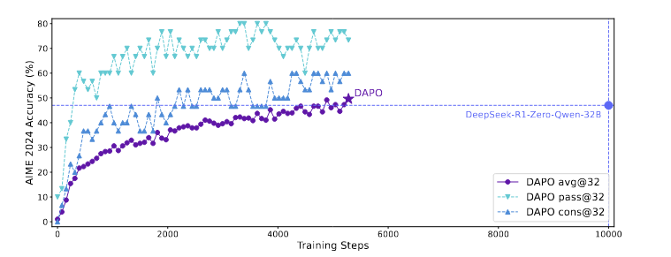
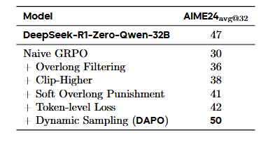

# DAPO: An Open-Source LLM Reinforcement Learning System at Scale
DAPO: 一个开源的大规模语言模型强化学习系统

- **Authors**: Qiying Yu, Zheng Zhang, Ruofei Zhu, Yufeng Yuan, Xiaochen Zuo, Yu Yue, et al. (ByteDance Seed, Tsinghua University, etc.)
- **Venue & Year**: arXiv, 2025 
- **URL / DOI**: https://arxiv.org/abs/2503.14476v2

---

## 1. 动机

- **研究问题**  `   `解决LLM在进行复杂推理任务的RL训练时，普遍存在的复现性差、关键技术细节不透明、以及训练不稳定（如熵坍塌、梯度消失）等核心问题。
- **背景与意义**  `   `尽管RL是激发LLM复杂推理能力（如长思维链CoT）的关键技术，但像OpenAI和DeepSeek等顶尖机构并未公开其技术细节，导致学术界和工业界在复现SOTA性能时面临巨大困难。

## 2. 核心贡献

- **提出DAPO算法**: 提出了一个名为**解耦裁剪和动态采样策略优化 (Decoupled Clip and Dynamic sampling Policy Optimization, DAPO)** 的新算法，集成了四项关键技术，有效解决了长思维链RL训练中的不稳定性问题。
- **发布完整的开源系统**: 开源了一整套大规模LLM RL系统，包括DAPO算法的实现代码（基于verl框架）、精心处理的**DAPO-Math-17K**数据集，以及详细的训练配置，极大地提升了研究的可复现性。
- **实现SOTA性能**: 基于Qwen2.5-32B模型，使用DAPO算法在AIME 2024数学竞赛基准上取得了50分的成绩，超越了此前DeepSeek-R1（47分）的SOTA结果，且训练步数减少了50%，验证了方法的有效性和高效性。

## 3. 方法论

- **模型／算法概述**: DAPO是对GRPO的重大改进，专为长思维链RL场景设计。它通过引入四项关键技术来系统性地解决训练中的核心痛点：
    1.  **Clip-Higher (提升裁剪上界)**: 解耦PPO中的裁剪上下界，通过提高上界($\epsilon_{\text{high}}$)来鼓励对低概率“探索性”词元的探索，防止熵坍塌，维持模型多样性。
    2.  **Dynamic Sampling (动态采样)**: 在训练前动态地过滤掉那些所有生成样本全对或全错的“零梯度”数据，确保每个训练批次都包含有效的梯度信号，从而加速收敛并提高训练效率。
    3.  **Token-level Policy Gradient Loss (词元级策略梯度损失)**: 将损失计算的基本单位从“样本”改为“词元”，使得长序列能获得更大的梯度贡献，从而更有效地学习长链推理中的关键模式，并惩罚无意义的长序列。
    4.  **Overlong Reward Shaping (超长奖励塑造)**: 过滤超长截断样本的损失或引入“软性惩罚”机制（设定一个惩罚缓冲区，在其中，惩罚力度随着超出长度的增加而线性增强（从0平滑过渡到-1）），来减少因截断而产生的奖励噪声，稳定训练过程。

- **关键公式或伪代码**:
  DAPO的核心目标函数如下，它整合了词元级损失和解耦裁剪：
  $J_{\text{DAPO}}(\theta) = \mathbb{E} \left[ \frac{1}{\sum_{i=1}^G |o_i|} \sum_{i=1}^G \sum_{t=1}^{|o_i|} \min \left( r_{i,t}(\theta) \hat{A}_{i,t}, \text{clip}(r_{i,t}(\theta), 1-\epsilon_{\text{low}}, 1+\epsilon_{\text{high}}) \hat{A}_{i,t} \right) \right]$
  其中，约束条件 `s.t. 0 < |{o_i | is_equivalent(a, o_i)}| < G` 体现了动态采样的思想。
  - $1/\sum|o_i|$: 体现了词元级损失的归一化方式，所有词元的权重相同。
  - $\text{clip}(..., 1-\epsilon_{\text{low}}, 1+\epsilon_{\text{high}})$: 体现了解耦裁剪（Clip-Higher）的核心机制。

- **DAPO的训练流程**:
  1.  **数据采样**: 从任务提示中采样一个批次。
  2.  **响应生成**: 使用当前策略模型生成多个响应。
  3.  **奖励计算**: 对每个响应进行评分（例如，答案是否正确）。
  4.  **动态过滤**: 将全对或全错的提示过滤掉，将有效数据存入一个动态缓冲区，直到缓冲区填满。
  5.  **优势计算**: 对缓冲区中的有效数据计算每个词元的优势值。
  6.  **梯度更新**: 使用DAPO目标函数（结合词元级损失和解耦裁剪）进行多次梯度更新。
  7.  **循环**: 重复以上步骤。

## 4. 实验与数据 

- **数据集 & 任务设置**:
    - **训练数据集**: **DAPO-Math-17K**，一个包含17,000个数学问题的提示数据集。该数据集经过特殊处理，将原始答案（如公式、表达式）统一转换为整数格式，以便进行精确的、基于规则的奖励评估。
    - **任务设置**: 在AIME 2024数学竞赛基准上进行评估，这是一个需要复杂多步推理的挑战性任务。
- **对比方法 & 评价指标**:
    - **对比方法**:
        - **DeepSeek-R1-Zero-Qwen-32B**: 先前的SOTA模型。
        - **Naive GRPO**: 作为基线方法，用于展示各项改进的有效性。
    - **评价指标**: **AIME 2024 avg@32**，即在AIME测试集上，每个问题生成32个答案，计算其平均准确率，以保证结果的稳定性。

## 5. 实验结果

- **性能指标对比表**:
  
  - DAPO在AIME 2024上达到了**50%**的avg@32准确率，显著优于DeepSeek-R1-zero-qwen-32B的**47%**。
  - 相对于基线Naive GRPO（仅**30%**），DAPO实现了巨大的性能提升。(该结果在下面的消融实验图)
  - 训练效率上，DAPO达到50%准确率仅用了DeepSeek-R1-zero-qwen-32B所需训练步数的**50%**。

- **消融研究要点**
  
  
  1.  **Naive GRPO (30%)**: 基线性能。
  2.  **+ Overlong Filtering (36%)**: 过滤超长样本损失，性能提升6%，证明了奖励噪声对训练的负面影响。
  3.  **+ Clip-Higher (38%)**: 引入解耦裁剪，性能再提升2%，证明了防止熵坍塌、鼓励探索的有效性。
  4.  **+ Soft Overlong Punishment (41%)**: 进一步优化超长奖励，性能提升3%。
  5.  **+ Token-level Loss (42%)**: 改为词元级损失，性能提升1%，同时作者指出该方法能显著增强训练稳定性和响应长度的健康增长。
  6.  **+ Dynamic Sampling (DAPO, 50%)**: 引入动态采样，性能大幅提升8%，证明了过滤无效梯度对训练效率和效果的巨大价值。

## 6. 优点分析 

- **优势**:
    - **问题导向性强**: 提出的四项技术分别精准地解决了大规模RL训练中遇到的熵坍塌、梯度噪声、信号稀释等具体且关键的痛点。
    - **高效率与高性能**: 实验结果证明，DAPO不仅在性能上超越了SOTA，还在训练效率上实现了翻倍的提升。
    - **动态采样的启发性**将太简单和太难的数据剔除确实比较符合直觉

## 8.本论文分类Tag（个人观点）

- **标签**:  RL, GRPO , DAPO

## 9. 本论文笔记知乎链接
* 敬请期待

