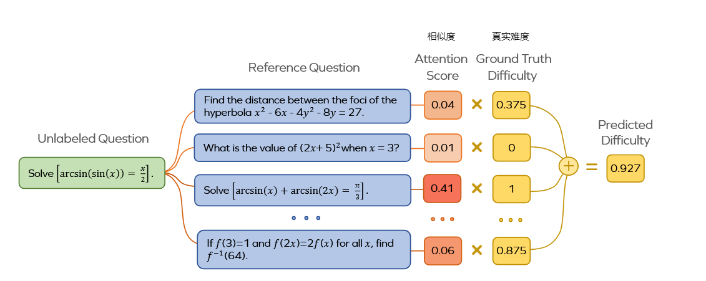
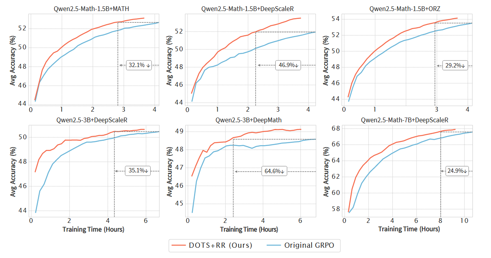
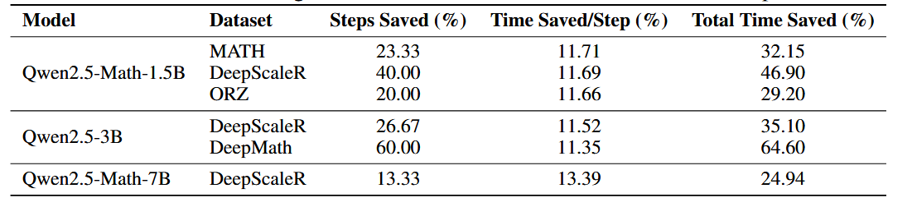
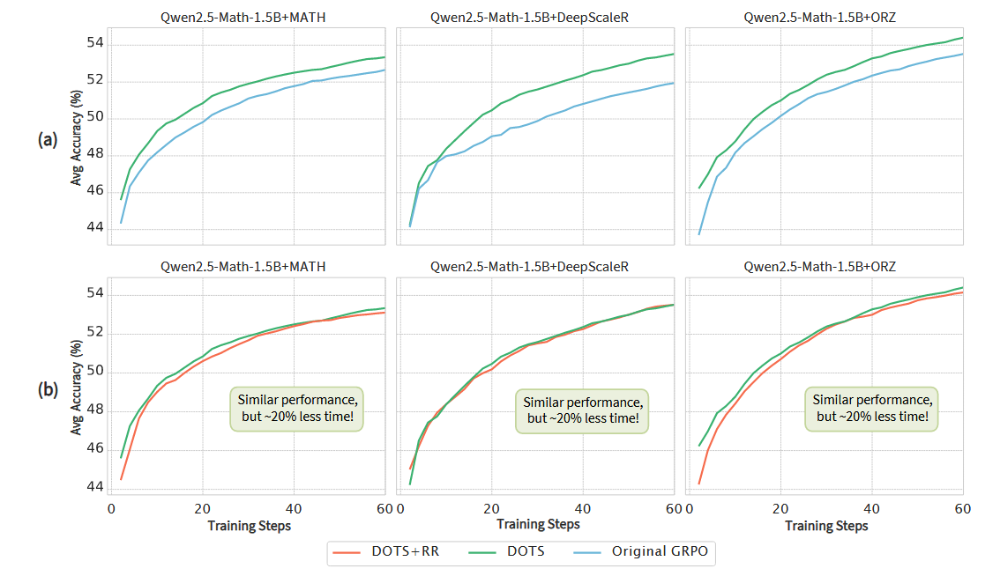
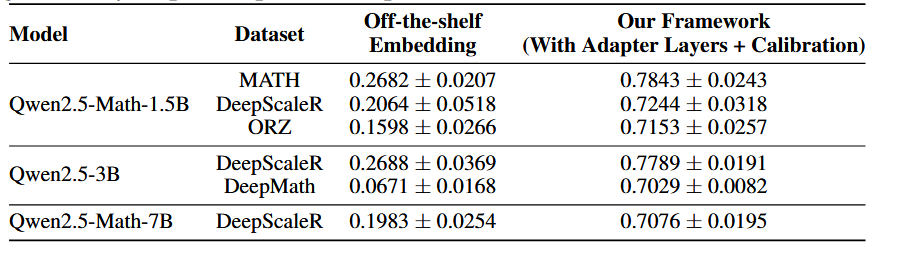
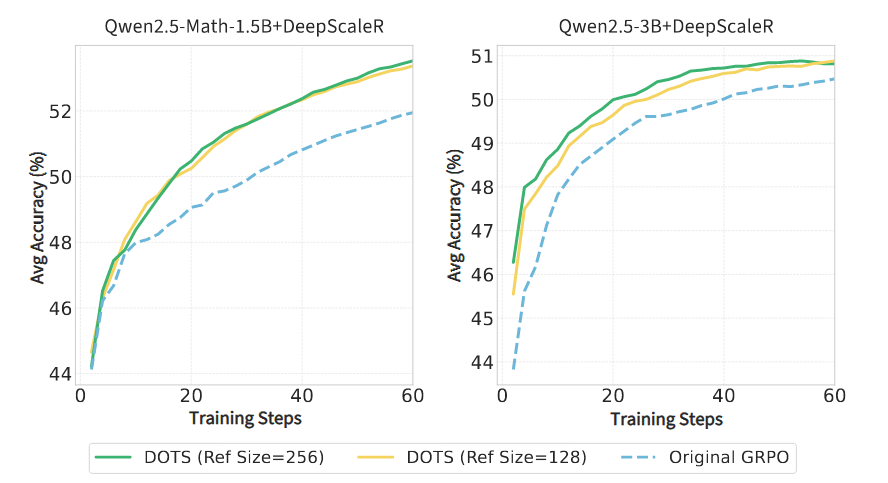

# Improving Data Efficiency for LLM Reinforcement Fine-tuning Through Difficulty-targeted Online Data Selection and Rollout Replay
通过难度导向的在线数据选择和Rollout回放提升大语言模型强化学习微调的数据效率

- **Authors**: Yifan Sun, Jingyan Shen, Yibin Wang, Tianyu Chen, Zhendong Wang, Mingyuan Zhou, Huan Zhang
- **Venue & Year**: arXiv, 2025 
- **URL / DOI**: https://arxiv.org/abs/2506.05316

---

## 1. 动机

- **研究问题**  `   `解决LLM在进行RL微调时，数据效率低下且计算成本高昂的核心问题。
- **背景与意义**  `   `尽管RL微调能显著提升LLM的推理等高级能力，但其过程（尤其是Rollout生成）极其消耗计算资源。现有工作主要关注算法优化，而忽略了数据层面的效率问题。在LLM规模日益增大的背景下，提升数据效率对于降低训练成本、加速模型迭代具有至关重要的意义。

## 2. 核心贡献

- 提出了一个名为**DOTS (Difficulty-targeted Online Data Selection)** 的在线数据选择机制，通过动态优先选择对当前模型难度适中（自适应难度接近0.5）的问题，加速模型收敛。
- 设计了一个轻量级的**基于注意力的自适应难度预测框架**，该框架仅需对一小部分参考数据进行Rollout，即可高效、准确地估算整个数据集中所有问题的难度，解决了直接计算自适应难度成本过高的问题。
- 引入了一种**Rollout回放 (Rollout Replay, RR)** 机制，并结合修改后的GRPO损失函数（使用重要性采样），通过重用近期Rollout数据，在保持训练稳定性的前提下，有效降低了每一步训练的计算成本。
- 通过实验证明，将DOTS与RR结合，能在达到与基线方法相同性能水平的情况下，将RL微调的总时间缩短25%至65%。

## 3. 方法论

- **核心模块概述**：
  论文的work主要包含两个核心模块：DOTS和RR，旨在分别从“减少训练步数”和“降低每步成本”两个维度提升效率。
  1.  **DOTS模块**：核心思想是避免在过易或过难的数据上浪费计算资源。首先定义了“自适应难度”（模型在问题上的平均失败率）这一动态指标。为了高效计算，使用一个基于注意力的预测器：先对一小撮参考问题进行真实Rollout得到其难度，然后通过计算其他问题与参考问题的嵌入相似度（注意力权重），来加权平均预测出它们的难度。最后，优先选择预测难度最接近0.5的问题进行训练。
   
  2.  **RR模块**：为了降低每一步生成Rollout的开销，该模块维护一个FIFO缓冲区来存储近期有价值的Rollout。在每个训练步骤，只生成一小部分（例如50%）新的Rollout，其余部分则从缓冲区中采样。为了解决使用旧数据（off-policy）带来的偏差问题，它在GRPO损失函数中引入了重要性采样进行修正。

- **关键概念**：
  - **自适应难度**：衡量当前策略在问题q上的失败率。
    $$
    d_q^{(t)} = \frac{1}{G} \sum_{i=1}^G (1 - r_i^{(t)})
    $$
    其中，$G$ 是Rollout次数，$r_i^{(t)}$ 是第 $i$ 次Rollout的奖励（0或1）。$d_q^{(t)}$ 越接近0.5，学习信号越强。
  - **Rollout回放的GRPO损失 (GRPO-RR Loss)**：
    $$
    J_{\text{GRPO-RR}}(\theta) \propto \sum \left( \min (\tilde{r}_{i,t}(\theta) \hat{A}_i, \text{clip}(\dots)\hat{A}_i) - \beta D_{\text{KL}}(\pi_\theta \| \pi_{\text{ref}}) \right)
    $$
    关键在于重要性采样比率 $\tilde{r}_{i,t}(\theta) = \frac{\pi_\theta(\dots)}{\pi_{\text{behavior}}(\dots)}$，它用当前策略 $\pi_\theta$ 和生成该Rollout的行为策略 $\pi_{\text{behavior}}$ 之间的概率比，来修正从回放缓冲区中取出的旧数据的梯度贡献。

## 4. 实验与数据

- **数据集 & 任务设置**：
  - **模型**: Qwen2.5-Math-1.5B, Qwen2.5-3B, Qwen2.5-Math-7B。
  - **训练数据集**: MATH, DeepScaleR-40K, Open-Reasoner-Zero-57K (ORZ), DeepMath-103K。这些数据集均为数学推理领域。
  - **评估数据集**: GSM8K, MATH500, Minerva Math, OlympiadBench。

- **对比方法 & 评价指标**：
  - **对比方法 (Baselines)**: 原始的GRPO算法，采用标准的均匀采样策略。此外，还与一个基于外部静态难度标签（GPT-4o标注）的课程学习基线进行了比较。
  - **评价指标 (Metrics)**: 在四大评估基准上的平均**准确率 (Average Accuracy)**。同时，也比较了**达到目标性能所需的训练步数**、**每步训练时间**和**总训练时间**。

## 5. 实验结果

- **性能指标对比表**：
  
  - **主要发现**：论文提出的方法（DOTS+RR）在所有6个LLM-数据集组合上均显著优于原始GRPO。DOTS+RR的学习曲线始终在原始GRPO之上，意味着在任意时间点都具有更高的准确率。
  
  - **效率提升**：与原始GRPO达到相同的最终性能，本文方法所需的训练步数减少了13%-60%，每步训练时间减少了11%-13%，最终导致**总训练时间节省了25%-65%**。其中在DeepMath数据集上效果最显著，节省了64.6%的时间。

- **消融研究要点**：
  
  - **DOTS vs. RR的独立贡献**：(上3张图)单独使用DOTS相比原始GRPO能显著加速收敛（学习曲线更陡峭）；下3张图显示，在DOTS的基础上加入RR，能在不牺牲性能的前提下，将训练时间进一步减少约20%。这证明了两者是以互补方式提升效率的。
  
  - **预测框架的有效性**：与使用现成的（off-the-shelf）模型嵌入相比，论文设计的带有适配器和校准头的预测框架能显著提升难度预测的准确性（皮尔逊相关系数从~0.2提升到~0.7以上），证明了微调嵌入层的必要性。(这个就是在计算一个问题和参考问题之间的相似度时用到的，具体来说，论文在冻结的预训练模型主干之上，增加了一个小型的、可训练的神经网络（3层MLP）。这个适配器的专门任务就是学习如何将原始的文本嵌入，转换成一种对“难度”更敏感的新嵌入，在得到加权平均的预测分数后，再通过一个小型MLP（校准头）进行后期处理)
  
  - **参考集大小的鲁棒性**：即使将参考集大小从256减小到128，模型的性能也几乎没有下降，证明了该方法对参考集大小是鲁棒的，并且可以在更低的Rollout成本下工作。

## 6. 优缺点分析

- **优势**：
  1.  **高效性**：显著减少了RL微调的时间和计算成本，兼顾了收敛速度和单步效率。
  2.  **通用性与简单性**：提出的两个技术（DOTS和RR）思想清晰，实现相对简单，且可以应用于基于GRPO的各种RL微调流程中，具有良好的通用性。
  3.  **理论支撑**：核心的DOTS策略（选择难度0.5的问题）有最大化梯度信号的理论依据。

- **局限性**：
  1.  **参考集采样的依赖**：难度预测的性能依赖于随机采样的参考集是否具有代表性。如果参考集碰巧比较片面，可能会影响预测的准确性。
  2.  **领域局限性**：实验主要集中在数学推理领域，其在其他需要RL微调的任务（如代码生成、文本摘要）上的有效性有待验证。

## 7. 个人思考

- **小问题**：
  - 论文中的难度预测器依赖于文本嵌入的相似性，这对于数学问题可能有效。但对于一些语义相似但逻辑难度差异巨大的问题，该框架的判别能力如何？

## 8.本论文分类Tag（个人观点）

- **标签**：RL, 数据效率,  经验回放

## 9. 本论文笔记知乎链接
* 敬请期待

