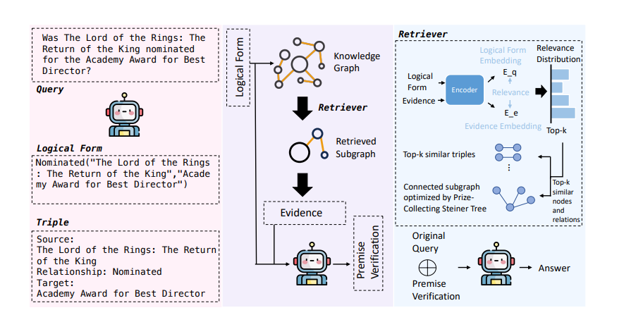
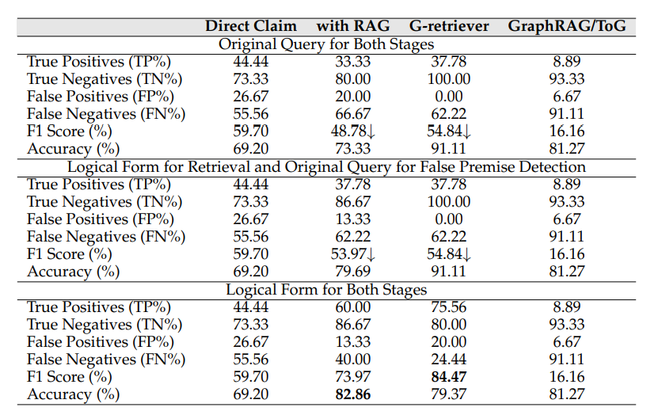
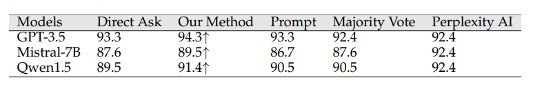

# Don't Let It Hallucinate: Premise Verification via Retrieval-Augmented Logical Reasoning
别让它产生幻觉：通过检索增强的逻辑推理进行前提验证

- **Authors**: Yuehan Qin, Shawn Li, Yi Nian, Xinyan Velocity Yu, Yue Zhao, Xuezhe Ma
- **Venue & Year**: arXiv,2025 
- **URL / DOI**: https://arxiv.org/abs/2504.06438

---

## 1. 动机

- **研究问题**  `   `解决当用户查询中包含与事实相悖的“错误前提”时（就是提问有误），大模型容易产生事实性幻觉的问题。
- **背景与意义**  `   `现有方法大多在幻觉发生后进行补救，或依赖于模型内部logits，计算成本高且不具备主动预防能力。尤其在金融、医疗等高风险领域，由错误前提引发的幻觉可能导致严重后果。因此，开发一种在生成前主动识别并处理错误前提的机制，对于提升LLM的可靠性和安全性至关重要。

## 2. 核心贡献

- 提出了一个在生成前主动预防幻觉的检索增强框架，核心是通过验证用户查询中的前提来规避事实性错误。
- 引入了将自然语言查询转换为结构化“逻辑形式”的方法，显著提升了在知识图谱中检索证据和验证前提的准确性。
- 实现了一种无需访问模型logits或进行额外微调的幻觉缓解策略，使其能够无缝集成到现有的、甚至是闭源的LLM工作流中。

## 3. 方法论

- **核心思想概述**:
    `   `构建了一个三步走的“提问-验证-再提问”流程。首先，将用户的自然语言查询转换为结构化的逻辑形式（三元组）。接着，利用这个逻辑形式作为精确查询，从外部知识图谱中检索最相关的事实证据。然后，通过对比查询的逻辑形式与检索到的证据，判断原始查询是否包含错误前提。最后，如果检测到错误前提，就在原始查询后附加一个明确的警告提示，再将这个修改后的查询发送给LLM，从而引导其生成事实准确、无幻觉的回答。
  
- **主要流程说明**:
  主要包含三个模块：
  
  1.  **逻辑形式提取**: 接收用户叽里呱啦的查询，利用GPT-4-mini将其解析为结构化的逻辑断言，例如 `关系("实体1", "实体2")`。
  2.  **结构化检索与验证**: 将逻辑形式作为输入，通过一个检索器（G-retriever）在知识图谱中进行精确匹配，找到最相关的事实证据。随后，对比查询与证据，完成事实验证。
  3.  **事实一致性强制**: 根据验证结果，决定是否需要修改原始查询。如果需要，它会向查询中注入一个明确的警告，然后将最终的prompt传递给目标LLM。

## 4. 实验与数据 

- **数据集 & 任务设置**:
  - **数据集**: KG-FPQ，一个包含基于KoPL知识图谱（Wikidata的子集）构建的真假前提问题的数据集。实验主要集中在艺术领域的判别性任务。
  - **任务设置**:
    1.  **错误前提检测**: 一个二分类任务，判断给定问题是否包含错误前提。
    2.  **幻觉缓解**: 一个问答任务，评估在给定（可能包含错误前提的）问题后，模型的回答是否事实正确（对真前提问题回答“Yes”，对假前提问题回答“No”）。

- **对比方法 & 评价指标**:
  - **对比方法 (Baselines)**:
    - **错误前提检测**: Direct Claim (直接问LLM)、with RAG (嵌入式检索)、G-retriever (非参数图检索)、GraphRAG/ToG (LLM打分检索)。
    - **幻觉缓解**: Direct Ask (直接回答)、Prompt (通用警告提示)、Majority Vote (多数投票)、Perplexity AI (结合网络搜索)。
  - **评价指标 (Metrics)**:
    - **错误前提检测**: 真阳性率 (TP%)、真阴性率 (TN%)、F1分数 (F1 Score)、准确率 (Accuracy)。
    - **幻觉缓解**: 问答准确率 (Accuracy)。

## 5. 实验结果

- **性能指标对比表**:
  
  - **逻辑形式的重要性**: 在错误前提检测任务中，“两个阶段都使用逻辑形式”的策略显著优于其他策略（解释一下俩阶段，第一个阶段是用户提问在KG里面检索，第二阶段是将检索到的证据和问题扔给模型回复）。在该设置下，G-retriever方法取得了最高的F1分数（84.47%）和真阳性率（75.56%），证明了其在精准识别错误前提方面的优越性。
  
  - **核心发现**: 在幻觉缓解任务中，论文提出的方法在所有测试的LLM（GPT-3.5, Mistral-7B, Qwen1.5）上均取得了最高的问答准确率，全面超越了Direct Ask、Prompt和Majority Vote等基线方法。

- **消融研究要点**:
  上面第一个表本身可以看作是一系列消融研究。通过对比三个部分（两个阶段都用原始查询 vs. 混合策略 vs. 两个阶段都用逻辑形式），实验清晰地证明了**在检索和检测两个阶段都使用逻辑形式是性能提升的关键**。仅在检索阶段使用逻辑形式（混合策略）也能带来提升，但效果不如全程使用。这证明了逻辑形式在整个验证流程中的不可或缺性。

## 6. 优缺点分析 

- **优势**:
  1.  **主动预防**: 在幻觉发生前介入，从源头上解决了问题，比事后修正更高效、更可靠。
  2.  **高兼容性**: 无需访问模型内部参数或进行微调，可作为即插即用的模块与各种闭源LLM结合。
  3.  **高精度**: 将问题转换为逻辑形式进行结构化检索和验证，避免了自然语言的歧义，显著提升了检测的准确率。

- **局限性**:
  1.  **依赖知识图谱**: 方法的有效性高度依赖于一个高质量、高覆盖率且实时更新的知识图谱。对于知识图谱中未包含或过时的知识，该方法将失效。
  2.  **性能差异**: 论文指出，方法在不同检索器和LLM上的性能提升幅度不一，并非对所有组合都同样有效。

## 7. 个人思考 

- **疑问**:
  - 论文中逻辑形式的提取依赖于另一个LLM（GPT-4-mini），这是否会引入新的潜在错误源？如果用于提取的LLM本身就出错或产生幻觉，整个系统的可靠性如何保证？

- **可能的改进方向**:
  1.  **混合检索机制**: 将知识图谱检索与传统的网络搜索引擎检索相结合。当知识图谱无法提供确凿证据时，可以启动网络搜索作为补充验证，以增强方法的鲁棒性和知识时效性。

## 8. 标签

- **标签**: 幻觉缓解, 事实性验证, RAG, 知识图谱, 逻辑推理

## 9. 本论文笔记知乎链接
* 敬请期待
