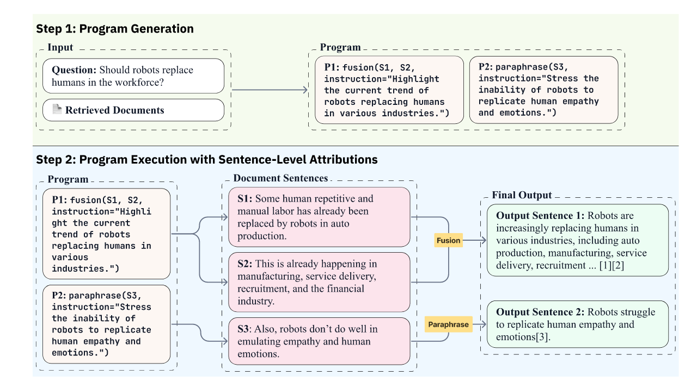
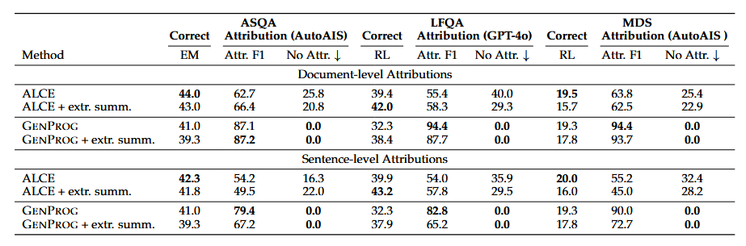
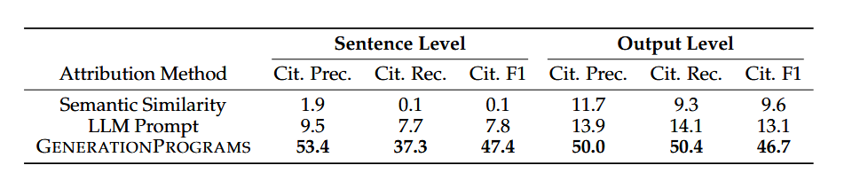
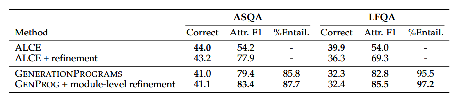

# GENERATIONPROGRAMS: Fine-grained Attribution with Executable Programs
通过可执行程序实现精细化溯源

- **Authors**: David Wan, Eran Hirsch, Elias Stengel-Eskin, Ido Dagan, Mohit Bansal
- **Venue & Year**: arXiv, 2025
- **URL / DOI**: https://arxiv.org/abs/2506.14580

---

## 1. 动机

- **研究问题**  `   `解决LLM在进行溯源生成时，难以提供准确、精细化的溯源引用，并且其生成过程缺乏可解释性的核心问题。
- **背景与意义**  `   `现有LLMs虽然生成能力强大，但其输出常包含“幻觉”，且溯源（正确引用）能力薄弱，这严重损害了内容的可验证性和用户信任。传统的溯源方法要么与生成过程耦合过紧导致性能下降，要么仅提供“佐证性”而非“贡献性”溯源，无法解释模型“如何”及“为何”使用特定信源，限制了模型的可解释性和可控性。

## 2. 核心贡献

- **提出了 `GENERATIONPROGRAMS` 框架**：一个新颖的、解耦的、模块化的生成框架，将复杂的文本生成任务分解为“程序生成”和“程序执行”两个阶段。
- **实现了贡献性溯源 (Contributive Attribution)**：通过生成可执行的程序追踪，框架能明确解释每个输出句子是由哪些源句子通过何种文本操作（如融合、释义）生成的，提供了高度的可解释性。
- **显著提升了溯源质量**：实验证明，该框架在文档级和句子级溯源的F1值上均大幅超越基线方法，并能完全消除无引用句子的问题。
- **拓展了溯源的应用场景**：证明了 `GENERATIONPROGRAMS` 不仅能用于同步生成与溯源，还能作为一种高效的事后溯源（Post-Hoc Attribution）方法，并支持对生成过程进行模块级的精细化验证与修正。

## 3. 方法论

- **思想方法概述**: `GENERATIONPROGRAMS` 的核心思想是将文本生成任务转化为一个“代码编写”问题。首先，一个LLM（规划器）根据用户查询和源文档，生成一个由预定义文本操作函数（如 `fusion`, `paraphrase`, `compression`）组成的Python程序列表。然后，另一组专门的LLM（执行器/神经模块）逐条执行这些程序指令，操作源文档中的句子，最终组合成答案。由于每一步操作和所用句子都被程序明确记录，溯源信息自然地被保留下来。
- **流程说明**:
  
  1.  **阶段一：程序生成**：输入问题和源文档，LLM规划器输出一个由多个程序调用组成的列表。每个程序调用（如`fusion(...)`, `paraphrase(...)`）都计划生成最终答案中的一个句子，并包含自然语言指令来指导具体的操作方式。
  2.  **阶段二：程序执行**：系统根据程序指令，从源文档中提取相应的句子（如S1, S2, S3），并将它们送入对应的神经模块（Fusion, Paraphrase等）。每个模块执行文本操作后生成一个句子，并将所用到的源句子ID自动作为该句的引用。最终，所有生成的句子组合成带引用的完整答案。

## 4. 实验与数据 
- **数据集 & 任务设置**:
  - **数据集**: ASQA（事实类问答）、LFQA（长文本问答）、MultiNews MDS（多文档摘要）。
  - **任务设置**: 在给定查询和一组源文档的条件下，生成长文本答案或摘要，并提供句子级和文档级的溯源引用。
- **对比方法 & 评价指标**:
  - **对比方法 (Baselines)**: 主要是 ALCE (Gao et al., 2023b)，一个直接生成答案和引用的SOTA方法。在事后溯源任务中，还比较了语义相似度和LLM提示法。
  - **评价指标 (Metrics)**:
    - **答案准确率**: EM (ASQA), ROUGE-L (LFQA, MDS)。
    - **溯源质量**: 溯源精确率、召回率、F1值（使用AutoAIS和GPT-4o进行NLI判断），以及无引用句子的比例。

## 5. 实验结果

- **性能指标对比表**
  
    `   `图中+ extr. summ.就是先从原始文档中挑选出最重要的几个句子，然后原封不动地将它们拼接在一起形成摘要，再送入模型处理。
  - **溯源质量**: 在所有任务上，`GENERATIONPROGRAMS` 的溯源F1值均显著优于ALCE。例如，在LFQA上，句子级溯源F1从54.0%提升至82.8%；文档级溯源F1从55.4%提升至94.4%。同时，`GENERATIONPROGRAMS` 将无引用句子的比例降至0。
  - **答案准确率**: `GENERATIONPROGRAMS` 的答案准确率略低于ALCE（如LFQA的ROUGE-L从39.9降至32.3）。但论文通过消融实验和额外评估（LLM评估、人工评估）指出，这种下降可能与评测指标的风格偏好有关，而非内容准确性的真实下降。
  
  - **事后溯源**: 在LFQA上的事后溯源任务中，`GENERATIONPROGRAMS` 的句子级引用F1值达到47.4，远超LLM提示法（7.8）和语义相似度法（0.1）。
    `   `这个任务的解释：为一个已经存在的、没有引用的文本，反向推导出它是如何由源文档中的具体句子通过一系列操作生成的，并以此给出精确的来源出处。
- **消融研究要点**:
 
  - **摘要预处理**: 对源文档应用抽取式摘要，可以有效缓解长上下文问题，帮助基线方法提升溯源质量，并能平衡`GENERATIONPROGRAMS`的答案准确率和溯源质量。（5.实验结果的第一张图所示）
  
  - **模块级修正**: 论文在4.3节中展示，通过对`GENERATIONPROGRAMS`中被判定为不忠实的模块执行结果进行重排序修正，可以进一步提升溯源F1值（如LFQA上从82.8%提升至85.5%），证明了其模块化设计带来的可控性优势。
    `   `模块级修正的解释：对于程序中的每一个模块执行（比如 output = fusion(S1, S2)），系统都会进行一次自动化的事实核查，看输出是不是忠于S1,S2,有无夹带私货导致幻觉，若果真如此，责令重新生成5个不同的候选输出，挑合格的输出。

## 6. 优点分析 

- **优势**:
  1.  **高可解释性**: 生成的程序本身就是对模型推理过程的清晰解释，实现了贡献性溯源。
  2.  **卓越的溯源精度**: 实验证明其在溯源质量上远超现有方法，且完全避免了漏引用的问题。
  3.  **框架灵活性与可扩展性强**: 两阶段设计使其易于集成新的文本操作模块（如去语境化、文本简化），并且不依赖特定模型架构，同时适用于同步溯源和事后溯源。
  4.  **高可控性与可修正性**: 模块化的设计允许对生成过程的中间步骤进行验证和局部修正，这比修正整个生成结果的成本更低、效率更高。

## 7. 个人思考 

- **疑问**:
  - 生成的程序是否可能存在“最优性”问题？即对于同一个目标，是否存在更简洁、更高效的程序？未来是否可以引入程序优化的思想来改进规划器？

## 8.本论文分类Tag（个人观点）

- **标签**: 知识溯源,  文本程序生成, 贡献式溯源 