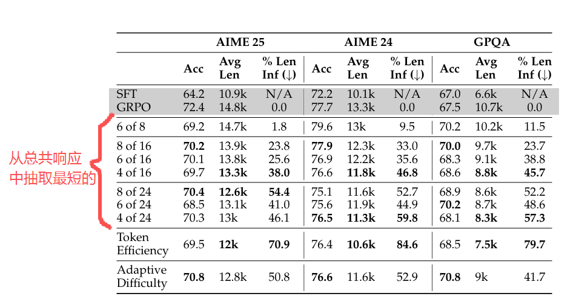
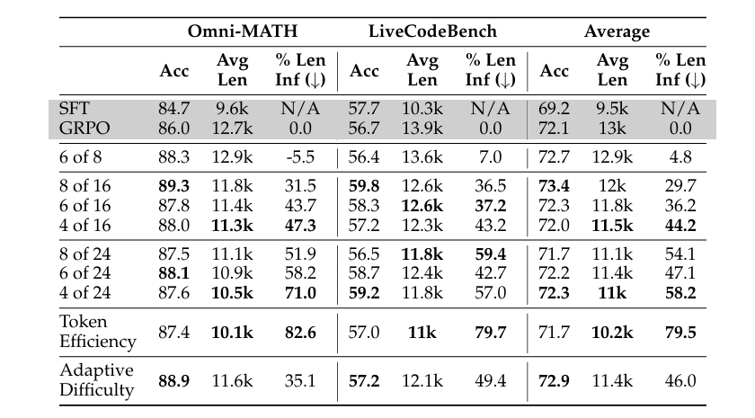
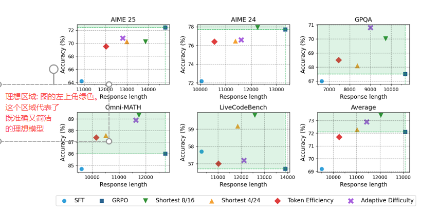
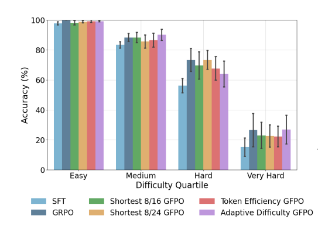
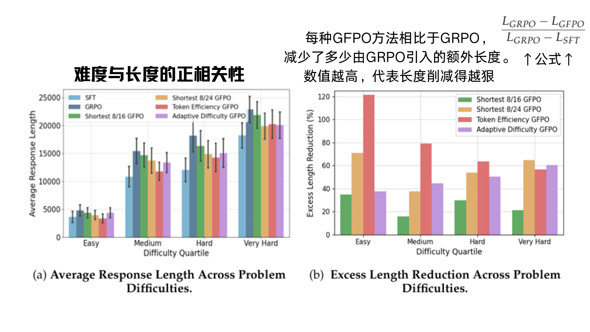
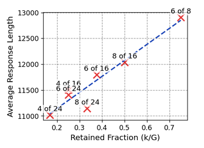

# Sample More to Think Less: Group Filtered Policy Optimization for Concise Reasoning
多采样，少思考：面向简洁推理的组过滤策略优化

- **Authors**: Vaishnavi Shrivastava, Ahmed Awadallah, Vidhisha Balachandran, Shivam Garg, Harkirat Behl, Dimitris Papailiopoulos
- **Venue & Year**: arXiv, 2025 
- **URL / DOI**: arXiv:2508.09726v1

---

## 1. 摘要与动机

- **研究问题**  `   `解决llm在通过RL（特别是GRPO方法）进行微调时，出现的响应“长度膨胀”问题，即模型倾向于生成过长、冗余的回答来换取准确率。
- **背景与意义**  `   `现有基于RLHF的推理模型在追求高准确率时，普遍存在生成内容冗长、推理效率低下的问题。这些冗长的内容不仅包含大量无用的“填充物”，增加了计算成本和延迟，有时甚至会因为引入错误而损害性能。因此，如何在保持高推理能力的同时，让模型学会简洁高效地表达，具有重要的研究和应用价值。

## 2. 核心贡献

- 提出了一种名为 **GFPO (Group Filtered Policy Optimization)** 的新算法，通过在训练时“扩大采样、过滤学习”的策略，有效抑制了模型的长度膨胀。
- 引入了 **token效率 (Token Efficiency)** 作为一种新的过滤指标，在简洁性和有效性之间取得了更好的平衡，实现了最大程度的长度缩减。
- 设计了 **自适应难度 GFPO (Adaptive Difficulty GFPO)**，能够根据问题难度动态调整过滤强度，在最难的问题上实现了最佳的准确率-效率权衡。
- 通过实验证明，GFPO能够在多个数学和代码基准上将响应长度缩减46%-85%，同时保持甚至略微提升了核心推理准确率。

## 3. 方法论

- **核心思想概述**: GFPO的核心思想是“多采样，少思考”。它对现有的GRPO算法进行了扩展，其工作流程如下：
  1.  **扩大采样**：对于每个训练问题，从当前策略中采样一个比标准GRPO更大的响应组 `G`。
  2.  **过滤选择**：根据一个预设的 **度量标准 (metric)**（响应长度、token效率等）对所有 `G` 个响应进行排序，并只选择最优的 `k` 个响应构成子集 `S`。
  3.  **选择性学习**：只使用子集 `S` 中的响应来计算优势函数和策略梯度，并更新模型。对于被过滤掉的 `G-k` 个响应，其优势函数值被强制设为零，不参与梯度更新。
  这种方法通过数据选择的方式，隐式地塑造了奖励，引导模型学习期望的行为模式（如简洁性）。

- **过滤步骤与优势函数**:
  - **过滤步骤**: `S, m = REJECTIONSAMPLE(G, k, metric, order)`，其中 `m` 是一个二元掩码，`m_i = 1` 表示响应 `i` 被选中。
  - **优势函数计算**:
    $$
    \tilde{A}_{i, t}^{(m)}=\frac{R\left(q, o_{i}\right)-\mu_S}{\sigma_S} m_{i}
    $$
    其中，`μ_S` 和 `σ_S` 分别是被选中的子集 `S` 中所有响应奖励的均值和标准差。关键在于，如果响应 `i` 未被选中 (`m_i = 0`)，其优势函数 `A` 恒为零。

- **论文三大GFPO变体数据选择流程**:
  1.  **输入**: 一个问题 `q`。
  2.  **生成模块**: 当前模型策略 `π_θ` 生成一个大规模的响应组 `G`。
  3.  **度量计算与过滤模块**: 这是GFPO的核心，根据不同的变体策略进行：
      - **最短 k/G (Shortest k/G)**:
        - **度量**: 响应的token **长度**。
        - **逻辑**: 直接选择 `G` 个响应中长度最短的 `k` 个。大道至简，强制模型学习简洁的表达方式，不考虑响应的正确性。
      - **token效率 (Token Efficiency)**:
        - **度量**: **`奖励 / 长度`**，即每个token的平均奖励。
        - **逻辑**: 选择 `G` 个响应中token效率最高的 `k` 个。寻找性价比最高的响应，允许为了获得高奖励而适当增加长度，但会严厉惩罚冗长且奖励低的响应。
      - **自适应难度 (Adaptive Difficulty)**:
        - **度量**: 响应的token **长度**。
        - **逻辑**: 这是一个动态策略。首先，根据 `G` 个响应的平均奖励来估计当前问题的难度。然后，根据预设的难度分桶（如简单、中等、困难），**动态地决定 `k` 的值**。对于简单问题，使用更小的 `k`（更激进的过滤）；对于困难问题，使用更大的 `k`（保留更多可能性）。
  4.  **优势计算模块**: **只使用** 被选中的 `k` 个响应来计算奖励的均值和标准差，并为它们计算优势值。所有被过滤掉的响应优势值为零。
  5.  **策略更新模块**: 使用计算出的优势值，通过策略梯度算法更新模型参数。

## 4. 实验与数据

- **数据集 & 任务设置**:
  - **训练集**: 72k个数学问题，与Phi-4-reasoning-plus模型使用的数据集相同。
  - **评估集 (in-distribution)**: 数学和科学推理任务，包括 AIME 24/25, GPQA, Omni-MATH。
  - **评估集 (out-of-distribution)**: 编码任务 LiveCodeBench，用于测试泛化能力。

- **对比方法 & 评价指标**:
  - **基线模型 (Baselines)**:
    1.  **SFT**: 经过监督微调但未经过强化学习的基础模型 (Phi-4-reasoning)。
    2.  **GRPO**: 标准的GRPO算法训练的模型 (Phi-4-reasoning-plus)。
  - **评价指标 (Metrics)**:
    1.  **pass@1 Accuracy**: 模型的准确率。
    2.  **Average Response Length (L)**: 平均响应的token数。
    3.  **Excess Length Reduction (ELR)**: 超额长度缩减率，衡量GFPO相比SFT基线，减少了多少由GRPO引入的额外长度。

## 5. 实验结果

- **性能指标对比表**:
  
  
  - **长度缩减**: 在所有基准上，GFPO变体均显著优于GRPO。使用“token效率”指标的GFPO在AIME 25上将超额长度缩减了70.9%，在AIME 24上缩减了84.6%。
  - **准确率保持**: Wilcoxon符号秩检验表明，GFPO与GRPO的准确率没有统计学上的显著差异，证明其在缩短长度的同时保持了核心推理能力。
  
  - **帕累托最优**: 在5个基准中的4个上，至少有一个GFPO变体在准确率和响应长度两个维度上都优于GRPO，实现了帕累托超越。
  
   - **分难度准确率分析**:
     - **简单问题**: 所有RL方法准确率均接近100%，GFPO在缩短长度的同时未牺牲准确率。
     - **中等和非常困难问题**: `Adaptive Difficulty` 表现最佳，准确率甚至超过了GRPO，显示了其动态策略的优越性。
     - **困难问题**: `Shortest 8/24` 因其最大的采样池，准确率能完美匹配GRPO，证明了“多采样”对保持难题性能的重要性。
  
  
   - **分难度长度分析**:
     - **普遍趋势**: 所有模型的响应长度都随问题难度增加而增加，GRPO在所有难度上几乎都是最长的。
     - **Token Efficiency**: 在简单、中等问题上长度压缩最狠（甚至比SFT还短），但在难题上允许更长响应以换取高奖励，因此缩减效果减弱。
     - **Adaptive Difficulty**: 与Token Efficiency相反,其缩减效果随着问题难度逐渐增强而增强

- **消融研究要点**:
   
  - **`k/G` 比例的重要性**: 实验证明，保留响应的比例 `k/G` 是控制长度的关键。降低该比例（通过减小 `k` 或增大 `G`）可以有效缩短响应长度，但当比例低于25%时，收益递减。
  - **扩大采样的必要性**: 仅在固定的小 `G`（如8）内减少 `k`（例如，从8个里选6个）对长度的缩减效果有限。必须扩大采样规模 `G`（如到16或24），才能为模型提供足够多的优质短响应进行学习。
  

## 6. 优缺点分析

- **优势**:
  1.  **有效性**: 极大地解决了RL训练中的长度膨胀问题，提升了推理效率。
  2.  **简单性与通用性**: 算法思想简单，易于实现，且可与任何GRPO变体结合。其框架是通用的，可以更换不同的度量标准来优化不同目标（如安全性、事实性）。
  3.  **保持性能**: 在大幅提升效率的同时，没有牺牲核心任务的准确率。
  4.  **成本权衡合理**: 将一次性的训练成本转化为持久的推理效率增益，这在实际部署中非常有价值。

- **局限性**:
  1.  **增加训练成本**: “多采样”策略显著增加了训练过程中的计算和时间成本。`G` 值越大，成本越高。
  2.  **指标设计的挑战**: 方法的有效性高度依赖于度量标准的设计。虽然论文验证了长度和token效率，但为其他目标（如创造力、可解释性）设计有效的度量标准可能具有挑战性。
  3.  **训练方差**: 论文提到，使用“token效率”指标时，由于梯度信号更复杂，可能会导致训练过程中的性能方差略微增加。

## 7. 个人思考

- **可能的改进方向**:

  1.  **多指标融合过滤**: 可以设计一个加权的、多目标的度量标准，同时考虑长度、token效率、事实性、安全性等多个维度，通过一个加权分数来进行综合排序和过滤，从而实现更全面的模型行为塑造。

## 8.本论文分类Tag（个人观点）

- **标签**: RL,  推理效率, 推理长度膨胀, GRPO
  
## 9. 本论文笔记知乎链接
* 敬请期待
