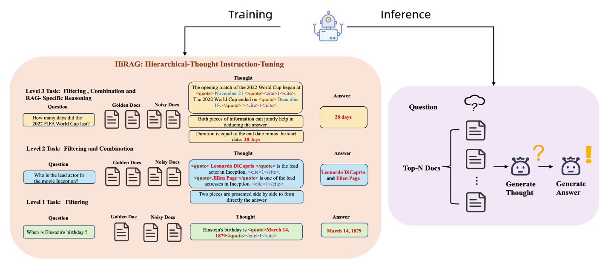
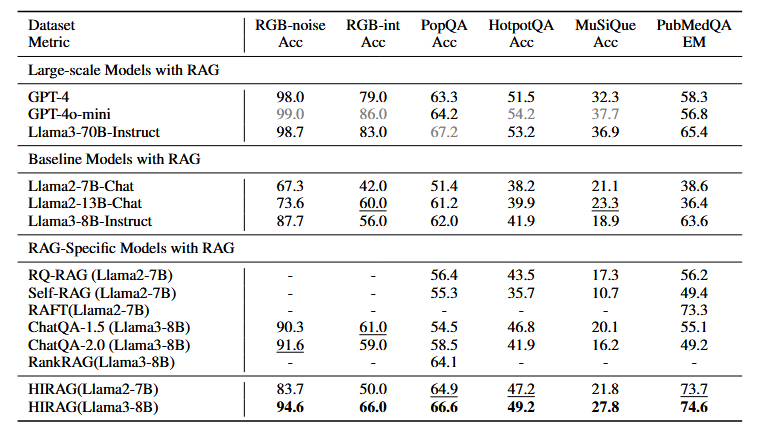
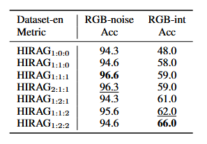
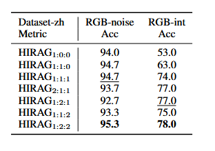

# HIRAG: Hierarchical-Thought Instruction-Tuning Retrieval-Augmented Generation
基于层级式思维指令微调的RAG

- **Authors**: Yihan Jiao*, Zhehao Tan*, Dan Yang, Duolin Sun, Jie Feng, Yue Shen, Jian Wang, Peng Wei (来自蚂蚁集团)
- **Venue & Year**: arXiv, 2025 
- **URL / DOI**: https://arxiv.org/abs/2507.05714v2

---

## 1. 动机

- **研究问题**  `   `解决现有RAG模型在处理复杂、含噪声或多源文档时，缺乏有效利用检索信息的细粒度能力的问题。核心是探索如何通过一种结构化的微调方法，系统性地教会模型掌握从信息筛选、组合到推理的层级化能力。

- **背景与意义**  `   `传统的RAG系统严重依赖LLM自身的上下文学习能力，但这种能力在面对低质量检索结果时表现不佳。尽管有研究对RAG模型进行微调，但大多缺乏对RAG特定任务的深入拆解。同时，强大的思维链（CoT）技术也未被系统地、针对性地改造以适应RAG场景的独特挑战（如处理文档引用、噪音和多跳问题）。

## 2. 核心贡献

- 提出了一个RAG模型应具备的递进式、层级化能力框架，包含三个核心能力：**筛选（Filtering）**、**组合（Combination）**和**RAG专属推理（RAG-specific Reasoning）**。
- 推出了一种名为**HIRAG**的新型指令微调策略，通过构建任务专属的、难度递增的思维链（CoT）训练数据，以“先思考后回答”的方式，实现了对上述三种能力的有效训练。
- 在包括RAG基准、开放域问答和领域专属问答在内的六个数据集上进行了广泛实验，证明了HIRAG显著优于现有的RAG专属模型，并且在部分任务上性能媲美甚至超越了规模远大于自身的模型（如GPT-4和Llama3-70B）。

## 3. 方法论

- **核心思想概述**：为RAG任务设计一个“课程学习”方案。通过合成一个包含三个难度等级（筛选、组合、推理）的指令微调数据集来训练LLM。训练过程中，模型被要求在生成最终答案`<|ANSWER|>`之前，先生成一步详尽的、结构化的思考过程`<|REASON|>`，该思考过程的复杂性随任务难度而增加。这种显式的“思考”步骤强制模型学习如何处理和转化原始检索信息。

- **数据构造流程**：论文的核心是数据构建流程，可总结如下：
    1.  **数据源准备**：从未标注的文档（如维基百科）中聚类相似文档。
    2.  **查询生成**：利用强大的GPT-4o这种强教师模型，根据文档内容生成对应三种能力（筛选、组合、推理）的查询。
    3.  **思路与答案生成**：再次利用教师模型，为每个查询生成结构化的“思考过程”（CoT）和标准答案，思考过程中包含明确的文档引用（`<quote>`和`<cite>`）。
    4.  **数据验证**：对生成的“查询-思路-答案”三元组进行质量校验和任务分类，确保其符合预设的任务定义且答案准确。
    5.  **噪声注入**：在训练样本中人为加入不相关的“干扰文档”，并随机打乱文档顺序，以增强模型的鲁棒性。

- **训练与推理流程**
  
    1.  **层级化任务设计**：将RAG能力分解为三个级别：
        -   **Level 1 (筛选)**：任务简单，只需从单一文档中提取信息。模型的“思考”过程是直接引用原文。
        -   **Level 2 (组合)**：任务中等，需要整合来自不同文档或同一文档不同位置的信息。模型的“思考”过程是并列引用多个信息点。
        -   **Level 3 (推理)**：任务复杂，需要基于文档信息进行多跳或隐式推理。模型的“思考”过程是一条清晰的逻辑推理链。
    2.  **训练阶段**：模型在上述构建好的层级化数据集上进行微调，学习生成“思考→答案”的完整序列。
    3.  **推理阶段**：面对新问题和检索到的文档，模型首先生成一个“思考”过程来整理思路，然后基于该思路给出最终答案。

## 4. 实验与数据 

- **数据集 & 任务设置**：
    -   **数据集**:
        -   RAG专属基准: RGB-noise(评估大量无关或干扰信息中筛选出正确答案的能力)、RGB-int(需要信息整合的复杂任务)
        -   开放域问答: PopQA (单跳), HotpotQA (多跳), MuSiQue (多跳)
        -   领域专属问答: PubMedQA (医学领域)
    -   **任务设置**: 在给定参考文档的条件下，进行零样本（Zero-shot）问答。

- **对比方法 & 评价指标**：
    -   **对比方法 (Baselines)**:
        -   带RAG的大模型: GPT-4, GPT-4o-mini, Llama3-70B
        -   带RAG的通用指令微调模型: Llama2-Chat, Llama3-Instruct
        -   RAG专属微调模型: Self-RAG, RAFT, ChatQA, RankRAG等
    -   **评价指标**: Accuracy 和 Exact Match (EM)。

## 5. 实验结果

- **性能指标对比表**：
  
    -   在8B模型规模下，HIRAG在所有六个测试数据集上均超越了同规模的其他RAG专属模型。
    -   相较于之前的SOTA模型，HIRAG-8B在PopQA、HotpotQA和MuSiQue上分别实现了2.5、2.4和7.7个百分点的显著提升。
    -   在PubMedQA任务上，HIRAG-8B的EM得分（74.6%）不仅远超同级模型，甚至超过了Llama3-70B（65.4%）和GPT-4（58.3%），展现了其在专业领域推理上的强大潜力。

- **消融研究要点**：
   
  
    -   消融实验通过调整训练数据中三种能力（筛选、组合、推理）的比例，验证了层级化设计的有效性。
    -   结果表明，仅有“筛选”能力的训练不足以应对复杂任务（如在RGB-int数据集上得分很低）。
    -   逐步增加“组合”和“推理”数据的比例，能够显著提升模型在复杂整合与推理任务上的性能。
    -   最终，1:2:2的“筛选:组合:推理”数据比例取得了最佳的综合性能，证明了三种能力对于构建一个全面的RAG模型缺一不可。

## 6. 优缺点分析 

- **优势**：
    -   **结构化能力培养**：通过层级化的课程设计，系统性地提升了模型的RAG能力，而非模糊地进行端到端训练，学习效率更高。
    -   **可解释性强**：显式生成的“思考”过程（CoT）使模型的决策路径透明化，便于用户理解和调试。
    -   **鲁棒性好**：通过引入干扰文档进行训练，提升了模型在真实嘈杂环境中的表现。

## 7. 个人思考 

- **可能的改进方向**：
    -   **动态推理路径选择**：使用RL，让模型根据问题的复杂度和检索到的文档，动态决定当前最需要应用哪种能力（筛选、组合或推理），而不是遵循一个固定的思考模式。
    -   **增加自我批判与修正机制**：在生成最终答案前，增加一个“反思”步骤。模型可以自我审视其生成的“思考”过程是否逻辑连贯、是否忠于原文，并进行修正，从而进一步提升答案的可靠性。

## 8.本论文分类Tag（个人观点）

- **标签**：RAG, CoT, 课程学习, 噪声引入训练

## 9. 本论文笔记知乎链接
* 敬请期待
