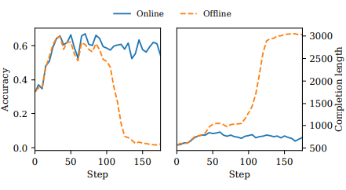

# Learning to Reason without External Rewards 
无需外部奖励地学习推理
- **Authors**: Xuandong Zhao*, Zhewei Kang*, Aosong Feng, Sergey Levine, Dawn Song
- **Venue & Year**: arXiv, 2025
- **URL / DOI**: https://arxiv.org/abs/2505.19590

---

## 1. 摘要与动机

- **研究问题**  `   `LLM能否在不依赖任何外部奖励（如人工标注或标准答案）的情况下，仅通过自我生成的内在信号来提升其复杂的推理能力。
- **背景与意义**  `   `当前提升LLM推理能力的主流方法，如RLHF和RLVR，严重依赖昂贵、耗时且领域特定的外部监督信息，这限制了它们在开放、无标准答案场景下的应用和扩展。因此，开发一种无需外部奖励的自主演进方法对实现更通用、可扩展的AI系统至关重要。

## 2. 核心贡献

- **提出了一个全新的强化学习范式——内部反馈强化学习（RLIF）**，使LLM能够从模型自身的内在信号中学习，摆脱对外部监督的依赖。
- **设计并实现了一种名为 INTUITOR 的具体RLIF方法**，该方法创新性地使用模型自身的置信度度量——“自我确定性”（Self-Certainty）——作为唯一的内在奖励信号。
- **通过实验证明了 INTUITOR 的有效性和优越泛化能力**：在数学推理任务上，其性能与依赖标准答案的监督式方法（GRPO）相当；在跨领域的代码生成任务上，其泛化能力显著优于监督式方法。

## 3. 方法论

- **算法概述**  `   `INTUITOR 的核心思想是，通过强化学习奖励模型生成“自信”的输出，而非“正确”的输出。将传统RL框架（如GRPO）中的外部奖励替换为内在的“自我确定性”得分。在训练的每一步，模型针对一个问题生成多个候选答案，计算每个答案的自我确定性，然后用这些得分构建优势函数，来更新模型策略，使其更倾向于生成高自信度的推理路径。

- **关键公式**：
    `   `**自我确定性 (Self-Certainty) 公式**:
  $$
  \text{Self-certainty}(o|q) := \frac{1}{|o|} \sum_{i=1}^{|o|} \text{KL}(U || p_{\pi_\theta}(\cdot|q, o_{<i}))
  $$
  **变量解释**:
  - `o|q`: 给定问题 `q` 生成的答案 `o`。
  - `|o|`: 答案 `o` 的长度（词元数）。
  - `KL(U || p)`: KL散度，衡量两个概率分布的差异。
  - `U`: 词汇表上的均匀分布，代表“完全不确定”状态。
  - `p`: 模型在生成第 `i` 个词元时的预测概率分布。
  **公式逻辑**: 该公式计算了模型在生成答案的每一步中，其预测分布相对于“完全不确定”状态的偏离程度的平均值。偏离越大（KL散度值越高），代表模型越自信、越确定。

- **流程说明**：
  
  1.  **输入 (Input)**：给定一个问题 `q`。
  2.  **生成 (Generation)**：策略模型（Policy Model）为问题 `q` 生成一组（例如G个）候选答案 `o_1, o_2, ..., o_G`。
  3.  **内在奖励计算 (Reward Calculation)**：使用一个参考模型（冻结的策略模型）计算每个候选答案的“自我确定性”得分 `u_1, u_2, ..., u_G`。
  4.  **优势计算 (Advantage Calculation)**：将这些内在奖励得分进行归一化（例如减去均值、除以标准差），得到每个候选答案的优势值 `A_1, A_2, ..., A_G`。
  5.  **策略更新 (Policy Update)**：使用这些优势值通过策略梯度算法更新策略模型的参数，使其更倾向于生成高优势值（即高自我确定性）的答案。

## 4. 实验与数据

- **数据集 & 任务设置**：
  - **训练数据**: 主要在 `MATH` 数据集的训练集上进行无监督训练。`Codeforces` 数据集也被用于代码生成任务的特定训练。
  - **评估任务**:
    - **领域内任务 (数学推理)**: `GSM8K`, `MATH500`。
    - **域外泛化任务 (代码)**: `LiveCodeBench (LCB)`, `CRUXEval-O`。
    - **通用能力**: `MMLU-Pro` (多任务语言理解), `AlpacaEval` (指令遵循)。

- **对比方法 & 评价指标**：
  - **对比方法 (Baselines)**:
    - **Base Model**: 预训练的基础模型（ Qwen2.5-3B）。
    - **GRPO**: 使用标准答案作为外部奖励的监督式强化学习方法。
    - **GRPO-PV**: GRPO的一个变体，使用多数投票（Plurality Voting）作为奖励，是一种弱监督形式。
  - **评价指标 (Metrics)**:
    - **Accuracy**: 用于数学和代码任务。
    - **Win Rate**: 用于 `AlpacaEval`。

## 5. 实验结果

- **性能指标对比表**：
  
  - **与监督方法相当**: 在领域内的 `GSM8K` 和 `MATH500` 基准上，INTUITOR 的性能与使用标准答案的 GRPO 方法基本持平，证明了内在信号的有效性。
  - **卓越的泛化能力**: 在 `MATH` 数据集上训练后，INTUITOR 在域外的代码生成任务 `LCB` 和 `CRUXEval` 上取得了显著优于 GRPO 的性能。例如，Qwen2.5-3B 经过 INTUITOR 训练后，LCB 得分从 9.3% 提升到 15.3%（相对提升65%），而 GRPO 几乎没有提升。
  - **涌现能力**: 训练过程中的分析表明，INTUITOR 能够自发地引导模型生成结构化的、代码前的自然语言推理，以增强其自身的理解和自信。

- **消融研究要点**：
  
  - **KL惩罚的重要性**: KL散度惩罚项 `β` 的大小对域外泛化性能有至关重要的影响。它作为一个关键的正则化器，防止模型在没有外部反馈的情况下过度偏离初始分布而导致能力退化。
  
  - **在线vs离线奖励**: 使用在线（随模型更新而更新）的自我确定性计算至关重要。使用离线（固定的基础模型）的奖励信号会导致模型学会利用奖励函数（即“奖励 hacking”），导致性能崩溃（策略模型学会了通过在给定问题的答案后附加一个辅助的、已解决的问题来膨胀其自我确定性奖励）

## 6. 优缺点分析

- **优势**:
  1.  **无监督性**: 完全摆脱了对昂贵的人工标注或标准答案的依赖，具有极高的可扩展性。
  2.  **通用性强**: 内在奖励信号与具体任务无关，使其能够应用于广泛的领域，特别是在缺乏可验证答案的开放性问题上。

- **局限性**:
  1.  **超参数敏感**: 尤其是KL惩罚系数对泛化性能影响巨大，需要仔细调整。
  2.  **自信不完全等同于正确**: 尽管实验显示了强相关性，但在某些情况下，模型可能会对自己错误的推理路径产生“盲目自信”，这可能是一个潜在的风险。

## 7. 个人思考

- **灵感 / 疑问**:
  - “自我确定性”作为一个标量奖励，是否会丢失推理过程中更丰富的信息？例如，一个逻辑上虽有小瑕疵但整体思路新颖的答案，可能会因为某一步的不确定性而得分较低。
  - 该方法能否用于创造性任务，如写诗或小说？在这些领域，“自信”的表达是否能引导模型产生更高质量的输出？但是，自信的同时，会不会造成多样性的缺失？

## 8.本论文分类Tag（个人观点）

- **标签**: RL, 无监督学习, 推理能力, 内在奖励
  
## 9. 本论文笔记知乎链接
* 敬请期待

