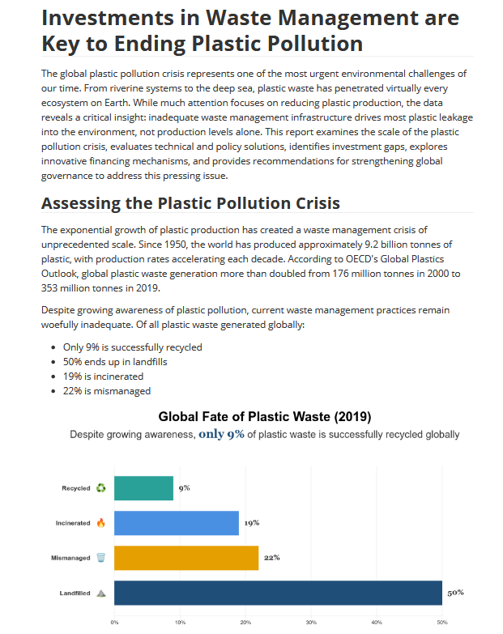
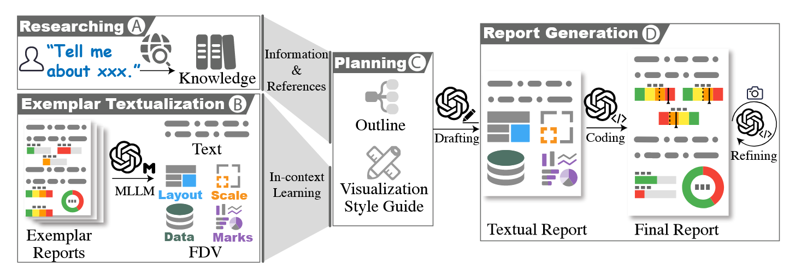
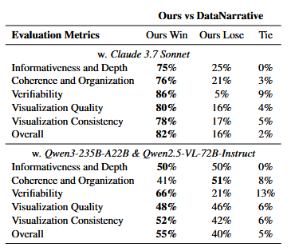
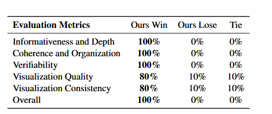
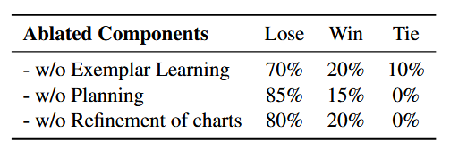

# Multimodal DeepResearcher: Generating Text-Chart Interleaved Reports From Scratch with Agentic Framework
多模态深度研究员：基于智能体框架从零开始生成文本-图表交错的报告

- **Authors**: Zhaorui Yang, Bo Pan, Han Wang, Yiyao Wang, Xingyu Liu, Minfeng Zhu, Bo Zhang, Wei Chen
- **Venue & Year**: arXiv, 2025 
- **URL / DOI**: 

---

## 1. 动机

- **研究问题**  `   `如何让LLM能自动地、从零开始地生成包含文本和高质量、多样化可视化图表交错的多模态研究报告？下面是一个图文并茂报告例子：
  
- **背景与意义**  `   `现有的deep research框架主要生成纯文本报告，这限制了信息传达的效率和读者的理解力。在真实世界中，图文并茂的报告是沟通复杂概念和数据洞察的标准。然而，自动生成高质量、风格一致的可视化，并将其与文本叙述无缝融合，是一个巨大的技术挑战，特别是缺乏一种标准化的方式来让LLM理解和生成复杂的视觉设计。

## 2. 核心贡献

- 提出了一个新颖的任务：从零开始生成文本-图表交错的多模态报告，并构建了相应的评测基准 **MultimodalReportBench**。
- 提出了一种名为 **“可视化形式化描述” (Formal Description of Visualization, FDV)** 的结构化文本表示方法，它将图表的视觉设计分解为布局、尺度、数据和标记四个维度，使LLM能够学习和生成多样化、高质量的可视化。
- 构建了一个名为 **“多模态深度研究员” (Multimodal DeepResearcher)** 的端到端智能体框架，该框架将复杂的生成任务系统地分解为研究、范例文本化、规划和多模态报告生成四个阶段。

## 3. 方法论

- **模型／算法概述**
    `   `Multimodal DeepResearcher 是一个四阶段的智能体框架。
  
    `   `整个框架由四个串联的模块组成，实现了从主题到完整多模态报告的端到端生成：
  - **A. 研究 (Researching)**: 输入用户主题，通过迭代搜索和推理，输出全面的信息和知识参考。
  - **B. 范例文本化 (Exemplar Textualization)**: 输入人类专家报告，利用多模态LLM将其图表转换为FDV文本，形成纯文本范例，用于上下文学习。
  - **C. 规划 (Planning)**: 结合研究阶段的知识和文本化的范例，生成报告大纲和统一的可视化风格指南。
  - **D. 报告生成 (Report Generation)**: 核心执行阶段。首先**起草**带FDV占位符的文本，然后**编码**将FDV转换为图表，最后通过**迭代精炼**优化图表质量，输出最终的图文报告。

- **关键方法**:
  
  - **方法1 (多模态报告的文本化)**: 遍历范例报告中的所有图表图像，使用一个多模态LLM将其转换为FDV文本格式，并替换原始图像。这个过程将多模态报告完全转化为纯文本，以便作为上下文学习的范例。
  - **方法2 (图表精炼算法)**: 这是一个基于“行动者-评论家”的迭代优化循环。**行动者** (LLM) 生成图表代码；**评论家** (多模态LLM) 评估渲染出的图表截图和控制台信息，并提供视觉反馈。行动者根据反馈修正代码。此过程重复进行，直到评论家满意或达到最大重试次数，最后由评论家选择最佳版本。
  - **核心概念：FDV**：从四个角度描述每个可视化图表：（1）整体布局，详述构成的子图及其空间排列；（2）绘图尺度，描述每个“数据到视觉通道（例如，位置、颜色）”映射背后的缩放逻辑及其注释；（3）数据，描述用于生成可视化的数值数据和文本元素；（4）标记，描述每个视觉元素的设计规范。文本化的逆过程可以通过编码实现，即从FDV重构可视化
  

## 4. 实验与数据

- **数据集 & 任务设置**:
  - **数据集**: MultimodalReportBench，包含从Pew Research、Our World in Data等网站策划的100个真实世界主题，涵盖10个类别。同时收集了6份人类专家报告作为上下文学习的范例。
  - **任务设置**: 针对给定的主题，从零开始生成一份文本与图表交错的多模态研究报告。

- **对比方法 & 评价指标**:
  - **对比方法 (Baselines)**: 改编自 DataNarrative 框架，并为其集成了与论文相同的研究和图表生成模块，以确保公平比较。
  - **评价指标 (Metrics)**: 采用GPT-4.1进行自动评估，并辅以3名人类标注员进行人工评估。评估维度全面，包括：**信息量与深度、连贯性与组织性、可验证性、可视化质量、可视化一致性**。

## 5. 实验结果

- **性能指标对比表**:
 
  - **自动评估**: 在使用 Claude 3.7 Sonnet 模型时，本文方法在所有指标上均显著优于基线，总体胜率高达 **82%**。特别是在可验证性（86%胜率）和可视化质量（80%胜率）上优势巨大。

  - **人工评估**: 人工评估结果更为突出，在10个主题的随机子集上，本文方法取得了 **100%** 的总体胜率，表明其生成结果更符合人类专家的偏好。

- **消融研究要点**:
  
  消融实验证明了框架中每个组件的不可或缺性：
  - 移除 **范例学习** 会导致70%的负率，证明了从高质量范例中学习风格和结构至关重要。
  - 移除 **规划阶段** 导致最高的85%负率，说明预先规划大纲和风格对于生成高质量、一致的报告是核心步骤。
  - 移除 **图表精炼** 机制导致80%的负率，突显了迭代优化对于提升最终可视化质量的巨大作用。

## 6. 优点分析

- **优势**:
  - **任务创新性**: 开创了从零生成图文交错报告的新颖任务，更贴近真实世界的高价值应用场景。
  - **FDV的有效性**: 提出的FDV表示法成功地将复杂的视觉设计语言化，是连接文本和视觉的关键桥梁，使LLM能够理解和生成高质量图表。

## 7. 个人思考

- **可能的改进方向**:
  - **混合评论家机制**: 结合基于确定性规则的视觉检查器（如检查文本重叠、元素是否出界）和LLM评论家。规则检查器可以快速发现低级错误，LLM则专注于评估更高层次的美学和信息传达效果，从而提高精炼过程的效率和准确性。
  - **专门化的FDV模型**: 收集大量的“图表-FDV”配对数据，对一个较小的开源多模态模型进行微调，使其成为一个专门的“图表描述器”。这可能会比依赖大型通用模型的少样本推理更稳定、成本更低。

## 8.本论文分类Tag（个人观点）

- **标签**: 多模态生成, 智能体框架, 数据可视化, 报告生成, deep research
## 9. 本论文笔记知乎链接
* 敬请期待