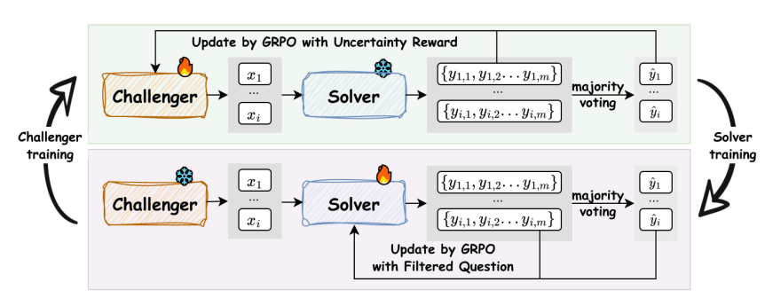
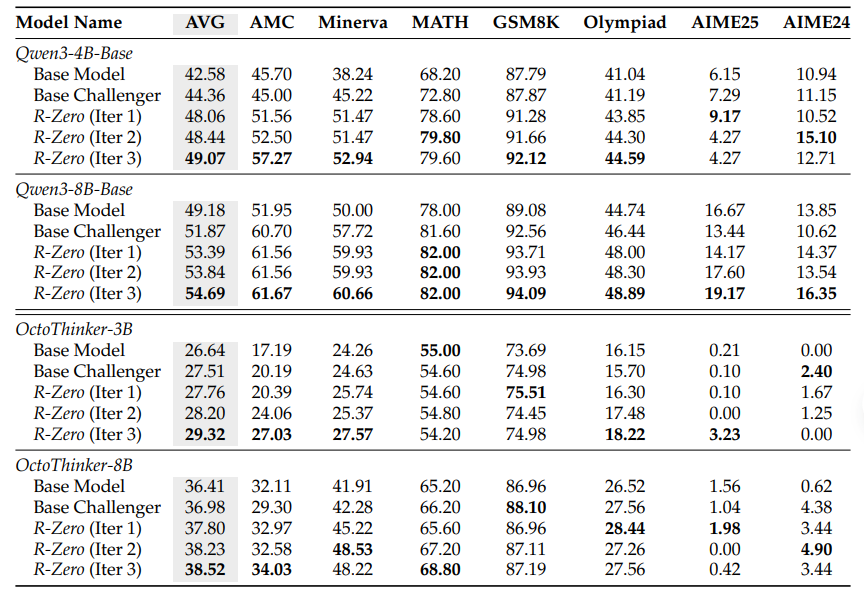
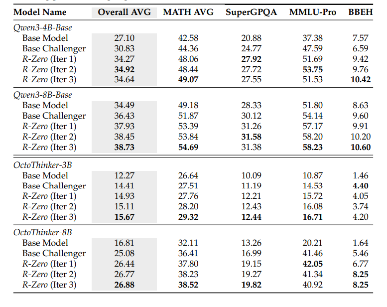
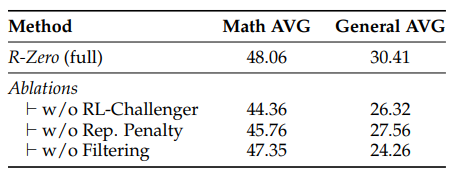
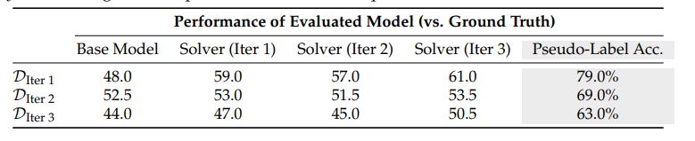

# R-Zero: Self-Evolving Reasoning LLM from Zero Data
R-Zero: 从零数据开始自我演进的推理大语言模型

- **Authors**: Chengsong Huang, Wenhao Yu, Xiaoyang Wang, Hongming Zhang, Zongxia Li, Ruosen Li, Jiaxin Huang, Haitao Mi, Dong Yu
- **Venue & Year**: arXiv, 2025 
- **URL / DOI**: https://arxiv.org/abs/2508.05004v1

---

## 1. 动机

- **研究问题**:解决现有LLMs严重依赖大规模人类标注数据进行训练的根本性瓶颈，探索如何让模型在没有任何预先存在的任务和标签的情况下，完全自主地生成训练数据并实现自我进化。

- **背景与意义**: 自我演进LLMs被认为是通往智能的可扩展路径，但其发展受限于人类数据。这种依赖不仅成本高昂、难以规模化，更重要的是，它将模型的上限限制在人类智能范围内。因此，开发一种能从“零数据”启动、完全摆脱人类监督的自演进框架，对于突破当前AI能力瓶颈、探索超越人类智能的AI系统具有重大意义。

## 2. 核心贡献

- **提出了R-Zero框架**：一个完全自主的、无需任何外部数据的自演进框架，能够从单个基础LLM开始生成自身的训练课程。
- **设计了协同演进机制**：创新地将单个LLM初始化为两个独立优化但相互作用的角色——“挑战者”（Challenger）和“解决者”（Solver）。挑战者负责生成难题，解决者负责解答，二者在对抗与协作中共同进步。
- **引入了基于不确定性的智能课程生成**：挑战者的奖励函数被设计为激励其生成恰好处于解决者能力“边缘”的问题（即解决者回答正确率约为50%），从而形成一个高效且自适应的动态学习课程。
- **验证了方法的有效性和泛化性**：实验证明，R-Zero能显著提升多种基础模型（如Qwen, OctoThinker）在数学推理和通用领域推理任务上的性能，证明了该框架的模型无关性和所学能力的良好泛化性。

## 3. 方法论

- **核心思想概述**: R-Zero的核心思想是一个迭代的、协同演进的循环。从一个基础LLM开始，初始化为功能相同的“挑战者”和“解决者”。在每一轮迭代中：
    1.  **挑战者训练**: “挑战者”模型的目标是生成对当前“解决者”来说有难度的问题。通过GRPO算法进行优化，奖励信号来源于“解决者”对生成问题的不确定性（多个回答的一致性）。当解决者回答正确率接近50%时，奖励最大。
   - **不确定性奖励 (Uncertainty Reward)**：这是挑战者训练的核心。对于一个问题 $x$，“解决者” $S_φ$ 的经验准确率为 $p(x; S_φ)$，则奖励函数为：
      $$ r_{\text{uncertainty}}(x; \phi) = 1 - 2|p(x; S_φ) - \frac{1}{2}| $$
      **解释**: 该函数是一个倒V形函数，当解决者的准确率 $p$ 恰好为0.5（50%）时，奖励达到最大值1，表明问题难度适中；当 $p$ 接近0或1时（太难或太简单），奖励接近0。
    2.  **解决者训练**: “挑战者”生成一批难题后，这些问题会被筛选（剔除太简单或太难的），然后由当前的“解决者”多次回答，通过多数投票生成伪标签。随后，“解决者”模型在这些（问题，伪标签）对上进行微调，同样使用GRPO算法，奖励是其回答是否与伪标签一致。
    这个过程不断重复，使得解决者的能力越来越强，而挑战者也随之生成更难的问题，形成一个自我驱动、难度递增的学习闭环。

- **训练流程简要说明**
  
  R-Zero的流程可以分为两个交替进行的阶段：
    1.  **挑战者训练阶段 (上部分)**:
        -   一个**挑战者**模型生成一个问题 $x_i$。
        -   一个**冻结的解决者**模型对该问题生成 $m$ 个答案。
        -   通过**多数投票**机制，评估解决者的答案一致性，计算出不确定性奖励。
        -   该奖励信号通过**GRPO算法**更新**挑战者**的参数，使其更擅长生成能让解决者感到“困惑”的问题。
    2.  **解决者训练阶段 (下部分)**:
        -   一个**冻结的挑战者**生成大量候选问题。
        -   这些问题经过**筛选**，保留难度适中的问题。
        -   对于每个筛选后的问题，当前的**解决者**生成多个答案并**投票**产生一个伪标签 $ŷ_i$。
        -   **解决者**模型在这些问题上进行训练，目标是生成与伪标签 $ŷ_i$ 一致的答案，并通过**GRPO**进行更新。

## 4. 实验与数据 

- **评估数据集**:
    -   **数学推理**: 使用AMC, Minerva, MATH-500, GSM8K, Olympiad-Bench, AIME等7个高难度基准。
    -   **通用领域推理**: 使用MMLU-Pro, SuperGPQA, BBEH等3个基准测试模型的泛化能力。

- **对比方法 & 评价指标**:
    - **对比方法**: 
        1.  **Base Model**: 未经任何训练的原始基础模型。
        2.  **Base Challenger**: 解决者在一个未经RL训练的、固定的挑战者所生成的数据上进行训练。
    - **评价指标 **:
        -   数学任务: mean@32 (用于AMC/AIME), 贪婪解码准确率。
        -   通用任务: 精确匹配 (EM) 准确率。

## 5. 实验结果

- **性能指标对比表**:
  
    - **数学推理**: R-Zero在所有测试模型和规模上都取得了持续且显著的性能提升。例如，经过3轮迭代，Qwen3-8B-Base的数学平均分从49.18提升至54.69 (+5.51)，OctoThinker-3B从26.64提升至29.32 (+2.68)。性能随迭代次数稳定增长。
  
    - **通用推理**: 在数学任务上学到的推理能力成功泛化到了通用领域。例如，Qwen3-8B-Base的通用领域平均分提升了+3.81分。这证明R-Zero增强的是模型的底层通用能力，而不仅仅是领域知识。

- **消融研究要点**:
  
    - 消融研究表明，框架的三个核心组件都至关重要。
    - 移除**挑战者的RL训练** 导致性能下降最大，证明了动态生成智能课程的核心价值。
    - 移除**重复惩罚** 和**任务筛选** 模块同样会损害性能，说明生成多样化且难度适中的问题对于高效学习是必不可少的。

## 6. 优缺点分析 

- **优势**:
    1.  **完全自主**: 摆脱了对人类标注数据的依赖，实现了从零开始的自我进化，具有极高的可扩展性。
    2.  **模型无关**: 在不同架构（Qwen, Llama系列）和规模的模型上均表现出有效性。
    3.  **高效课程**: 通过不确定性奖励机制，动态生成难度适中的“最佳”学习课程，避免了在过易或过难的任务上浪费计算资源。

- **局限性**:
  
    1.  **伪标签质量下降**: 论文明确指出，随着问题难度增加，由解决者多数投票产生的伪标签的真实准确率会系统性下降（从79%降至63%），这可能成为限制模型性能进一步提升的瓶颈。
    2.  **领域局限性**: 当前框架的核心机制依赖于答案的客观正确性（如数学），易于通过多数投票进行验证。将其扩展到评估标准主观、模糊的任务（如创意写作、对话）仍然是一个重大挑战。

## 7. 个人思考 

- **灵感**:
    - **任务拓展**: 能不能将其用于知识检索里面，挑战者负责生成一大堆文档，解决者负责在里面检索。

## 8.本论文分类Tag（个人观点）

- **标签**: 自我演进LLM, RL, GRPO, 零数据学习, 生成对抗
## 9. 本论文笔记知乎链接
* 敬请期待