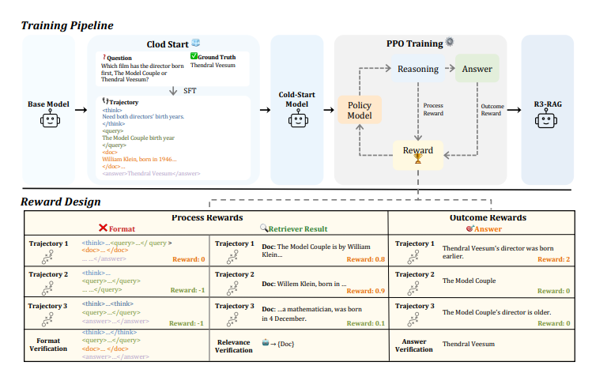
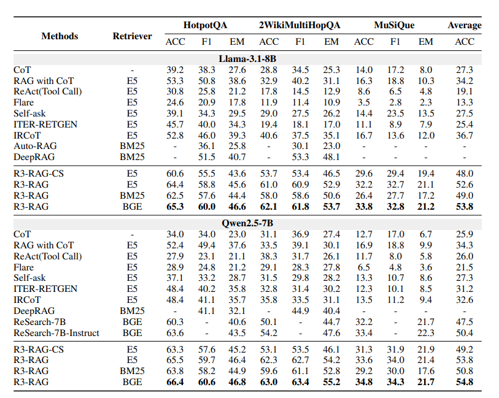
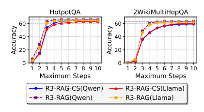
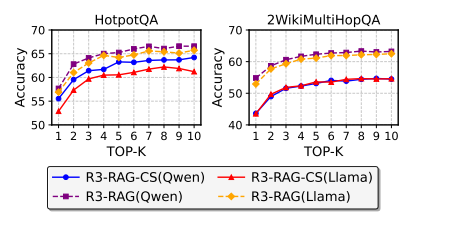
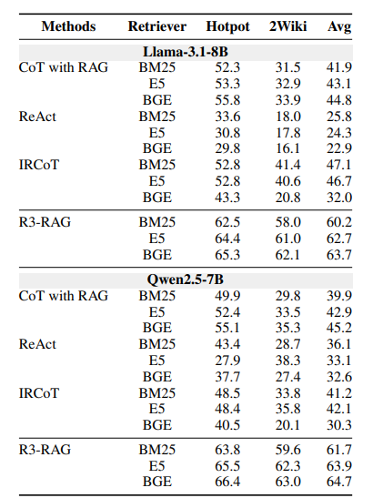

# R3-RAG: Learning Step-by-Step Reasoning and Retrieval for LLMs via Reinforcement Learning

- **Authors**: Yuan Li, Qi Luo, Xiaonan Li, Bufan Li, Bo Wang, Yining Zheng, Yuxin Wang, Zhangyue Yin, Qinyuan Cheng, Xipeng Qiu
- **Venue & Year**: arXiv, 2025 
- **URL / DOI**: https://arxiv.org/abs/2505.23794v1

---

## 1. 摘要与动机

- **研究问题**: 如何让模型学会像人一样进行逐步的推理和检索，以克服传统RAG系统中检索器成为性能瓶颈的问题，从而处理需要复杂推理的查询？

- **背景与意义**: 传统RAG系统通常采用一次性检索，难以处理多跳或需要分解的复杂问题。虽然有迭代式RAG方法，但它们大多依赖于人工设计的、固定的工作流，无法充分发挥LLM的动态推理能力。因此，研究一种能让LLM自主学习何时检索、检索什么内容的方法，对于提升RAG系统处理复杂问题的上限和事实准确性至关重要。

## 2. 核心贡献

- 提出了一个名为 **R3-RAG** 的新框架，利用强化学习（RL）让LLM自主学习如何逐步地**推理(Reason)**和**检索(Retrieve)**。
- 创新地设计了一种混合奖励机制，结合了用于判断最终答案正确性的**结果奖励(outcome reward)**和用于评估每一步检索质量的**过程奖励(process reward)**，为模型提供了更密集、更细粒度的学习信号。
- 通过“冷启动+强化学习”的两阶段训练范式，有效解决了从零开始训练LLM进行复杂工具调用的难题，显著提升了模型的性能和泛化能力。
- 实验证明，R3-RAG在多个多跳问答基准上显著优于现有SOTA方法，并展示了其在不同检索器和基础模型上的良好可迁移性和鲁棒性。

## 3. 方法论

- **模型／算法概述**: R3-RAG采用两阶段训练范式来教LLM进行迭代式推理和检索。
    1.  **冷启动**：首先，使用一个强大的教师模型DeepSeek-v3生成包含详细推理和检索步骤的“专家轨迹”作为示范数据。然后，通过SFT让基础LLM模仿这些轨迹，使其学会执行迭代式推理和检索的基本流程。这个阶段产出的模型被称为`R3-RAG-CS`。
    2.  **强化学习**：在冷启动模型的基础上，使用PPO算法进行强化学习训练。模型在与检索环境交互的过程中，通过最大化混合奖励信号来不断优化其策略。这个奖励信号包括判断最终答案是否正确的“结果奖励”，以及评估每一步检索文档相关性的“过程奖励”，鼓励模型不仅要答对，还要高效、准确地获取信息。还有格式奖励

- **关键概念**:
  **混合奖励机制** 是该方法的核心。总奖励由两部分组成：
  1.  **结果奖励**: 基于最终答案的正确性，判断整个轨迹的好坏。
     -   `Acc(a)`: 结合了字符串精确匹配和LLM模型判断的答案正确性评估。
  2.  **过程奖励**: 基于每一步检索的质量，提供细粒度的指导。
     -   `Rel(d)`: 使用一个LLM判断检索到的文档 `d` 与当前查询 `q` 的相关性得分。
     -   `r_format`: 检查生成的检索指令格式是否正确。
  过程奖励还会被一个基于最终结果的因子 `λ_T(T_i)` 进行加权，以确保模型更关注于能带来正确答案的路径。这个`λ_T(T_i)`是有说法的，最终答案正确时，这个是正数，如0.6，相当于：最终结果对了，中间的步骤行为都是有益的；最终答案错误时，这个值是负的，如-0.2，这会反转中间步骤过程奖励的符号，相当于：最终结果错了，尽管中间某些步骤看起来不错，但并没有把模型引向正确的道路，这些行为的组合是有害的。

- **模块说明**:
    - **整体流程**: 基础LLM -> 冷启动 -> R3-RAG-CS模型 -> PPO训练 (与检索环境交互，接收奖励) -> 最终的R3-RAG模型。
    - **冷启动模块**: 核心是数据生成。一个强大的教师LLM为问答数据集生成详细的、一步步的解题轨迹，包括思考过程和检索查询。
    - **PPO训练模块**: 
        - **Policy Model (策略模型)**: 即正在被训练的LLM，负责生成推理和检索动作。
        - **Reward Module (奖励模块)**: 负责计算奖励。它包含两个子模块：一个用于评估最终答案的正确性（结果奖励），另一个用于评估每一步检索文档的相关性（过程奖励）。
        - **Environment (环境)**: 外部知识库和检索器。模型生成的检索查询会在这里被执行。

## 4. 实验与数据

- **数据集**:
    - **测试数据集**: HotpotQA, 2WikiMultiHopQA, MuSiQue。这些都是需要多跳推理的问答数据集。
    
- **对比方法 & 评价指标**:
    - **对比方法 (Baselines)**: 
        - 标准方法: CoT, RAG with CoT。
        - 迭代式RAG: ReAct, Flare, Self-ask, ITER-RETGEN, IRCoT。
        - 微调方法: Auto-RAG, DeepRAG, ReSearch。
        - 自身变体: R3-RAG-CS (消融实验)。
    - **评价指标 (Metrics)**:
        - **Exact Match (EM)**: 精确匹配。
        - **F1 Score**: 单词级别的F1分数。
        - **Accuracy (Acc)**: 基于LLM判断的语义正确率。

## 5. 实验结果
- **性能指标对比表**:
  
    - R3-RAG在所有三个数据集、所有指标上均显著优于所有基线方法。
    - 以Llama-3.1-8B为基础模型，使用BGE检索器时，R3-RAG的平均准确率（Avg ACC）达到**53.8%**，远超最强的迭代式基线IRCoT（36.7%）和微调基线ReSearch-7B（50.4%）。
    - 结果表明，R3-RAG不仅性能强大，而且在不同基础模型（Llama, Qwen）和检索器（E5, BM25, BGE）上都表现出优秀的鲁棒性。

- **消融研究要点**:
    - **奖励机制**: 同时移除过程奖励和结果奖励（即退化为R3-RAG-CS）会导致性能大幅下降。只移除过程奖励，性能也会有明显下降。这证明了**结果奖励和过程奖励的组合是有效的，且两者都不可或缺**。
  
    - **迭代步数**: 随着允许的最大迭代步数增加，R3-RAG的性能稳步提升，并且在推理时能泛化到比训练时更长的步数，证明了其学到的策略是可扩展的。
  
    - **检索Top-k**: 增加每步检索的文档数（top-k）可以提升性能，但当k>5后，性能增益变得非常小，表明模型能够有效利用有限的关键信息。
  
    - **不同的检索器**: 不管是使用BM25、E5还是BGE，都保持了最优性能，说明了方法的泛化性。
## 6. 优缺点分析

- **优势**:
    1.  **性能卓越**: 在多个具有挑战性的多跳QA数据集上取得了SOTA性能，大幅超越现有方法。
    2.  **奖励设计精巧**: 创新的“结果+过程”混合奖励为模型提供了丰富且有效的学习信号，解决了RL在复杂任务中奖励稀疏的问题。
    3.  **鲁棒性与可迁移性好**: 模型在不同的基础LLM和检索器上均表现出色，显示了其学到的推理策略具有普适性。

- **局限性**:
    1.  **依赖高质量冷启动数据**: 方法的初始性能受限于用于生成冷启动数据的“教师模型”的能力。如果教师模型不够强大，生成的轨迹质量不高，会影响最终模型的上限。
    2.  **数据集局限**: 实验均在学术数据集上进行，这些数据集与真实世界用户查询可能存在差异，模型的泛化能力有待进一步验证。
    3.  **计算成本较高**: 两阶段训练范式，特别是涉及PPO的强化学习阶段，通常需要大量的计算资源。

## 7. 个人思考

- **可能的改进方向**:
    1.  **结合自我修正/反思**: 在RL框架中引入“反思”步骤。当模型得到一个较低的奖励（如答案错误）时，可以触发一个反思机制，让模型分析失败原因，并生成指导性信息来优化未来的决策，这可能比单纯的奖励信号更有效。
    2.  **探索更高效的RL算法**:PPO已经算是一个比较老的算法了。能不能探索除PPO之外，更适合LLM微调的RL算法，以降低训练成本和不稳定性，例如DPO及其变体。

## 8. 标签

- **标签**: RAG, RL, 多轮检索
