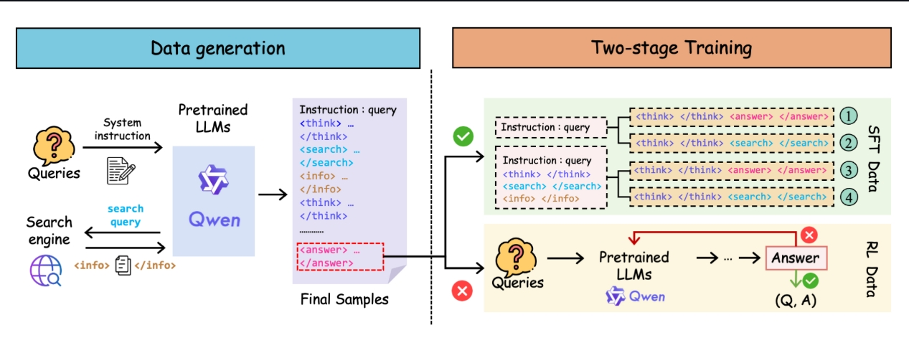
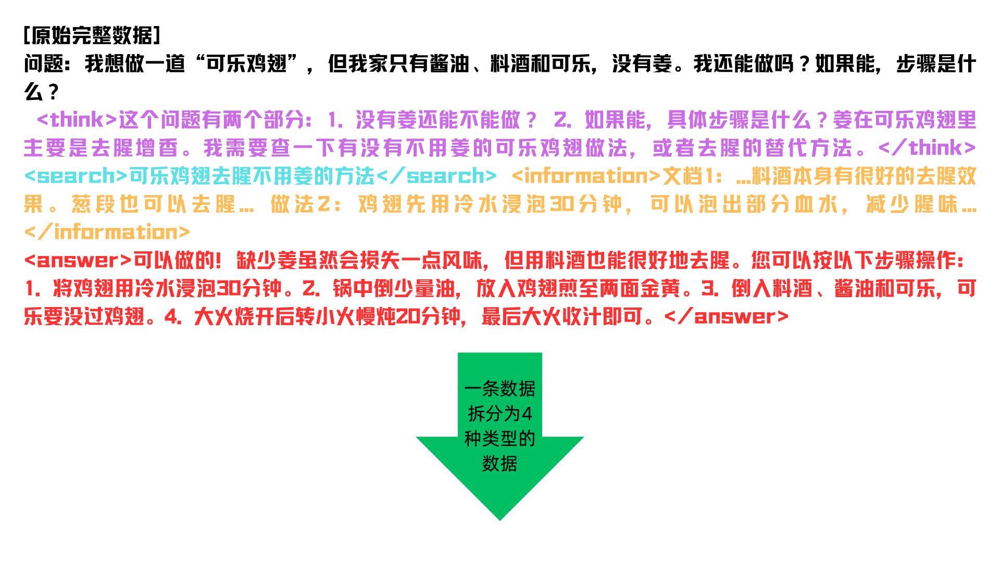
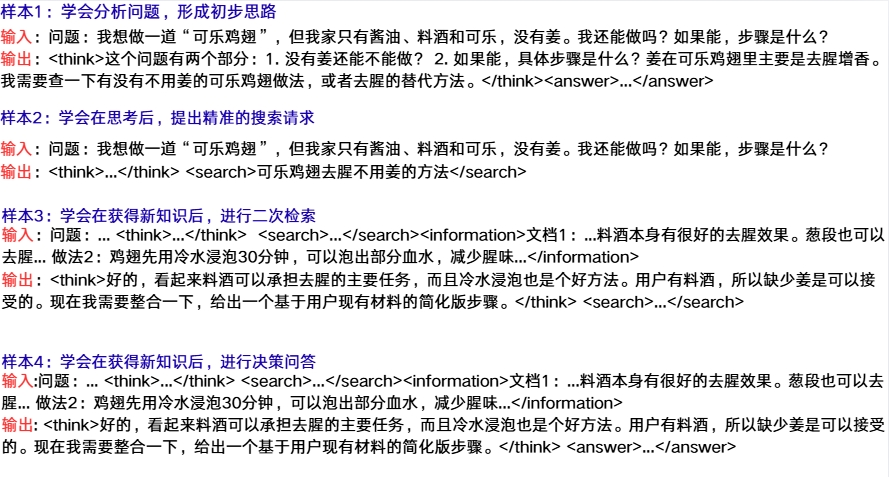
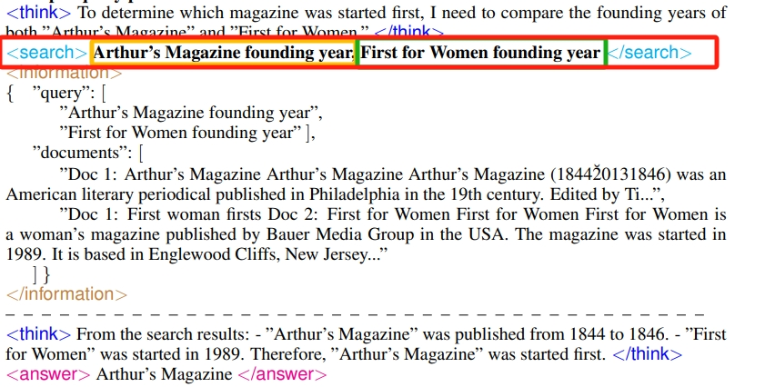
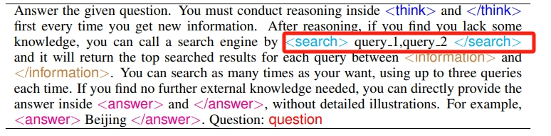
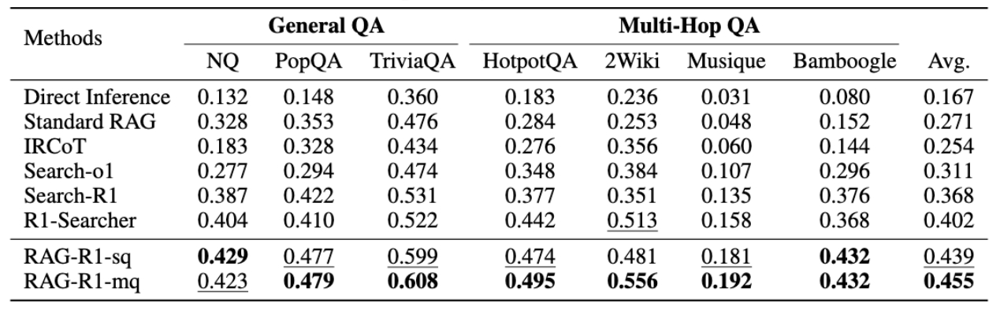
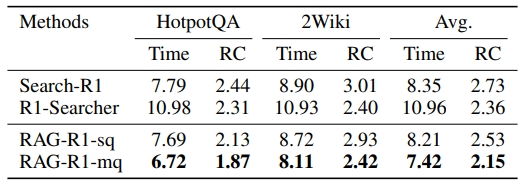
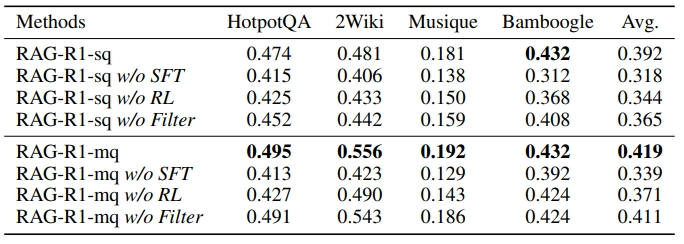

# RAG-R1 : INCENTIVIZE THE SEARCH AND REASONING CAPABILITIES OF LLMS THROUGH MULTI-QUERY PARALLELISM

- **Authors**: Zhiwen Tan, Jiaming Huang, Qintong Wu, Hongxuan Zhang, Chenyi Zhuang, Jinjie Gu
- **Venue & Year**: arXiv,2025
- **URL / DOI**: https://arxiv.org/abs/2507.02962v2 

---

## 1. 动机

`   `现有的高级RAG方法，特别是那些使用RL来增强搜索和推理能力的方法，通常采用迭代式的“单查询”模式。这种模式在处理多跳复杂问题时，需要多次检索，导致推理延迟高；同时，每一步只能获取有限信息，限制了模型的推理深度。因此，开发一种既能高效检索又能进行深度推理的框架至关重要。

## 2. 核心贡献

- 提出了一个名为 RAG-R1 的两阶段训练框架，使LLM能够自适应地利用内部和外部知识进行推理，并正确回答问题。
- 将框架内的检索生成过程从单查询模式扩展到**多查询并行模式**，有效减少了检索轮次和模型推理时间，同时通过获取更丰富的信息来提升性能。
- 在七个问答基准数据集上进行了广泛实验，证明了该方法的有效性。与最强的基线模型相比，性能提升高达13.2%，推理时间减少了11.1%。

## 3. 方法论

- **模型、算法概述**
   `   `RAG-R1 采用一个两阶段的训练框架（SFT + RL）来激励模型的搜索与推理能力。
  
  * **格式学习SFT**: 
   `   `让模型学会一种“先思考，后搜索 ”的响应格式。首先，使用强大的教师模型（Qwen2.5-72B-Instruct）生成包含思考链和搜索动作（由`<think>`、`<search>`等特殊token包裹）的高质量样本。
 `   `然后，将这些样本进行切分4类，将这4类样本扔给模型训练，训练模型在特定格式下自适应地利用内部知识（直接回答）或外部知识（生成搜索查询）。这一步为后续的RL阶段提供了一个稳定且能力强大的冷启动模型。这4类数据拆分的例子如下所示：

   * **重要拓展**--**多查询并行机制** `   ` 在推理时，模型被引导一次性生成多个（最多3个）相关的搜索查询。这些查询被并行发送到搜索引擎，检索到的文档以JSON格式返回给模型。这使得模型在单次交互中就能获得更全面、更多样化的信息，从而减少了检索的总轮次。
    
    `   `让模型适应这种拓展，除了训练数据的扩充，提示词也要有所改变
    

  * **检索增强强化学习**
   `   `这个阶段使用基于结果的强化学习（PPO）来进一步优化SFT阶段得到的模型。通过精心筛选出对模型**有挑战性但又可回答的问题**进行训练，并使用简单的基于规则的奖励函数（答案的精确匹配EM）来指导优化，从而增强模型的推理能力和动态检索外部知识的决策能力。为了训练稳定，优化时会通过掩码（Masked Loss）忽略掉从外部检索到的文本内容，只在模型自己生成的token上计算损失。
   `   `**有挑战性但又可回答的问题解释**：筛选出SFT阶段生成错误答案的样本（代表有挑战性），随后，过滤掉那些由于数据检索不完整或模型能力限制而本身无法回答的样本，具体来说，对 Qwen2.5-72B-Instruct 进行随机采样（采样温度1.2，最大检索次数10），对每个问题进行最多10次rollout，并只保留那些至少包含一个正确解的样本（代表能够回答），此外，还随机抽取了SFT阶段生成的正确回答样本

- **关键公式**:
    - **RL 目标函数**:
      $$ \max_{\pi_\theta} E_{x \sim D, y \sim \pi_\theta(\cdot|x; R)}[r_\phi(x, y)] - \beta D_{KL}[\pi_\theta(y|x; R) || \pi_{ref}(y|x; R)] $$
      其中，`πθ`是策略模型，`πref`是参考模型（均从SFT模型初始化），`rφ(x, y)`是奖励函数，`DKL`是KL散度，`β`是控制KL惩罚的系数。该公式旨在最大化预期奖励，同时约束策略模型不过于偏离初始的参考模型。
    - **奖励函数**:
      $$ r_\phi(x, y) = \text{EM}(a_{pre}, a_{gold}) $$
      奖励函数直接计算模型预测答案`apre`与标准答案`agold`之间的精确匹配（Exact Match, EM）度。这种基于规则的奖励简单有效，避免了使用神经奖励模型可能带来的“奖励作弊”问题。

    

## 4. 实验与数据

- **数据集 & 任务设置**:
    
    - **数据集**: 共7个基准数据集，分为两类：
        1.  **通用问答**: NQ (Natural Questions), TriviaQA, PopQA.
        2.  **多跳问答**: HotpotQA, 2Wiki-MultiHopQA, Musique, Bamboogle.
    - **训练数据**: 利用部分HotpotQA训练集进行SFT和RL训练，其他数据集用于评估模型的泛化能力（out-of-domain）。

- **对比方法 & 评价指标**:
    - **对比方法**:
        1.  **Naive Generation**: LLM直接生成答案，不进行检索。
        2.  **Standard RAG**: 传统的检索增强生成。
        3.  **RAG-CoT Methods**: 结合思维链的RAG方法，如IRCOT, Search-01。
        4.  **RAG-RL Methods**: 结合强化学习的RAG方法，如Search-R1, R1-Searcher。
    - **评价指标 (Metrics)**: 精确匹配

## 5. 实验结果

- **性能指标对比表**:
     
     `   `根据上表，**RAG-R1-mq**（多查询并行版本）在所有7个数据集上的平均EM得分达到0.455，显著优于所有基线方法。相较于最强的基线模型 R1-Searcher (EM 0.402)，平均性能提升了13.2%。
     即使是单查询版本的 **RAG-R1-sq** (EM 0.439)，其性能也超越了所有之前的基线模型。
     
    `   `根据上表，**RAG-R1-mq** 在推理效率上表现最佳，其平均推理时间和平均检索次数（RC）均为最低。例如，在HotpotQA上，其平均推理时间为6.72秒，检索次数为1.87次，均低于所有对比方法。

- **消融研究要点**:
 
    - **SFT 和 RL 的必要性**: 上表的消融实验表明，移除SFT阶段（`w/o SFT`）会导致性能大幅下降（平均EM从0.419降至0.339），证明SFT对于教会模型基本格式和能力至关重要。移除RL阶段（`w/o RL`）同样导致性能下降，证明RL对于提升模型的推理能力是有效的。
    - **RL 数据筛选的有效性**: 移除RL数据筛选步骤（`w/o Filter`），即使用所有未能正确回答的问题进行训练，会导致性能下降。这表明精心筛选有挑战性且可回答的问题进行RL训练，对于模型的有效提升至关重要。

## 6. 优势分析

- **性能卓越**:
     在多个QA基准上取得了当前最佳性能，尤其在需要复杂推理的多跳问答任务上。
- **高效推理**: 多查询并行机制显著降低了推理延迟和检索API调用次数，使其在实际应用中更具可行性。
- **训练框架稳定**: “SFT+RL”的两阶段范式，通过SFT提供一个高质量的冷启动模型，有效缓解了直接使用RL训练LLM时常见的不稳定问题。
    

## 7. 个人思考

- **不知是否可行的疑惑**:
    
     `   `当前的奖励函数只关注最终答案的正确性（EM），是否可以设计更细粒度的奖励，比如对推理步骤的合理性或检索查询的有效性进行奖励，以更好地指导模型学习？

- **可能的改进方向**:
    
    **查询后反思与重写**:
     `   `在多查询并行检索后，增加一个“反思”步骤。模型可以评估返回信息的全面性和一致性，如果发现信息不足或存在冲突，可以主动重写或生成新的查询进行补充检索，形成一个“并行检索-反思-再检索”的闭环。当然啦，这样token使用量应该会暴涨🤓。

## 8. 本论文分类Tag（个人观点）

- RAG, RL, 大模型推理,模型内外部知识
## 9. 本论文笔记知乎链接
* 敬请期待
