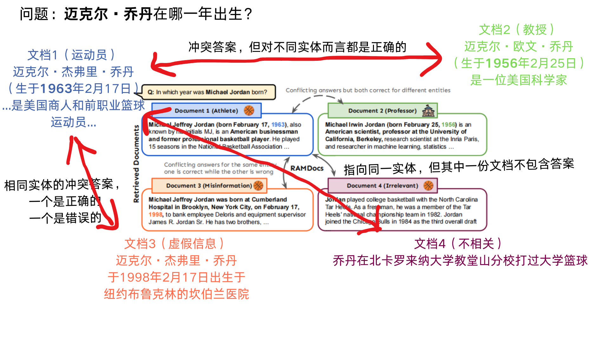

# Retrieval-Augmented Generation with Conflicting Evidence 

- **Authors**: Han Wang, Archiki Prasad, Elias Stengel-Eskin, Mohit Bansal
- **Venue & Year**: arXiv, 2025
- **URL / DOI**: https://arxiv.org/abs/2504.13079
  

---

## 1. 摘要与动机

- **研究问题**
    `   `如何在单一系统内同时处理RAG中因查询歧义、噪声及错误信息导致的多源冲突证据，并给出恰当响应（既展示所有正确解，又抑制错误信息）
- **背景与意义**
   `   `RAG通过引入外部知识来提升大型语言模型（LLM）的真实性，但现实中检索到的信息常常是不可靠的。以往的研究通常孤立地处理某一种挑战，例如，只关注如何处理歧义性查询（存在多个正确答案），或只关注如何过滤噪声和错误信息（只存在一个正确答案）。
   `   `然而，实际应用中的RAG系统需要面对这些问题的混合体，并且必须学会权衡：何时应为歧义性问题呈现多个有效答案，何时应果断地滤除错误和无关信息。解决这一混合冲突问题对于构建更可靠的RAG系统至关重要。
  

## 2. 核心贡献

- 提出了 **RAMDocs** (Retrieval with Ambiguity and Misinformation in Documents) 数据集，这是一个新的评测基准，它模拟了RAG在真实世界中面临的复杂场景，即单个查询同时关联到由歧义、错误信息和噪声文档所构成的混合冲突证据。
- 提出了 **MADAM-RAG** (Multi-agent Debate for Ambiguity and Misinformation in RAG)，一个新颖的多智能体辩论框架。该框架能统一处理多种来源的信息冲突，通过让代表不同文档的智能体进行多轮辩论，来区分合法的歧义和需要被抑制的错误信息。
- 通过在现有基准（AmbigDocs, FaithEval）和新提出的RAMDocs上进行的实验，证明了MADAM-RAG相较于强大的基线模型（如Astute RAG）有显著的性能提升。

其中，RAMDocs一个数据样本包含以下字段：

*   **`question`**: 用户的提问字符串。

*   **`documents` (列表)**: 检索到的文档池，每份文档包含：
    *   **`text`**: 文档原始内容。
    *   **`type`**: 文档类型标签，三选一：
        *   `correct`: 含正确答案。
        *   `misinfo`: 含错误信息。
        *   `noise`: 不含答案（噪声）。
    *   **`answer`**: 从文档中能推断出的具体答案。若是`noise`类型，则为`unknown`。

*   **`disambig_entity` (列表)**: 问题中歧义名称指向的所有实体列表。

*   **`gold_answers` (列表)**: 所有正确的标准答案。

*   **`wrong_answers` (列表)**: 所有由`misinfo`文档引入的错误答案。

## 3. 方法论

- **模型方法概述**
   `   `MADAM-RAG是一个结构化的多智能体框架，它的核心思想是“分而治之”和“集体辩论”。它不将所有检索到的文档粗暴地拼接在一起，而是为每个文档分配一个独立的LLM智能体。这些智能体首先独立地根据自己的文档形成初步判断。随后，它们进入一个多轮辩论过程：一个中心“聚合器”（Aggregator）负责总结所有智能体的观点，并将总结反馈给所有智能体。智能体们根据全局反馈和自己的“证据”（即所持有的文档）来捍卫、挑战或修正观点。 `   `这个迭代过程让系统能够自然地分辨出两种观点：第一种是有坚实证据支持的不同观点（就是用户的问题有歧义，正确答案有多个），会被保留下来；第二种是源于错误信息、在辩论中站不住脚的观点则会被识别并摒弃。
  

- **流程详解** 
   `   `整个流程可以分为以下几个模块：
  1.  **文档分配**: 系统接收到一个查询（如“迈克尔·乔丹在哪一年出生？”）和一组检索到的文档。这些文档可能包含：关于篮球运动员乔丹的正确信息（Doc 1），关于同名科学家的正确信息（Doc 2，歧义），关于篮球运动员的错误信息（Doc 3，错误信息），以及不相关的信息（Doc 4，噪声）。每个文档被分配给一个独立的智能体（Agent 1-4）。
  2.  **独立分析**: 每个智能体独立分析其文档并生成初始回答。例如，Agent 1 回答 "1963"，Agent 2 回答 "1956"，Agent 3 回答 "1998"，Agent 4 表示信息未知。
  3.  **多轮辩论与聚合**:
      - **聚合器**收集所有回答，并进行综合分析，形成一个全局视角（例如，“Agent 1和2的回答冲突，但似乎指向不同的人。Agent 3的回答与常识不符”）。
      - 这个全局视角被反馈给所有智能体。
      - 智能体们进行**修正**。例如，Agent 2在辩论中会强调它的信息源是关于一位科学家的，从而帮助聚合器理解这是合法的歧义。Agent 3的观点由于缺乏支持且与其他可靠信息源（如Agent 1）冲突，其可信度会降低。Agent 4会坚持认为其文档无关。
      
  4.  **最终输出**: - 辩论进行固定的 `T` 轮，或当所有智能体的回答不再变化时提前停止。最终答案由聚合器在最后一轮生成如：“篮球运动员Michael Jeffrey Jordan出生于1963年，而科学家Michael Irwin Jordan出生于1956年”，同时成功过滤掉了错误信息和噪声。

## 4. 实验与数据 

- **评测数据集**:
  
    1.  **FaithEval**: 用于评估模型在面对包含错误信息（事实扰动）的文档时，是否能保持对证据的忠实性。
    2.  **AmbigDocs**: 用于评估模型处理歧义性查询的能力，即一个问题有多个不同但都有效的答案。
    3.  **RAMDocs (论文提出)**: 一个更复杂的混合场景数据集，每个查询的文档池中同时包含歧义、错误信息和噪声。
  

- **对比方法 & 评价指标**:
  - **与之对比的方法**:
    1.  **No RAG**: 不使用任何检索文档，仅依赖模型的参数化知识。
    2.  **Concatenated-prompt**: 标准的RAG方法，将所有检索到的文档拼接起来作为上下文输入。
    3.  **Astute RAG**: 一种先进的RAG方法，它会先聚类文档，并结合模型的参数化知识来解决冲突。
  - **评价指标**:
    - **严格精确匹配 (Strict Exact Match)**: 只有当模型生成的答案**完整包含所有**正确答案，并且**不包含任何**由错误信息文档支持的错误答案时，才算正确。

## 5. 实验结果

- **性能指标对比表**:
  
  - MADAM-RAG在所有三个数据集（FaithEval, AmbigDocs, RAMDocs）和所有使用的LLM（Llama3.3-70B-Inst, Qwen2.5-72B-Inst, GPT-4o-mini）上，均一致且显著地优于所有基线方法。
  - 在处理歧义的AmbigDocs数据集上，使用Llama3.3-70B-Inst的MADAM-RAG比强基线Astute RAG的准确率高出11.40%。
  - 在处理错误信息的FaithEval数据集上，其性能提升同样显著，例如使用Qwen2.5-72B-Inst时高出13.10%。
  - 实验结果同时表明，RAMDocs是一个极具挑战性的数据集，所有模型的性能都显著下降，表现最好的MADAM-RAG（Llama3.3-70B）也仅取得了34.40%的准确率。

- **消融研究要点**
  
  **评估指标**
   `   `准确率 (Accuracy): 最严格的指标，要求找出所有正确答案，且不能包含任何错误答案。
   `   `精确率 (Precision): 在你给出的所有答案中，有多少是正确的。这个指标衡量的是**不犯错**的能力。
   `   `召回率 (Recall): 在所有应该给出的正确答案中，找出了多少。这个指标衡量的是**不遗漏**的能力。
   `   `F1分数 (F1 Score): 精确率和召回率的调和平均数，综合衡量整体表现。
   `   `其中，蓝色线代表有聚合器，橙色线代表无聚合器，横轴代表辩论的轮数
  - **聚合器和多轮辩论的重要性**: 消融实验证明，聚合器和多轮辩论机制都至关重要。
    1.  **聚合器**: 移除聚合器（仅简单拼接各智能体回答）会导致性能大幅下降。聚合器在综合证据、抑制错误信息方面起到了关键作用，能显著提升回答的精确度。
    2.  **多轮辩论**: 将辩论轮数从1增加到3，性能持续提升。这表明迭代式的反思和修正过程能有效帮助智能体们发现并纠正错误，最终收敛到更可靠的答案。
    3. 有意思的是，聚合器实现了“精确率-可靠性”的权衡，优先保证不犯错。聚合器会略微降低召回率，但显著提升精确率。这意味着聚合器非常谨慎。在面对冲突信息时，如果它不能100%确定一个答案是正确的，它宁愿**不回答**（导致召回率下降），也绝**不回答错**（从而保证精确率很高）

## 6. 优缺点分析 

- **优势**:
  - **多智能体协同**: 提出了同时解决RAG中歧义、错误信息和噪声混合冲突的统一框架。
  - **性能卓越**: 在多个基准上显著超越了现有的先进方法，特别是在处理复杂和混合冲突场景时。
  - **可解释性**: 多智能体辩论的过程为模型的决策提供了清晰的轨迹，有助于理解模型是如何权衡不同证据并得出结论的。

- **局限性**:
  - **性能仍有很大提升空间**: 尽管性能提升显著，但在最具挑战性的RAMDocs数据集上，最佳模型的绝对准确率（34.4%）仍然较低，表明该问题远未被完全解决。
  - **计算成本高**: 多智能体、多轮次的框架意味着需要进行多次LLM调用（每个智能体每轮一次，聚合器每轮一次），其计算开销和延迟远高于单次推理的RAG模型。
  - **可扩展性问题**: 论文未明确提及，但可能存在。当检索到的文档数量非常多时，“一文档一智能体”的策略可能会导致智能体数量过多，使得辩论过程变得难以管理且成本高昂。

## 7. 个人思考 

- **可能的改进方向**
 `   `引入一个预处理步骤，先对检索到的文档进行快速聚类，将观点相似的文档分配给同一个智能体，从而减少智能体的总数，提高框架的可扩展性和效率。
 `   `可以设计更智能的辩论流程，例如，引入置信度分数。让高置信度的智能体“休战”，而让观点冲突或低置信度的智能体继续辩论，从而优化计算资源的分配。但是这个置信度让模型自己给的话，感觉不妥啊
    

## 8. 本论文分类Tag（个人观点）

-  RAG, 多智能体系统, 冲突信息
  
## 9. 本论文笔记知乎链接
* https://zhuanlan.zhihu.com/p/1936465311260979335

