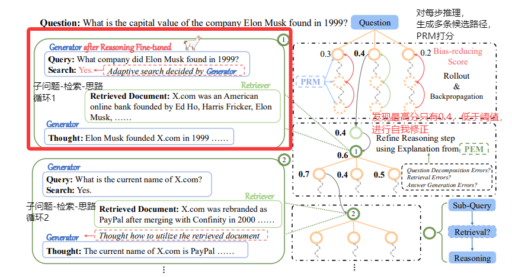
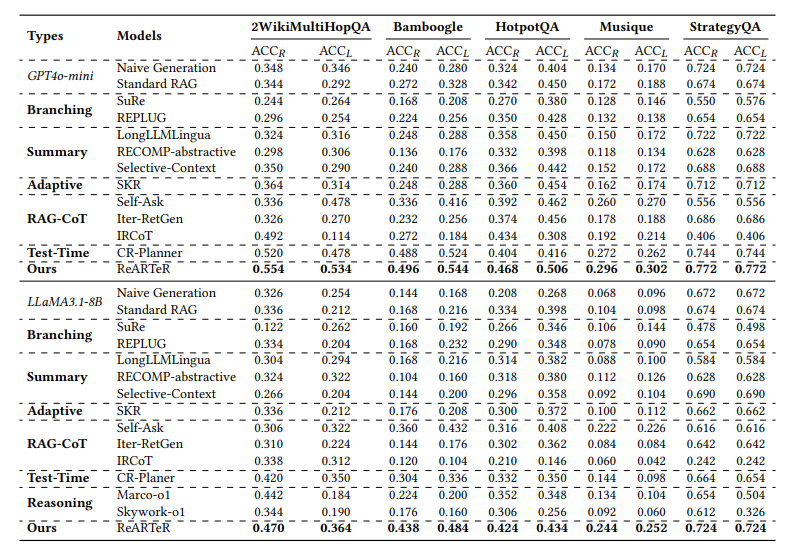
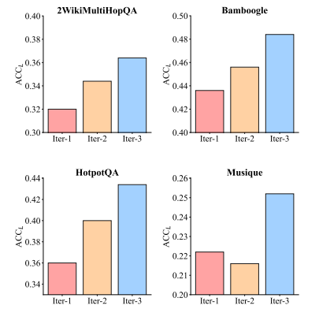
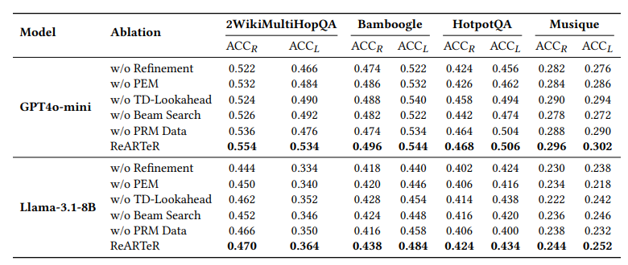

# ReARTeR: Retrieval-Augmented Reasoning with Trustworthy Process Rewarding
ReARTeR: 检索增强推理新框架
- **Authors**: Zhongxiang Sun, Qipeng Wang, Weijie Yu, Xiaoxue Zang, Kai Zheng, Jun Xu, Xiao Zhang, Yang Song, Han Li
- **Venue & Year**: arXiv, 2025 
- **URL / DOI**: https://arxiv.org/abs/2501.07861

---

## 1. 动机

- **研究问题**  `   `解决当前RAG系统在处理复杂、多步推理任务时能力有限的核心问题，特别是如何克服推理过程中存在的不可信挑战。
- **背景与意义**  `   `尽管RAG在知识密集型任务中表现出色，但其推理链的生成过程仍面临诸多挑战：1) 过程奖励模型（PRM）缺乏解释性；2) PRM训练数据存在严重偏见（如高分样本过多）；3) PRM对推理链早期步骤的评分不准（早期步骤偏见）；4) 模型缺乏针对推理能力的训练后优化。

## 2. 核心贡献

- **提出了 ReARTeR 框架**：将“测试时扩展”与“训练后优化”相结合，系统性地提升RAG系统的多步推理能力。
- **设计了可信过程奖励机制**：引入过程奖励模型（PRM）进行精确评分，并辅以过程解释模型（PEM）提供可解释的自然语言反馈，实现了既准确又可信的推理引导。
- **解决了三大核心挑战**：通过创新的方法有效解决了PRM训练数据偏见、早期步骤偏见以及PRM与PEM不对齐的问题，显著提升了奖励信号的可靠性。
- **验证了方法的有效性与普适性**：在多个标准多步推理数据集上进行了广泛实验，证明了ReARTeR框架在闭源（GPT4o-mini）和开源（LLaMA3.1-8B）模型上均能取得显著的性能提升。

## 3. 方法论

- **核心概述**：ReARTeR的核心是一个双轨增强框架。**在测试时（实时推理）**，它通过PRM对多条候选推理路径进行评分，并利用PEM对低分路径生成解释，引导模型进行自我精炼，从而动态修正错误。**在训练后（离线优化）**，它利用由PRM和PEM引导的蒙特卡洛树搜索（MCTS）收集高质量的步骤级偏好数据，并通过迭代式偏好优化（KTO Loss）对RAG模型进行微调，从根本上增强其推理能力。

- **关键组件训练流程**:
   - 过程奖励模型 (PRM) 的训练与优化  `   `
PRM的目标是为每一个中间推理步骤提供一个精确的标量分数，以预测该步骤导向最终正确答案的概率。但是传统训练方法有局限性。

     - **无偏见训练数据的自动化收集**  `   `
为解决传统蒙特卡洛方法导致的训练数据偏见问题（即样本得分倾向于极高或极低），论文提出了一种分阶段、策略性的数据标注流程：
       -  **初始评估**: 对任一推理步骤，通过执行N次独立的蒙特卡洛模拟（Rollouts）生成N个最终答案，并计算其平均正确率，得到一个蒙特卡洛分数（MC Score）。
       - **样本筛选与精细化标注**:
      `   `对于信息量有限的样本（MC Score = 1 或 0），直接予以丢弃，以避免数据分布失衡。
      `   `对于最具信息量的样本（0 < MC Score < 1），采用**二分查找策略**来高效定位推理链中的**首个错误步骤**。该错误步骤前的所有步骤被标记为正样本，而该错误步骤本身则被标记为负样本。
      `   `对于模型难以处理的困难样本（初始MC Score = 0），使用**更强大的“教师”生成器**（GPT-4o）来生成一条高质量的参考路径，再对该路径进行标注。这为模型学习困难场景下的正确推理提供了必要的监督信号。

     - **减少早期步骤偏见**  `   `
PRM在评估推理链早期步骤时准确性较低，因其不确定性更高。为解决此“早期步骤偏见”，论文引入了一种**基于时序差分（TD）的展望搜索策略**：
        -   在评估一个早期步骤时，模型会向前模拟性地推演H步。
        -   利用这些未来步骤的预期奖励值来修正当前步骤的评分，从而引入一种前瞻性的价值判断，有效平衡了评估中的偏见与方差。

     - **模型训练**  `   `
收集到的高质量数据被用于微调一个预训练的奖励模型。将MC Score转化为二元标签（以0.5为阈值），并用**交叉熵损失函数**进行监督学习，最终得到一个可靠的PRM。

  - 过程解释模型 (PEM) 的对齐与训练
   `   `PEM旨在为PRM给出的低分步骤生成可解释的、结构化的自然语言反馈，以指导模型的自我修正。核心挑战在于确保其解释与PRM的价值判断标准相一致。
    - **通过离策略偏好学习实现对齐**
      -  **生成与修正**: 对于一个低分步骤，首先由PEM生成一个解释，然后RAG模型根据该解释进行自我修正，得到一个新步骤。
      -  **价值评估**: PRM对修正前后的两个步骤分别进行评分。
      -  **偏好数据生成**: 如果修正后的步骤分数更高，则该解释被视为一个**正偏好样本**；反之，则为**负偏好样本**。
      -  **模型优化**: 利用这些生成的偏好数据，通过**KTO 损失函数**来微调PEM。

  - 训练后优化：步骤级离线强化学习
   `   `通过迭代式学习，从根本上提升一个较弱RAG模型的内在推理能力。

    - **预热阶段**
首先，使用一个教师模型生成一批高质量的完整推理示范，对学生模型进行初步的监督微调。为后续的强化学习提供了一个更高质量的初始策略。
    - **迭代式强化学习阶段**
  `   `通过一个“数据收集-模型优化”的循环来持续提升模型性能：
      -  **高质量数据收集**: 采用**MCTS**来探索广阔的推理空间。至关重要的是，MCTS的每一步探索和评估都由前述**已训练好的、可信的PRM和PEM共同引导**。这确保了收集到的不仅是最终结果的奖励，更是高质量、步骤级别的偏好数据（即在特定状态下，哪一步是更优的选择）。
      -  **模型迭代优化**: 将MCTS收集到的步骤级偏好数据，通过KTO损失函数来更新“学生”模型的策略。
      -  **循环提升**: 经过优化的模型策略变得更强，在下一轮的数据收集中便能探索出更优的推理路径，从而形成一个持续自我改进的良性循环，直至模型性能收敛。
    

- **流程说明**：
    ReARTeR的完整工作流程
    
    - **左侧：推理步骤的执行**
  这部分展示了RAG模型如何生成一个具体的推理步骤。
      1.  **子问题生成 (Sub-Query)**：模型首先将复杂问题分解为一个可操作的子问题，例如“埃隆·马斯克在1999年创立了什么公司？”。
      2.  **自适应检索 (Adaptive Retrieval)**：模型动态决定是否需要进行检索。如果需要（`Search: Yes`），则调用检索器获取外部知识。
      3.  **思路生成 (Thought)**：模型整合上下文和检索到的信息，生成一个推理思路，例如“埃隆·马斯克在1999年创立了X.com”。
  这个“子问题-检索-思路”的循环构成了推理链中的一步，然后模型会继续分解下一个子问题，例如“X.com现在的名字是什么？”，从而形成一个完整的思维链。
  
  - **右侧：测试时搜索与精炼**
    这部分是ReARTeR的核心创新，展示了PRM和PEM如何协同工作。
    1.  **多路径探索与PRM评分**：对于每一步推理，模型会生成多个候选路径。PRM会为每个候选路径打分（如图中0.3, 0.4, 0.2等分数）。
    2.  **低分路径的识别**：当最优路径的分数（例如0.4）仍然低于阈值时，系统判定这一步可能存在问题。
    3.  **PEM激活与解释生成**：此时，PEM被激活，针对这个低分步骤生成  具体的错误分析，如图中所示的“问题分解错误？检索错误？答案生成错误？”等自然语言解释。
    4.  **反馈与精炼**：RAG模型接收到PEM的解释后，进行自我修正，生成一个更高质量的推理步骤。

## 4. 实验与数据 

- **评估数据集**：
     HotpotQA, 2WikiMultiHopQA, Musique, Bamboogle, StrategyQA。这些都是需要进行多步推理才能回答的复杂问答数据集。
    
- **对比方法 & 评价指标**：
    - **对比方法**: 包括标准RAG、分支方法（SuRe, REPLUG）、摘要方法（LongLLMLingua）、自适应检索（SKR）、RAG-CoT方法（Self-Ask）以及最新的测试时扩展方法（CR-Planner）和强大的开源推理模型（Marco-01, Skywork-01）。
    - **评价指标**: `ACCR` (判断答案是否被包含在生成答案中) 和 `ACCL` (使用LLM-as-Judge，即GPT-4o来判断答案的正确性)。

## 5. 实验结果

- **性能指标对比表**：
  
    - 在所有五个数据集上，无论使用GPT4o-mini还是LLaMA3.1-8B作为生成器，ReARTeR的性能均显著优于所有基线方法。例如，在使用GPT4o-mini时，ReARTeR在StrategyQA数据集上将ACCL从最强基线CR-Planner的0.744提升至0.772。
  
    - 训练后优化效果显著：经过3轮迭代优化的LLaMA3.1-8B模型，在所有数据集上的性能都得到了持续且稳定的提升。
- **消融研究要点**：
  
    - **所有组件均不可或缺**：移除ReARTeR的任何一个关键组件（如Refinement阶段、PEM、TD-Lookahead、无偏PRM数据收集、Beam Search）都会导致性能显著下降，证明了框架设计的完整性和各部分的必要性。
    - **无偏数据收集至关重要**：使用传统蒙特卡洛方法收集的数据训练出的PRM，其性能远不如使用ReARTeR提出的无偏数据收集策略训练出的PRM。
    - **PEM解释的价值**：直接使用PRM分数进行反馈的效果不如使用PEM生成的自然语言解释，证明了可解释性对于有效引导模型修正错误的重要性。

## 6. 优缺点分析 

- **优势**：
    - **创新性与系统性**：系统性地结合了测试时和训练后两个阶段来增强RAG推理，并专门设计了一套解决不可信问题的完整方案。
    - **可解释性强**：引入PEM使得推理的修正过程不再那么黑盒，为理解和调试模型的推理错误提供了可能。
    - **数据质量高**：通过精巧的自动化数据标注策略，有效解决了传统方法的数据偏见问题，为训练可靠的奖励模型提供了坚实基础。
- **局限性**：
    - **计算成本较高**：无论是测试时的多路径搜索与精炼，还是训练后的MCTS数据收集与迭代优化，都引入了显著的计算开销。
    - **组件依赖性**：框架的整体性能高度依赖于PRM和PEM的质量，这两个辅助模型的训练本身就是一个复杂的工程。
    - **可扩展性待验证**：论文中提到由于资源限制，未在更大规模的数据集或更多的迭代次数上验证其可扩展性。

## 8. 标签

- **标签**：RAG, 多步推理, PRM, 强化学习, PEM , 可解释性
## 9. 本论文笔记知乎链接
* 敬请期待
