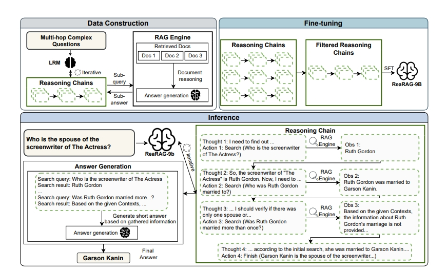
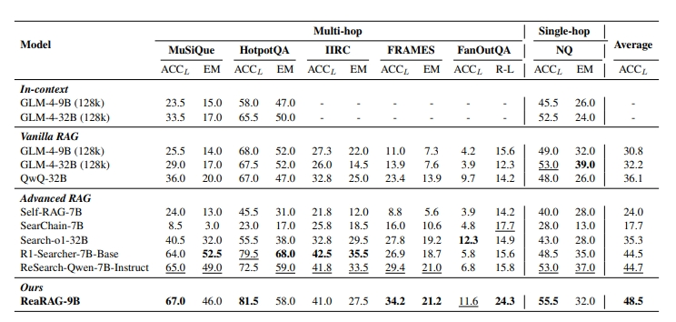
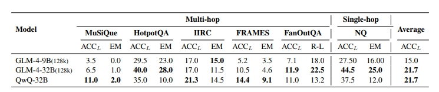
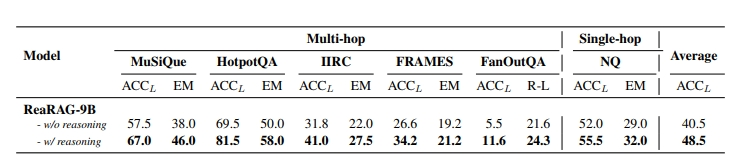
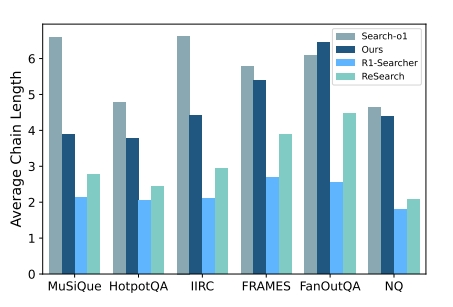

# ReaRAG: Knowledge-guided Reasoning Enhances Factuality of Large Reasoning Models with Iterative Retrieval Augmented Generation

- **Authors**: Zhicheng Lee¹, Shulin Cao¹, Jinxin Liu¹, Jiajie Zhang¹, Weichuan Liu², Xiaoyin Che², Lei Hou¹, Juanzi Li¹
- **Venue & Year**: arXiv, 2025 
- **URL / DOI**: https://arxiv.org/abs/2503.21729v3

---

## 1. 动机

- **研究问题**  `   `如何在不依赖复杂强化学习训练的情况下，有效提升大型推理模型（LRMs）在处理事实性问答任务时的准确性，特别是解决其对外部知识的依赖和利用效率问题？

- **背景与意义**  `   `尽管大型推理模型（如o1, QwQ-32B）在推理任务上表现出色，但它们主要依赖于内部的参数化知识，这导致在需要外部事实依据的复杂（尤其是多跳）问答任务中，其事实准确性受到限制。现有的RAG方法虽然能引入外部知识，但面临着查询构建不准、错误传播以及与模型推理能力结合不佳等问题。一些基于RL的方法虽然有效，但训练过程复杂、资源消耗巨大，难以广泛应用。因此，研究一种更高效、轻量的方法来增强模型的事实性具有重要的学术和应用价值。

## 2. 核心贡献

- **提出了一种名为ReaRAG的新型RAG框架**，通过迭代的“思考-行动-观察”范式，将知识引导的推理与检索过程深度融合，显著提升了模型的事实性。
- **构建了一个高效的数据生成与微调流程**，通过“策略蒸馏”的方式，将一个强大推理模型（QwQ-32B）的复杂规划和推理能力迁移到一个较小的模型（GLM-4-9B）上，实现了在无需复杂RL训练的情况下达到甚至超越RL方法的性能。
- **在多个基准测试上验证了方法的有效性和稳健性**，ReaRAG在六个涵盖单跳和多跳的问答基准上取得了平均性能最佳，尤其在FRAMES和FanOutQA等更具挑战性的任务上优势明显。
- **深入分析了模型的行为**，揭示了ReaRAG具备强大的反思和自我纠错能力，能有效处理歧义和知识冲突，同时缓解了现有方法中常见的“过度思考”和冗余检索问题。

## 3. 方法论

- **模型方法概述**: ReaRAG的核心思想是将复杂的问答任务分解为一系列由规划、执行协同完成的步骤。
    1.  **规划与执行分离**：系统采用两个模型协同工作。一个较小的、经过微调的**ReaRAG模型 (GLM-4-9B)** 担任规划师，负责在每一步迭代中生成包含`Thought`（思考）和`Action`（行动，search、finish）的指令。另一个更强大的**答案LLM (GLM-4-32B)** ，在所有信息搜集完成后，整合所有证据并生成最终答案。
    2.  **迭代的思考-行动-观察循环**：ReaRAG模型遵循`Thought-Action-Observation`范式。它首先`Thought`分析当前状况，然后生成`Action`（如`search(query)`），系统执行该行动后返回一个`Observation`（检索结果），这个结果又成为下一步`Thought`的输入，如此循环直到模型决定调用`finish`行动。
    3.  **策略蒸馏微调**：为了让ReaRAG模型学会高质量的规划，使用了一个强大的教师模型（QwQ-32B）来生成高质量的推理链数据，然后用这些数据对学生模型（GLM-4-9B）进行SFT，从而将复杂的推理能力蒸馏过来。

- **整个项目关键伪代码**:

    -   **数据构建算法**:
        这个算法描述了如何自动化地生成用于微调ReaRAG模型的高质量推理链数据。
        1.  **输入**: 种子数据集 (包含问题和文档)、强大的LRM ($M_{LRM}$，即QwQ-32B)、指令提示 ($P_d$)、最大迭代次数 ($T_{max}$)、RAG引擎。
        2.  **过程**: 对于种子数据集中的每个问题 ($x_i$) 和文档 ($doc_i$)：
            -   初始化一个空的推理链 `Ci`。
            -   在一个循环中，ReaRAG模型 ($M_{LRM}$) 根据问题和当前的推理链，生成响应。
            -   从响应中解析出思考 ($T_t$) 和行动 ($a_t$)。
            -   **如果行动是 `finish`**: 将 `(T_t, a_t)` 加入 `Ci` 并结束当前问题的迭代。
            -   **如果行动是 `search`**: 从 `a_t` 中提取搜索查询 ($q_s$)，通过RAG引擎在 `doc_i` 上执行搜索，获取观察 ($o_t$)。然后将 `(T_t, a_t, o_t)` 加入 `Ci`。
            -   迭代直到达到 `finish` 行动或超过 `Tmax`。
        3.  **输出**: 包含所有构建好的推理链的数据集 ($D_{reason}$)。

    -   **推理算法**:
        该算法描述了ReaRAG模型在解决问答任务时的实际运行过程。
        1.  **输入**: 用户问题 ($x$)、文档 ($doc$)、ReaRAG模型 ($M_{ReaRAG}$，即微调后的GLM-4-9B)、答案LLM ($M_{Ans}$，即GLM-4-32B)、指令提示 ($P$)、答案提示 ($P_{ans}$)、最大迭代次数 ($T_{max}$)、RAG引擎。
        2.  **过程**:
            -   初始化空的推理链 `C` 和摘要链 `Sum`。
            -   在一个循环中，**ReaRAG模型 ($M_{ReaRAG}$)** 根据输入（提示$P$、问题$x$和当前的推理链$C$）生成当前步骤的响应。
            -   从响应中解析出思考 ($T_t$) 和行动 ($a_t$)。
            -   **如果行动是 `finish`**: 将之前累积的所有搜索查询和摘要结果 (`Sum`) 与原始问题和答案提示 ($P_{ans}$) 传递给**答案LLM ($M_{Ans}$)**，由其生成最终答案 ($ŷ$) 并返回。
            -   **如果行动是 `search`**: 从 `a_t` 中提取搜索查询 ($q_s$)，通过RAG引擎在 `doc` 上执行搜索，获取观察 ($o_t$)。然后将 `(T_t, a_t, o_t)` 加入推理链 `C`，并将搜索配对 `(q_s, o_t)` 加入摘要链 `Sum`。
            -   迭代直到达到 `finish` 行动或超过 `Tmax`。
        3.  **输出**: 最终答案 ($ŷ$)。

- **流程-模块说明**:
  
    - **数据构建阶段**:
        1.  从多跳复杂问题开始，利用一个强大的**LRM(老师模型)**在RAG引擎的辅助下，生成包含中间步骤（子查询、子答案）的迭代推理链。
        2.  这些生成的推理链经过**过滤**（例如，去除答案错误的数据），形成一个高质量的微调数据集。
    - **微调阶段**:
        1.  使用过滤后的数据集对一个基础模型进行监督微调（SFT），得到最终的**ReaRAG模型**。
    - **推理阶段**:
        1.  用户输入问题，**ReaRAG模型**开始迭代地生成`Thought`和`Action`。
        2.  `search`行动会调用**RAG引擎**，返回的`Observation`反馈给ReaRAG模型。
        3.  这个过程循环往复，直到ReaRAG模型生成`finish`行动。
        4.  最后，将所有检索到的信息汇总，由**答案LLM**生成最终答案。

## 4. 实验与数据

- **测试数据集**:
    
    - **多跳QA**: MuSiQue (MQ), HotpotQA (HP), IIRC, FRAMES, FanOutQA (FQ)。
    -   **单跳QA**: Natural Questions (NQ)。
    

- **对比方法 & 评价指标**:
    -   **对比方法 (Baselines)**:
        -   **上下文内检索**: GLM-4-9B/32B (128k context)。
        -   **Vanilla RAG**: GLM-4-9B/32B, QwQ-32B。
        -   **先进RAG**: Self-RAG, SearChain, Search-o1, R1-Searcher, ReSearch (涵盖了基于RL和非RL的SOTA方法)。
    -   **评价指标 (Metrics)**:
        -   **ACCL**: 基于GPT-4o的LLM-as-a-Judge指标，用于更准确地评估语义等效的答案。
        -   **EM (Exact Match)**: 精确匹配率。
        -   **ROUGE-L (R-L)**: 专用于FanOutQA数据集的指标。

## 5. 实验结果

- **性能指标对比表**:
  
    -   **ReaRAG-9B取得了最佳的综合性能**，其平均ACCL分数（48.5）在所有方法中最高。
    -   在MuSiQue, HotpotQA, IIRC, NQ等基准上，ReaRAG的性能与基于RL的SOTA方法（如ReSearch）相当或略优。
    -   在**更难的FRAMES和FanOutQA基准上，ReaRAG显著超越了所有基于RL的基线**，ACCL分别高出7.3%和5.8%，证明了其在复杂任务上的强大泛化能力。
    -   与强大的Search-o1（基于QwQ-32B）相比，ReaRAG性能也全面领先，显示出其方法的优越性。

- **消融研究要点**:
   
      **闭卷性能**：证明了即使是强大的LRM，在不访问外部知识的情况下，处理复杂多跳问题的能力也极其有限，凸显了RAG的必要性。
  
      **强推理能力的优势**：通过对比“使用强推理模型生成训练数据”和“使用弱推理模型生成训练数据”的两个版本，实验证明了性能的巨大提升（6-12% ACCL增益）主要归功于**从强大LRM中“蒸馏”出的高级推理和规划能力**，而不仅仅是`Thought-Action-Observation`框架本身。

## 6. 优缺点分析

- **优势**:
    1.  **性能卓越且高效**: 在不依赖复杂、昂贵的强化学习训练范式的情况下，达到了甚至超越了SOTA RL方法的性能，训练效率更高，实用性更强。
    2.  **强大的推理和纠错能力**: 模型不仅能规划复杂的检索步骤，还能在推理过程中进行反思，识别并纠正早期错误，处理知识冲突和歧义，鲁棒性强。
    3.  **缓解“过度思考”**: 与依赖强大LRM直接进行迭代检索的方法（如Search-o1）相比，ReaRAG的推理链更短、更有效率，避免了不必要的冗余检索。
   
    4.  **方法设计巧妙**: “策略蒸馏”和“规划-总结分离”的架构设计，成功地将大模型的复杂能力迁移到小模型上，兼顾了性能与效率。

- **局限性**:
    1.  **有限的行动空间**: 当前行动仅限于`search`和`finish`，无法执行代码、进行数学计算或实时Web搜索，限制了其应用场景。
    2.  **数据构建效率**: 依赖强大LRM生成高质量数据，但生成过程中会有大量无效数据被过滤掉，导致了一定的计算资源浪费。
    3.  **推理延迟**: 迭代式推理虽然提升了准确性，但也增加了端到端的推理时间，可能不适用于对延迟有严格要求的实时应用。

## 7. 个人思考

- **灵感 / 疑问**:
    -   “策略蒸馏”的思想非常具有启发性。既然可以蒸馏推理规划能力，是否可以蒸馏出更复杂的工具使用能力，比如让模型学会如何组合使用搜索、计算器、代码解释器等多种工具？
    -   论文中ReaRAG模型和答案LLM是分离的。这种分离式架构是否总是优于一个端到端优化的单一模型？在未来，当模型能力足够强时，这种分工是否还有必要？
    -   模型如何判断何时该“反思纠错”？这种自我修正的能力是隐式学到的还是有明确的机制引导？

- **可能的改进方向**:
    1.  **扩展行动空间与工具集**: 引入更丰富的工具（如代码解释器、计算器API），并让ReaRAG学习何时以及如何调用这些工具来解决更广泛类型的问题，而不仅仅是事实性问答。
    2.  **优化数据构建与训练**: 研究更高效的数据增强或自举（self-bootstrap）方法，减少对昂贵“老师”模型的依赖。例如，让模型从自己成功的推理轨迹中学习，或者设计一个奖励模型来指导数据筛选，替代简单的F1过滤。
    3.  **自适应推理深度**: 开发一种动态机制，让模型可以根据问题的复杂度和当前信息的置信度，自适应地决定需要多少轮迭代。对于简单问题，可以提前`finish`以减少延迟；对于复杂问题，则允许更深入的探索。

## 8. 标签

- **标签**: 检索增强生成 (RAG), 知识溯源, 大型推理模型 (LRMs), 迭代推理, 策略蒸馏, 多跳问答
