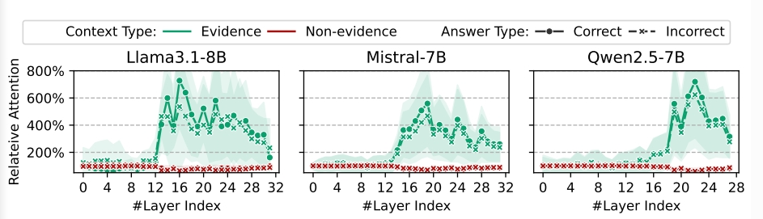
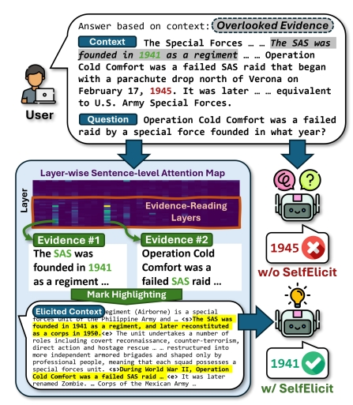
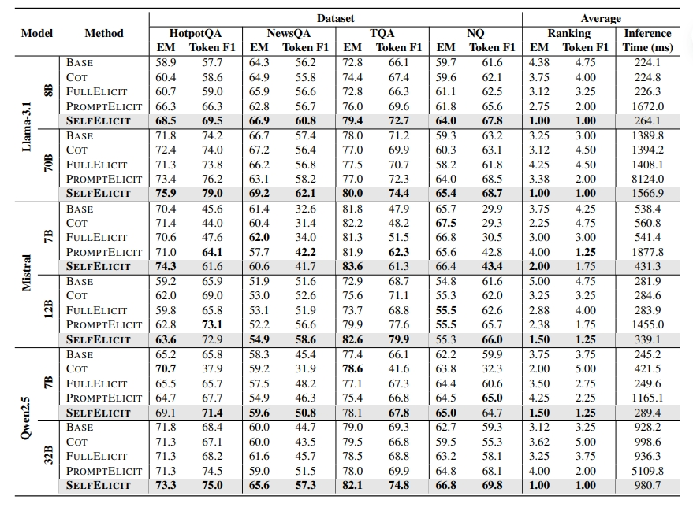
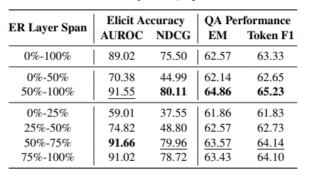
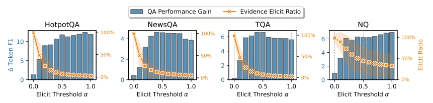
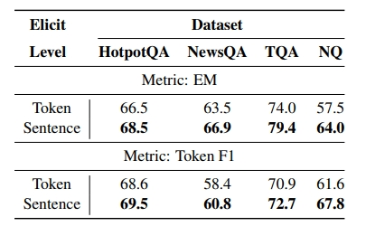
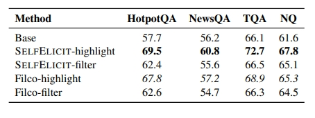
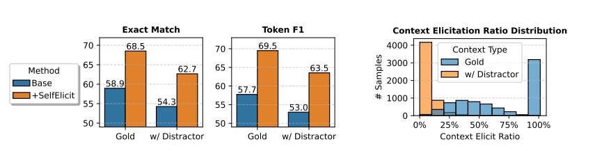
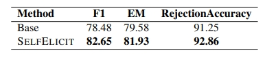

---

# SELFELICIT: Your Language Model Secretly Knows Where is the Relevant Evidence

- **Authors**: Zhining Liu¹, Rana Ali Amjad², Ravinarayana Adkathimar², Tianxin Wei¹, Hanghang Tong¹, et al.
- **Venue & Year**: arXiv, 2025 
- **URL / DOI**: https://arxiv.org/abs/2502.08767v2

---

## 1. 摘要与动机

- **研究问题**:
  `   `在处理包含大量噪声、干扰项或冗长信息的上下文时，模型往往难以有效利用其中的关键证据。那么，能否设计一种**无需额外训练、在推理时即可应用**的方法，通过利用模型**自身的内部信号**（特别是注意力分数），来自动定位并凸显这些关键证据，从而引导模型生成更准确、更有事实依据的回答？

- **背景与意义**
  `   `随着RAG发展，向模型提供外部知识已是常态。然而，学术界和工业界都发现了一个严峻的挑战：模型很容易被上下文中的无关信息“淹没”或“带偏”，即所谓的“上下文迷失”问题。这导致即使正确答案就在上下文中，模型也可能给出错误或基于幻觉的回答。
  `   `现有的解决方案存在明显不足：1) 简单的提示工程（如CoT）无法稳定提升模型对证据的利用能力；2) 训练一个专门的“证据过滤”模型（如Filco）成本高昂，且泛化能力有限；3) 将整个上下文同等对待，忽略了信息重要性的差异。
  `   `因此，开发一种**低成本、高效率、通用性强**的证据定位机制，对于提升RAG系统在真实世界（充满噪声）应用中的可靠性和可信度具有至关重要的意义。SELFELICIT正是为此而生，它试图从模型内部寻找解决方案，而非依赖外部工具。

## 2. 核心贡献

- **揭示并量化了LMs的内在证据发现能力**  `   `通过对多个主流模型家族（Llama, Mistral, Qwen）进行系统性的逐层注意力分析，发现了一个关键现象：无论模型最终回答正确与否，其**更深层次的网络层**都对上下文中的相关证据句子展现出显著更高的注意力。这表明模型“内心”其实是知道答案在哪的，只是在最终生成时未能有效利用。
  `   `就像下面这张图展示的一样

   - **X轴 (`#Layer Index`)**: 代表语言模型的**层数索引**。从左到右，表示从模型的输入层（第0层）到更深（更高）的层。
  - **Y轴 (`Relative Attention`)**: 代表**相对注意力**。这个值不是绝对的注意力分数，而是一个**比率**。它的计算方式是：**(特定类型文本的平均注意力) / (整个上下文的平均注意力)**。
  - 例如，Y值为600%意味着模型对该类型文本中每个词元（token）的关注度是其对整个上下文平均关注度的**6倍**。这个指标能有效消除不同模型或不同样本间注意力总量的差异，更纯粹地反映模型对特定信息的**偏好程度**。
  - **`Context Type` (上下文类型)**:
    - **绿色线 (`Evidence`)**: 代表上下文中被标注为**相关证据**的句子的相对注意力。
    - **红色线 (`Non-evidence`)**: 代表上下文中被标注为**无关信息**的句子的相对注意力。
  - **`Answer Type` (答案类型)**:
    - **实线+圆点 (Correct)**: 代表模型最终**回答正确**时，各层注意力的表现。
    - **虚线+叉号 (Incorrect)**: 代表模型最终**回答错误**时，各层注意力的表现。

  **发现一：模型能清晰地区分“证据”与“非证据”**

  - 在所有三个模型中，**绿色线（证据）始终远高于红色线（非证据）**。红色线基本贴近100%以下，意味着模型对无关信息的关注度低于或等于平均水平。而绿色线则在模型的某些层段急剧攀升，达到400%甚至接近800%，说明模型投入了数倍于平均水平的注意力在关键证据上。
  - **结论**: 这证明了语言模型内部的注意力机制**并非随机或平均分配**，而是具有**高度的选择性**。它能够有效识别并聚焦于上下文中那些对回答问题真正有用的信息。

  **发现二：证据的识别能力主要体现在“深层网络”**

  - 观察绿色线的走势，我们可以看到一个共同的模式：在模型的**浅层**（例如，Llama3.1-8B的0-12层），对证据的注意力并不突出，与非证据的差别不大。
  - 然而，当进入模型的**中层到深层**（例如，Llama3.1-8B的第13层之后），绿色线开始**急剧拉升**，形成一个或多个明显的峰值。
  - **结论**: 这揭示了模型内部的分工。浅层网络可能更多地负责词法、句法等基础的编码工作，而**语义理解和关键信息定位**这一高级认知功能，则主要由**更深层次的网络**来完成。这为SELFELICIT方法选择**后50%的层**作为“证据读取层”（LER）提供了强有力的理论依据。

  **发现三：无论最终回答正确与否，模型“内心”都知道答案在哪（最关键的发现）**
  - 我们可以清晰地看到，这两条线的**整体趋势和峰值位置几乎是重合的**。即使模型最终给出了错误的答案（虚线），它在深层网络中对关键证据的注意力**同样非常高**，与回答正确时的情况相差无几。
  这意味着模型的“失败”通常不是因为它“没看到”或“不理解”关键证据。恰恰相反，在它的“思考过程”（即中间层的计算）中，它已经成功地定位了证据。失败的原因更可能发生在**最后的决策和生成阶段**——模型可能被其他因素（如位置偏见、指令格式、或某些 spurious correlations）干扰，从而“背叛”了自己深层的判断，最终生成了错误的答案。

- **提出了SELFELICIT**: 基于上述发现，论文提出了SELFELICIT框架。这是一个创新的**两阶段、免训练、自引导**的推理时方法。它不修改模型任何权重，仅通过一次前向传播来得到注意力分数，并以此为依据，在原始上下文中用特殊标记显式地凸显关键证据，从而引导模型的第二次、也是最终一次的答案生成过程。

- **实现了显著的性能提升与卓越的效率**: 在四个主流QA数据集上的全面实验表明，SELFELICIT不仅在性能上一致且显著地超越了所有基线方法（包括直接问答、CoT），甚至在48个评测项中的40个上优于计算成本极高的生成式证据提取方法（PROMPTELICIT）。最关键的是，它实现了这种提升的同时，只引入了微不足道（约3-5%）的额外推理延迟，展现了极高的效费比。

## 3. 方法论

- **模型、算法概述**:
SELFELICIT的运作流程分为清晰的两个阶段：

1.  **第一阶段：自引导的证据启发 (Self-guided Contextual Evidence Eliciting)**
    - **目的**: 找出上下文中哪些句子是关键证据。
    - **过程**: 首先，将原始的“问题+上下文”输入模型，并执行一次常规的前向传播（仅生成一个token即可）。此举的唯一目的是为了捕获模型在处理整个输入序列时产生的注意力分数。论文发现，模型的**深层**（默认使用后50%的层，称为`LER`）对关键信息最为敏感。因此，该方法会聚合这些深层中每个token的注意力分数，并进一步计算出每个**句子**的平均注意力值，这个值就被定义为该句子的**证据分数（evidence score）**。

2.  **第二阶段：上下文证据凸显与生成 (Contextual Evidence Highlighting and Generation)**
    - **目的**: 利用已定位的证据引导模型生成最终答案。
    - **过程**: 根据第一阶段计算出的证据分数，通过一个可调的阈值`α`（默认为0.5）筛选出得分最高的句子集合。然后，该方法并不丢弃原始上下文，而是在原文中，用特殊的文本标记（如论文中的`<start_important>`和`<end_important>`）将这些被选中的证据句子**包裹**起来。这种凸显的方式形成了一个新的、带有重点标记的上下文。最后，修改原始的prompt，并将这个增强后的上下文和问题再次输入模型，生成最终的、更具依据性的答案。

- **关键公式和伪代码**:
  - **证据分数计算**: `eᵢ = (1 / |LER|) * Σ(l∈LER) āᵢ⁽ˡ⁾`
    - `eᵢ`: 第`i`个句子的最终证据分数。
    - `LER`: “证据读取层”（Evidence-Reading Layers），即用于计算分数的模型层集合。实验表明，使用模型的后50%层效果最佳。
    - `āᵢ⁽ˡ⁾`: 在模型的第`l`层，第`i`个句子的平均注意力值。这是从token级注意力聚合而来的。

  - **证据句子选择**: `SSE = {sᵢ | sᵢ ∈ S; eᵢ ≥ α · max(e)}`
    - `SSE`: 最终被选为证据的句子集合（Set of Selected Evidence）。
    - `α`: 启发阈值，一个介于0和1之间的超参数。它控制了选择的严格程度：`α=1`只选最高分句，`α=0`则全选。默认为0.5，在精确率和召回率之间取得了良好平衡。

  - **算法 (SELFELICIT) 伪代码解读**:
    1.  **输入**: 模型`Φ`, 问题`q`, 上下文`c`, 阈值`α`,提示词TQA、TSEQA等。
    2.  **步骤1 (获取注意力)**: 执行一次`Φ(TQA(c, q))`，生成一个token以获取注意力分数。
    3.  **步骤2 (计算分数)**: 计算每个句子的证据分数`e`。
    4.  **步骤3 (选择与凸显)**: 选择证据句子`SSE`，并用标记将其在原文`c`中凸显，得到新上下文`c*`。
    5.  **步骤4 (生成答案)**: 执行`Φ(TSEQA(c*, q))`得到最终答案。
    6.  **输出**: 最终答案`gSE`。

- **实例流程说明**:
  
  1.  **起点 (User & w/o SelfElicit)**: 用户提问“冷慰行动的特种部队成立于哪年？”。标准模型（w/o SelfElicit）在上下文中看到了“1941年”和“1945年”，但它错误地将“冷慰行动”的时间（1945年）与部队成立时间关联，给出了错误答案“1945”。
  2.  **核心引擎 (Layer-wise Attention Map & Mark Highlighting)**: SELFELICIT启动。它分析模型的内部注意力图，发现“SAS was founded in 1941”（SAS成立于1941年）这个句子获得了极高的注意力分数。于是，它将这个句子判定为关键证据。接着，它在原始上下文中，将这个句子用特殊标记`<s>...<e>`“圈”了起来。
  3.  **终点 (w/ SelfElicit)**: 模型接收到这个被“划了重点”的上下文。在新的指令下，它被引导去特别关注标记内的内容，从而正确地将问题与“1941年”这个信息点连接起来，最终给出了正确答案“1941”。整个过程就像一个智能助教，帮模型在阅读材料上划出了重点。

## 4. 实验与数据

  - **数据集**
    - **HotpotQA**: 一个具有挑战性的数据集，需要模型进行**多跳推理**，即答案的证据分散在上下文的不同部分，需要整合才能得出。
    - **NewsQA**: 上下文来自CNN新闻文章，文本风格更具叙事性。
    - **TriviaQA (TQA)**: 上下文来自网络搜索结果，通常更长且包含更多噪声。
    - **Natural Questions (NQ)**: 来自真实的谷歌搜索查询，问题和上下文形式多样。

  - **对比方法 (Baselines)**:
    - **BASE**: 最基础的直接问答，作为性能下限。
    - **CoT**: 思维链提示，用于验证仅靠提示能否解决证据利用问题。
    - **FULLELICIT**: 凸显整个上下文，用于证明“细粒度”选择的必要性。
    - **PROMPTELICIT**: 一个强大的基线，它让LM自己先生成它认为的证据，再基于这些生成的证据回答。它代表了模型自身提取证据能力的上限，但计算成本极高。
  - **评价指标 (Metrics)**:
    - **精确匹配率 (Exact Match, EM)**: 生成的答案与标准答案完全一致。
    - **词元级F1分数 (Token-level F1)**: 衡量生成答案和标准答案在词元上的重叠程度，比EM更具鲁棒性。

## 5. 实验结果

- **性能指标对比表**
  
  - **压倒性优势**: SELFELICIT在所有六个模型（Llama-3.1-8B/70B, Mistral-7B/12B, Qwen2.5-7B/32B）和四个数据集上均表现最佳。其平均性能提升幅度在**5.0%到11.7%**之间，这是一个非常显著的改进。例如，在Llama-3.1-8B上，HotpotQA的F1分数从57.7%大幅提升至69.5%，相对提升超过20%。
  - **效率与性能双赢**: 与性能强劲但缓慢的PROMPTELICIT相比，SELFELICIT不仅在多数情况下性能更优，其推理时间开销也微乎其微。例如，在Llama-3.1-8B上，PROMPTELICIT使推理时间增加了**644.5%**，而SELFELICIT仅增加了**17.8%**，其中大部分时间还是Python脚本的开销，实际模型计算增加极少。

- **消融研究要点**:
     `   `
  - **深层注意力是关键**: 实验系统地比较了使用不同层段（如前50%、后50%、全部）作为`LER`的效果。结果明确显示，使用**模型的后50%层**时，证据定位的准确性（AUROC/NDCG）和最终的QA性能（EM/F1）都达到了峰值，这强有力地支持了论文的核心假设。

  - **对阈值`α`的鲁棒性**: 改变启发阈值`α`的实验表明，当`α`在[0.5, 1.0]这个宽泛的区间内取值时，模型的性能都保持在较高水平且波动很小。这证明了SELFELICIT是一个“即插即用”的方法，不需要对超参数进行繁琐的精细调优。
     `   `此外，蓝色柱子QA性能增益。具体来说，是使用SELFELICIT后，相比于基线，Token F1分数提升了多少。条形越高，表示性能提升越大。
  
  - **句子级启发的优越性**: 论文对比了在句子层面和token层面进行启发（凸显）的效果。结果显示，**句子级启发显著优于token级**。原因是tokenization会切碎语义单元（如将年份"2002"切成"200"和"2"），导致token级启发可能只凸显了部分无意义的片段，破坏了证据的完整性。
  
  - **“凸显”优于“过滤”**: 论文还比较了两种处理证据的方式：1) 在原文中“凸显”（SELFELICIT的标准做法）；2) 将证据句子“过滤”出来，形成一段全新的、更短的上下文。实验证明，**“凸显”策略效果更好**，这表明保留原始上下文的语篇结构和信息流，让模型在完整的语境中聚焦，比生硬地抽离信息更有效。
  
  - **噪声和不可回答场景的鲁棒性**: 在包含大量干扰信息的数据集上(上下文长度暴涨1443%)，SELFELICIT依然能有效提升性能。更有趣的是，在干扰较多的场景下，它会自动降低选择的证据比例，表现出对噪声的自适应性。
   `   `  `   `在上下文不包含答案的场景下，SELFELICIT不会损害模型“拒绝回答”的能力，甚至略有提升，证明了其应用的安全性。

## 6. 优缺点分析 

- **优势**:
  1.  **极高效率**: 作为一种推理时方法，其核心计算仅需一次额外的前向传播（且只生成一个token），额外开销极低（约3-5%），几乎不影响用户体验，非常适合部署于在线服务。
  2.  **完全免训练**: 无需任何模型微调或梯度更新，使其能够以“即插即用”的方式应用于任何开放内部注意力分数的预训练模型。
  3.  **广泛通用性**: 在不同架构、不同大小的模型家族（Llama, Mistral, Qwen）以及覆盖不同领域和推理类型的QA任务上，都展现出了一致且显著的有效性。
  4.  **保留上下文完整性**: 采用“原地凸显”而非“过滤”的策略，保留了原始文本的语篇结构和语义流，被证明是更优的证据整合方式。
  5.  **有效抗干扰**: 在面对噪声干扰和无答案场景时，方法表现稳健，不会轻易被欺骗或降低模型的判断力，展现了良好的实践价值。

- **局限性**:
  1.  **依赖模型内部访问 (Requires Internal Access)**: 这个方法的核心是分析注意力分数，因此它无法应用于那些不提供内部状态访问权限的闭源模型
  2.  **静态阈值的局限 (Limitation of Static Threshold)**: 虽然方法对静态阈值`α`具有鲁棒性，但论文的失败案例分析（附录C.1）表明，对于某些需要整合多条、重要性稍弱的证据才能回答的复杂问题，固定的`α`可能导致“证据召回不足”。一个能根据问题或上下文复杂度动态调整的`α`可能会是更优的方案。

## 7. 个人思考 

- **疑问**:

  - SELFELICIT本质上是一种“信号放大器”。它能否被用于**模型调试和可解释性分析**？比如，当模型回答错误时，我们可以运行SELFELICIT，看看它“划的重点”在哪里。如果它划错了重点，说明模型的注意力机制出了问题；如果它划对了重点但依然答错，则说明问题出在更高层的推理或生成环节。

- **可能的改进方向**:
  1.  **自适应阈值策略**: 放弃固定的`α`，设计一种轻量级的自适应策略。例如，可以基于初步计算出的证据分数`e`的分布（如方差、峰度）来动态设定`α`。如果分数分布很尖锐（某个句子得分远超其他），则用一个较高的`α`（高精度）；如果分数分布平缓（多个句子得分相近），则用一个较低的`α`（高召回率）。
  2.  **分层式凸显**: 对于极长的文档（如万字报告），可以进行分层凸显。第一步，先在段落（paragraph）级别运行SELFELICIT，找出最重要的几个段落。第二步，仅在这些被选中的段落内部，再运行一次句子（sentence）级别的SELFELICIT。这种由粗到细的聚焦方式，有望在处理超长上下文时进一步提升效率和准确性。

## 8. 本论文分类Tag（个人观点）

- **标签**:知识溯源, 注意力机制, 推理时优化, RAG, 上下文利用

## 9. 本论文笔记知乎链接
* https://zhuanlan.zhihu.com/p/1936465311260979335

