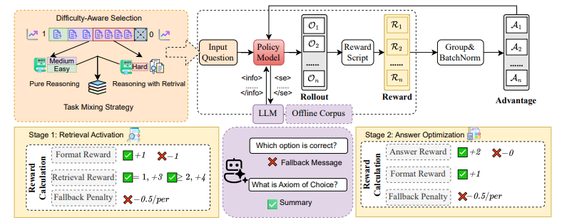
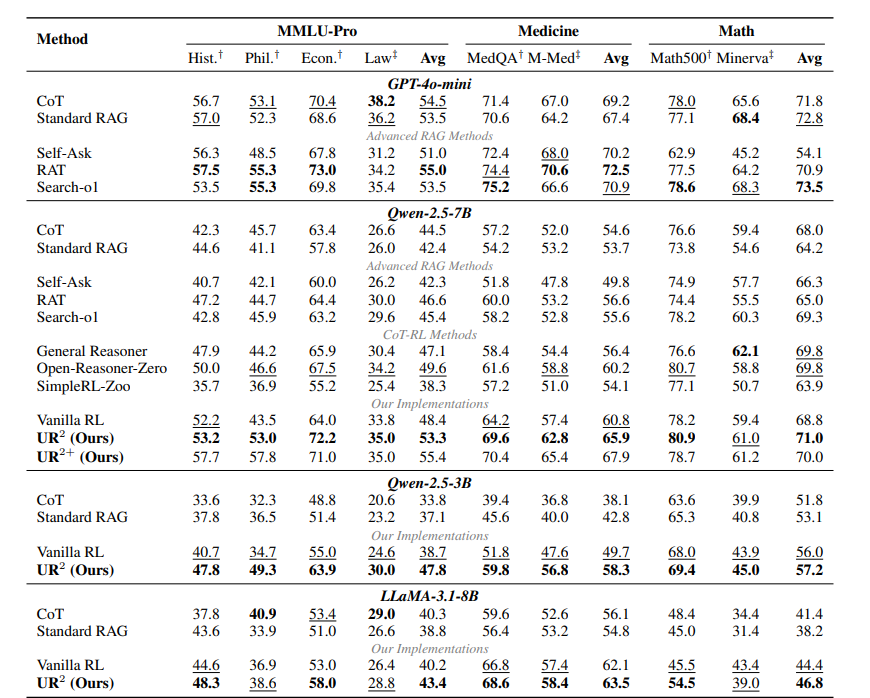
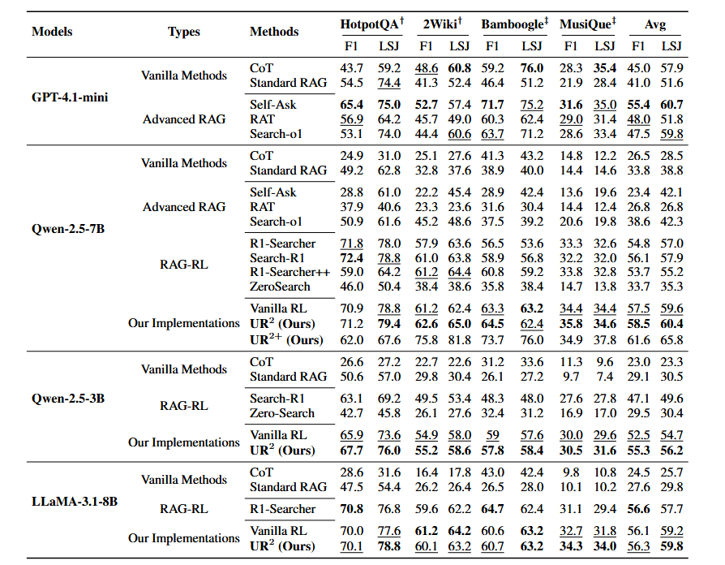
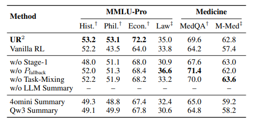

# UR²: 通过强化学习统一RAG与推理

- **Authors**: Weitao Li, Boran Xiang, Xiaolong Wang, Zhinan Gou, Weizhi Ma, Yang Liu
- **Venue & Year**: arXiv 2025
- **URL / DOI**: https://arxiv.org/pdf/2508.06165

---

## 1. 动机

- **研究问题**  `   `如何构建一个通用框架，通过RL动态地协调RAG与Reasoning，使LLM能够智能地决定何时、何事以及如何利用外部知识，从而克服现有RAG-RL方法在任务泛化和检索策略僵化上的局限性？

- **背景与意义**  `   `当前，RAG增强了模型的知识 grounding，而RL优化了其复杂推理能力，但两者通常被孤立研究。现有的结合方法大多局限于开放域问答，依赖静态检索策略（如每步都检索）和固定的知识源，难以适应需要专业知识或更灵活推理策略的复杂任务（如医学、数学）。创建一个能自适应协调二者的通用框架，对于提升LLM在多样化、高难度任务上的性能和鲁棒性至关重要。

## 2. 核心贡献

- 提出了一个名为**UR²**的通用框架，通过RL统一了RAG和多步推理，使其能够应用于从开放域问答到数学、医学等多样化任务。
- 设计了一种**难度感知的课程学习**策略，让模型仅在面对困难问题时才激活检索，从而保留并强化了自身的原生推理能力，避免了对检索的过度依赖。
- 提出了一种**混合知识访问策略**，结合了领域特定的离线语料库和LLM生成的摘要，通过信息提炼显著提高了检索内容的质量和模型的利用效率。
- 设计了一个**两阶段优化框架**，将检索技能的激活与答案质量的优化解耦，确保了模型训练的稳定性和有效性。

## 3. 方法论

- **核心思想概述**: UR²的核心思想是把“检索”视为一种可由模型通过RL（具体为REINFORCE++算法）动态学习的动作。模型在生成答案的每一步都可以选择是继续推理还是发出一个检索查询。整个训练过程通过精心设计的奖励函数进行引导，让模型学会何时检索最有效，以及如何生成高质量的查询。

- **关键公式**:
  - **训练目标函数 (J_UR²(θ))**:
    $$ J_{\text{UR}^2}(\theta) = \mathbb{E}_{x, \{y^i\}} \left[ \frac{1}{G} \sum_{i=1}^{G} \sum_{t=1}^{|y^i|} \mathbb{I}(y_t^i) \cdot r_{i,t} \cdot \hat{A}_{i,t} \right] $$
    这个公式是REINFORCE算法的变体，目标是最大化期望奖励。其中，`r_i,t`是重要性权重，`Â_i,t`是归一化后的优势函数，它衡量了当前动作比平均水平好多少，是驱动模型学习的关键信号。

  - **两阶段奖励函数 (Two-Stage Reward)**:
    1.  **阶段1 (检索激活)**: `R = R_format + R_retrieval - P_fallback`
        - 奖励侧重于鼓励模型生成**格式正确**且**有效**的检索查询，而不关心最终答案是否正确。
    2.  **阶段2 (答案优化)**: `R = R_answer + R_format - P_fallback`
        - 奖励的重心转移到**最终答案的正确性**上，同时保留对格式和回退的奖惩，引导模型利用学会的检索技能来解决问题。
    - 回退惩罚：识别出这个查询不适合通过检索来回答,进行扣分

- **大体流程说明**:
  
  1.  **难度感知选择**: 训练开始前，使用基线模型评估问题难度，将数据分为“简单”、“中等”、“困难”三档。
  2.  **任务混合与提示**: 根据难度和任务类型（如数学 、 问答），为模型提供不同的提示。困难任务的提示会引导模型使用检索。
  3.  **模型推理与检索 (Rollout)**: 模型根据输入问题和提示生成推理步骤。在需要时，它会生成特殊的`<se>...</se>`标签来发起检索。
  4.  **混合知识访问**: 检索请求被发送至混合知识库（离线语料+LLM摘要），返回提炼后的信息。
  5.  **奖励计算**: 根据模型的输出（格式、检索行为、最终答案）和预设的两阶段奖励函数，计算出总奖励。
  6.  **模型更新**: 使用计算出的奖励和优势函数，通过REINFORCE++算法更新模型参数。

## 4. 实验与数据

- **数据集 & 任务设置**:
  - **训练集**: 混合了多个领域的数据，包括数学 (SimpleZoo-RL)，开放域问答 (R1-Searcher)，医学问答 (MedQA)，以及使用Qwen3-32B生成的MMLU-Pro领域的合成数据（哲学、历史、经济学）。
  - **评估任务**: 涵盖四大类：
    1.  **数学推理**: MATH500 (域内), Minerva (域外)
    2.  **医学问答**: MedQA (域内), MMLU-Pro Medical (域外)
    3.  **多领域知识**: MMLU-Pro (哲学、历史、经济学为域内，法律为域外)
    4.  **开放域问答**: HotpotQA, 2WikiMultiHopQA (域内), Bamboogle, Musique (域外)

- **对比方法 & 评价指标**:
  - **对比方法 (Baselines)**:
    - **Vanilla方法**: CoT, Standard RAG
    - **高级RAG方法**: Search-o1, Self-Ask, RAT
    - **CoT-RL方法**: Open-Reasoner-Zero, SimpleRL-Zoo
    - **RAG-RL方法**: R1-Searcher, Search-R1, ZeroSearch
    - **Vanilla RL (自实现基线)**
  - **评价指标 (Metrics)**: EM (Exact Match) for MMLU-Pro & MedQA; F1-Score & LLM-as-a-judge for QA; LLM-as-a-judge for Math.

## 5. 实验结果

- **性能指标对比表**:
  - **推理与数学任务**: UR²在所有模型和任务上均显著优于基线。在Qwen-7B上，相比最强的CoT-RL基线，MMLU-Pro平均分提升3.7%，医学任务提升5.7%。
  
  - **开放域问答任务**: UR² 同样表现出色。在Qwen-7B模型上，其平均F1分数达到58.5%，超越了最强的专门RAG-RL基线Search-R1 (56.1%)。特别是在域外泛化数据集Bamboogle和MusiQue上，UR²的优势更加明显，证明了其动态协调策略的鲁棒性。
  - **跨模型对比**: 基于7B开源模型的UR²，其性能在多个基准上（包括开放域问答）达到了与**GPT-4o-mini**和**GPT-4.1-mini**相当甚至更高的水平，展示了该框架的强大效能。

- **消融研究要点**:
  
  - **移除阶段1**: 性能显著下降，证明了显式地激活检索能力是至关重要的。
  - **移除LLM摘要**: 模型性能急剧恶化，几乎退化为纯CoT，凸显了高质量、提炼后的知识对于7B规模模型的重要性。
  - **移除难度感知训练**: 性能略微下降，表明该策略在提升准确性的同时，主要贡献在于提高了训练效率和模型的决策智能性。
  - **更换摘要模型**: 即便使用较弱的开源模型或成本更低的API进行摘要，UR²依然能取得远超基线的性能，证明了框架的鲁棒性和实用性。

## 6. 优缺点分析

- **优势**:
  1.  **通用性强**: 框架设计不局限于特定任务，成功地从开放域问答扩展到了数学、医学等多个专业领域。
  2.  **策略智能**: 通过难度感知学习，模型学会了动态决策，避免了不必要的检索
  3.  **性能卓越**: 在中等规模的开源模型上实现了与顶级闭源模型相媲美的性能，性价比极高。

- **局限性**:
  1.  **计算开销**: 训练过程（尤其是LLM摘要和多轮Rollout）引入了额外的计算成本和API调用开销。

## 7. 个人思考

- **可能的改进方向**:
  1.  **探索更经济的摘要方式**: 可以研究使用更小型的、专门为摘要任务微调的模型，或者探索非LLM的摘要方法，以降低对昂贵API的依赖和计算成本。
  2.  **端到端联合训练**: 目前摘要模型是独立于主模型的。未来可以探索将摘要器和推理器进行端到端联合训练，让摘要器生成对主推理器“最有用”的摘要，而不是通用的摘要。

## 8. 标签

- **标签**: RL, RAG, 推理, 课程学习