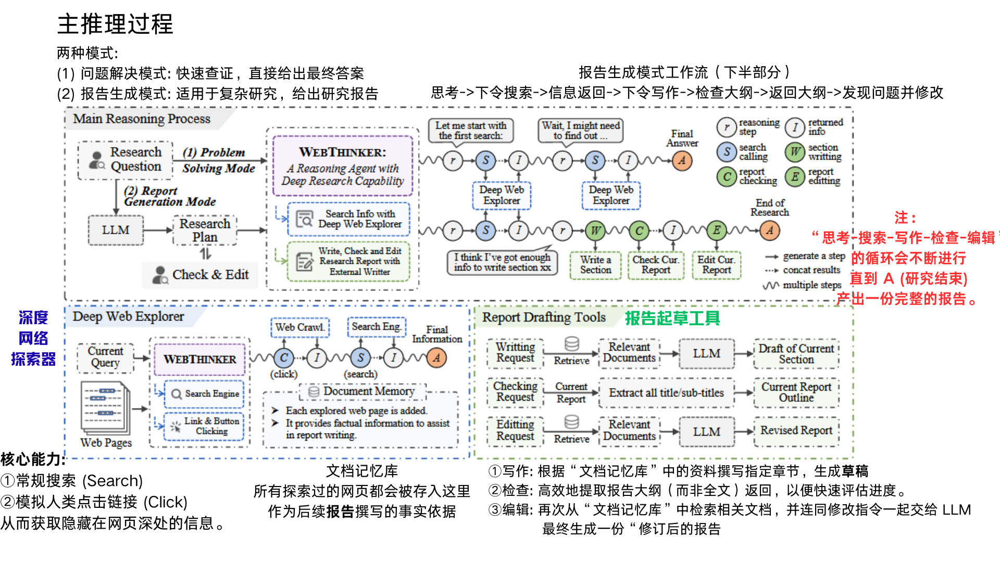
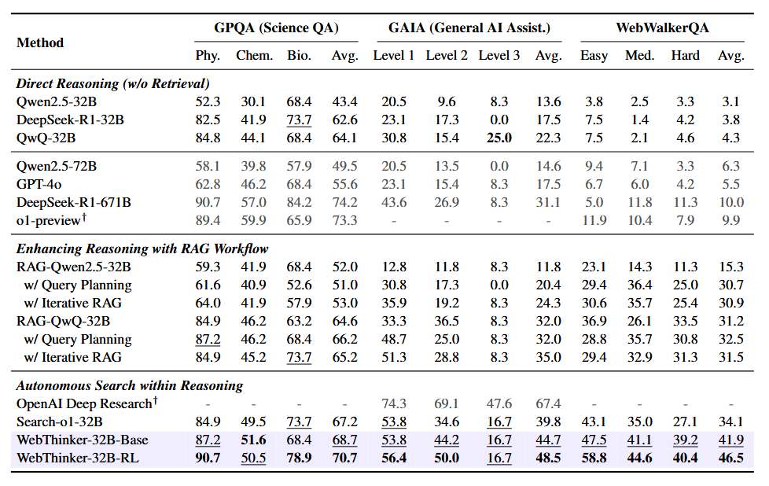
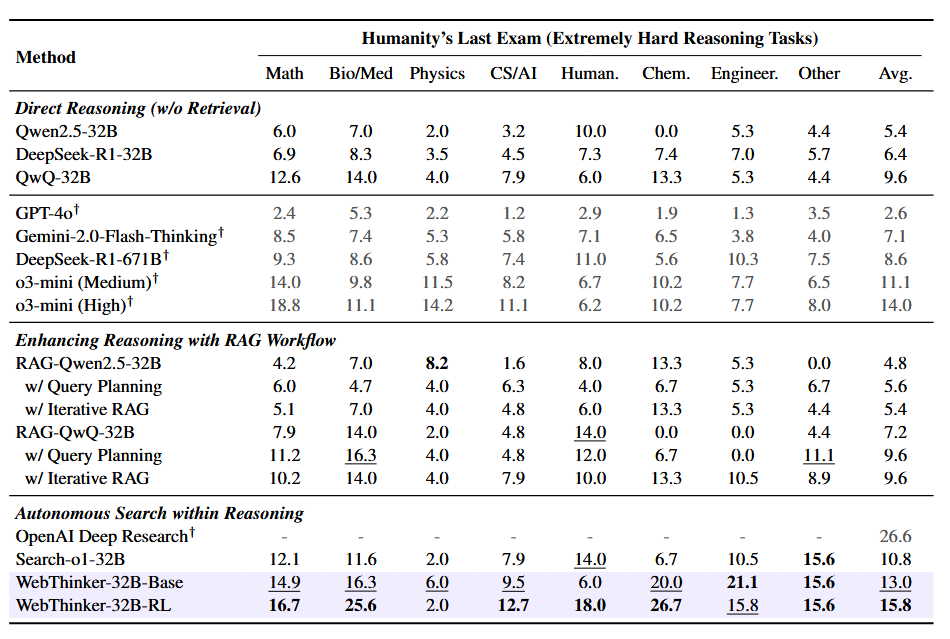
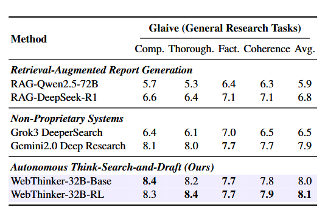
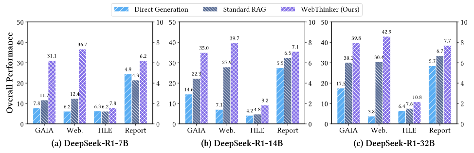
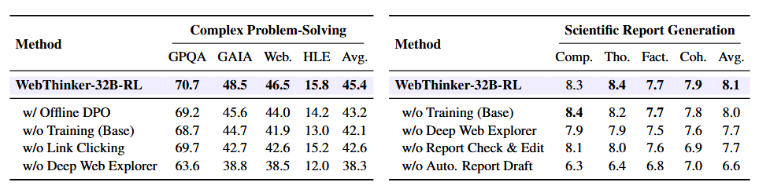

# WebThinker: Empowering Large Reasoning Models with Deep Research Capability
WebThinker：赋能大型推理模型以深度研究能力

- **Authors**: Xiaoxi Li, Jiajie Jin, Guanting Dong, Hongjin Qian, Yutao Zhu, Yongkang Wu, Ji-Rong Wen, Zhicheng Dou
- **Venue & Year**: arXiv, 2025
- **URL / DOI**: https://arxiv.org/abs/2504.21776

---

## 1. 动机

- **研究问题**: 如何解决大型推理模型在面对需要综合多样化、实时网络信息的复杂知识密集型任务时，因依赖静态内部知识而导致的性能瓶颈，并提升其生成深度研究报告的能力？
- **背景与意义**: 现有的LRMs在长程推理上表现出色，但无法有效利用外部世界的动态知识。而传统的RAG方法通常采用预定义、固定的工作流，限制了模型探索网络信息的深度和灵活性，难以应对复杂的真实世界研究场景和全面的报告撰写任务。因此，开发一个能让模型自主、深度地与网络交互并进行研究的框架至关重要。

## 2. 核心贡献

- **提出了 WebThinker 框架**，一个能让LRM在单次连续推理过程中自主完成搜索、深度网络探索和研究报告起草的深度研究智能体。
- **设计了深度网络探索器 (Deep Web Explorer) 模块**，使LRM能够通过模仿人类的“点击链接”行为来导航和遍历网页，从而获取超越传统浅层搜索的深度信息。
- **引入了自主思考-搜索-起草 (Autonomous Think-Search-and-Draft) 策略**，将推理、信息收集和报告撰写三个过程无缝交织，实现了类似人类研究员的实时、迭代式工作模式。
- **开发了基于RL的迭代式在线 DPO 训练策略**，通过构建反映“正确、高效、简洁”的偏好数据，持续优化模型对研究工具的使用能力。

## 3. 方法论

- **模型概述**  `   `WebThinker 框架通过赋予 LRM 一系列研究工具，使其能够在两种模式下工作：  `   `**1) 问题解决模式**，利用“深度网络探索器”解决需要查证的复杂问题；  `   `**2) 报告生成模式**，利用“自主思考-搜索-起草”策略和写作工具集（起草、检查、编辑）来撰写综合性研究报告。其核心思想是通过一个分层的、自主的流程，让主 LRM 负责高层逻辑规划，并将具体的信息挖掘和文本撰写任务委托给专门的子模块或辅助LLM处理，从而实现高效的深度研究。

- **关键公式**
  
    `   ` **DPO 损失函数**
  $$ L_{DPO}(\pi_\theta; \pi_{ref}) = -\mathbb{E}_{(R_w, R_l) \sim D} \left[ \log \sigma \left( \beta \log \frac{\pi_\theta(R_w | I, q)}{\pi_{ref}(R_w | I, q)} - \beta \log \frac{\pi_\theta(R_l | I, q)}{\pi_{ref}(R_l | I, q)} \right) \right] $$

      `   ` **训练目标**: 提升LRM在执行复杂研究任务时，对工具集 `T`的**策略性使用能力**
      `   ` **偏好数据构建**: 对于每个给定的查询 `q`，使用初始的LRM策略 `πθ` 进行**自采样（self-sampling）**，生成 `n` 条不同的推理轨迹，探索模型策略空间，捕获在主推理链和`Deep Web Explorer`内部推理过程中多样的工具使用模式。
      `   ` **偏好标注准则**：①整体正确性（首要准则）：若轨迹 `Ri` 能够生成正确的最终答案（针对推理任务）或更高质量的最终报告（针对报告生成任务），而轨迹 `Rj` 不能，则 `Ri` 被定义为偏好轨迹，即 `Rw = Ri, Rl = Rj`。
    ②工具效率（次要准则）：，仅在 `Ri` 和 `Rj` 均能达成正确结果（满足首要准则）时适用，总工具调用次数少的为Rw
    ③思考简洁性（最终准则），此准则仅在 `Ri` 和 `Rj` 均正确且工具调用次数相同时适用，更短的轨迹被认为是为Rw
  
    `   `

- **流程模块说明**  `   `
  **WebThinker 整体流程**:
  
  1.  **输入**: 用户提出研究问题（Query）。
  2.  **模式选择**: 根据任务类型，WebThinker 进入“问题解决”或“报告生成”模式。
  3.  **核心推理循环**: 主 LRM 开始进行思考（生成推理链）。当遇到知识缺口或需要撰写报告时，它会生成特殊的工具调用指令。
  4.  **工具调用**:
      - **深度网络探索器**: 接收到搜索指令后，该模块启动一个子流程，进行搜索、分析结果、点击链接深入探索，最后将提炼后的摘要信息返回给主 LRM。
      - **报告起草工具**: 接收到写作/编辑指令后，一个辅助 LLM 在后台被触发，它会参考“文档记忆库”（所有已爬取的网页内容）来完成写作任务，而不直接干扰主 LRM 的推理流。
  5.  **循环与输出**: 主 LRM 接收到工具返回的信息后，继续其推理过程。这个“思考-调用工具-再思考”的循环会持续进行，直到任务完成，最终输出答案或一份完整的报告。

## 4. 实验与数据

- **数据集 & 任务设置**:
  - **复杂问题解决任务**: GPQA (博士级科学问答), GAIA (通用AI助手能力评估), WebWalkerQA (深度网络遍历问答), HLE (高难度跨学科学术考试)。
  - **科学报告生成任务**: Glaive (大规模通用开放式推理问答)。
- **对比方法 & 评价指标**:
  - **对比方法 (Baselines)**: 
    1.  **直接推理**: Qwen2.5, QwQ-32B, DeepSeek-R1, GPT-4o 等。
    2.  **检索增强推理 (RAG)**: 标准RAG, 带查询规划的RAG, 迭代式RAG。
    3.  **自主搜索系统**: Search-o1, OpenAI Deep Research, Grok3 DeeperSearch, Gemini2.0 Deep Research。
  - **评价指标 (Metrics)**:
    - **问题解决**: Pass@1 (准确率)。
    - **报告生成**: 由 GPT-4o 和 DeepSeek-R1-671B 对报告的**综合性、详尽性、事实性、连贯性**进行打分 (1-10分)。

## 5. 实验结果

- **性能指标对比表**
  
  
  - 在所有复杂问题解决基准（GPQA, GAIA, WebWalkerQA, HLE）上，WebThinker-32B-RL 均显著优于所有32B级别的基线模型，包括各种RAG变体和Search-o1。
  
  - 在科学报告生成任务上，WebThinker 在总分上超越了所有对比系统，包括 Gemini 2.0 Deep Research，尤其在**综合性**和**详尽性**上优势明显。
  
  - 跨模型尺寸（7B, 14B, 32B）的实验表明，WebThinker 框架具有良好的可扩展性，在不同大小的模型上都能带来巨大性能提升。

- **消融研究要点**:
  
  - **RL训练至关重要**: 移除RL训练（仅使用Base模型）会导致问题解决能力明显下降，证明了通过DPO进行策略优化的有效性。
  - **深度网络探索不可或缺**: 移除整个深度网络探索器模块会导致所有任务性能急剧下降。即使只禁用其中的“链接点击”功能，也会损害导航密集型任务的性能，证明了“深度”探索的价值。
  - **自主起草是报告质量的关键**: 在报告生成中，移除自主起草模块导致的性能下降最为严重，说明了思考与写作交错进行的重要性。

## 6. 优缺点分析

- **优势**:
  1.  **高度自主与灵活**: 摆脱了预定义工作流的束缚，模型能根据实时情况自主决定搜索、导航和写作，更接近人类的研究方式。
  2.  **信息获取深度**: “深度网络探索器”通过模拟点击行为，能挖掘到隐藏在链接之后、传统RAG难以触及的深层信息。
  3.  **任务分解与协同**: 通过将高层规划与底层执行（信息挖掘、文本撰写）分离，主模型可以专注于核心逻辑，提高了推理的连贯性和效率。
  4.  **性能卓越且可扩展**: 实验证明，该方法在多个高难度基准上超越了现有SOTA方法，并且框架设计使其能很好地适应不同规模的LRM。

- **局限性**:
  1.  **仅处理文本信息**: 当前框架主要处理文本信息，尚未具备处理图像、视频等多模态内容的研究能力。

## 7. 个人思考

- **灵感 / 疑问**:
  - **“文档记忆库(M)”的管理机制？** 论文提到会累积所有探索过的网页，但当信息量巨大时，如何高效地从这个记忆库中检索到与当前写作任务最相关的内容？最近上下文工程比较火，是否能借助这一思路。
  - **死信息问题** 如果点击了一个死链、遇到需要登录的页面或网页内容是动态加载的，直接略过吗？能否与browser_use等集成。

## 8.本论文分类Tag（个人观点）

- **标签**: RL , deep research , 工具使用 , DPO
  
## 9. 本论文笔记知乎链接
* 敬请期待