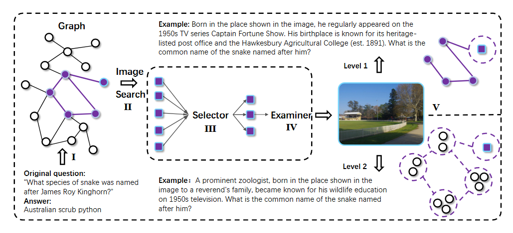
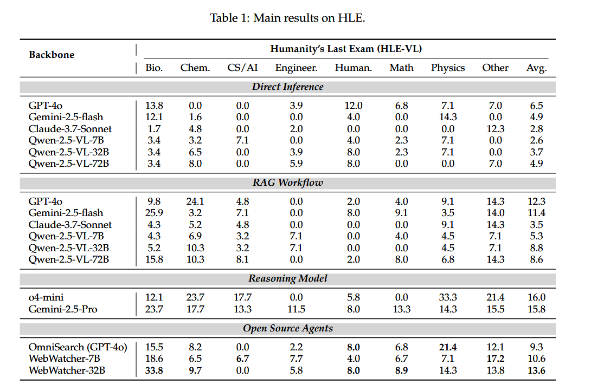
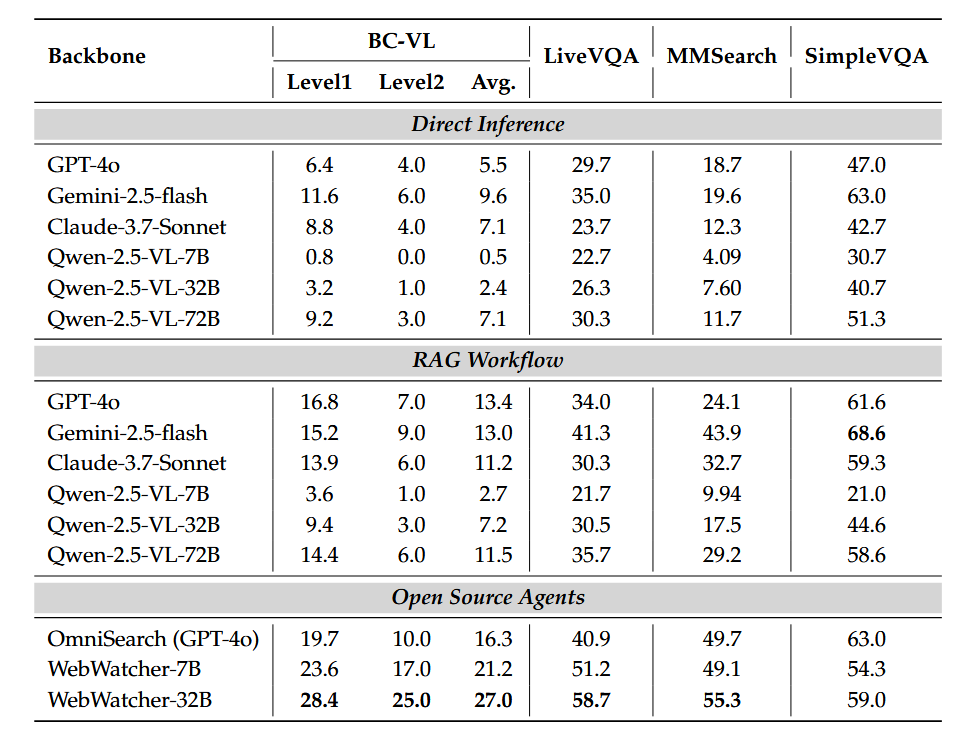
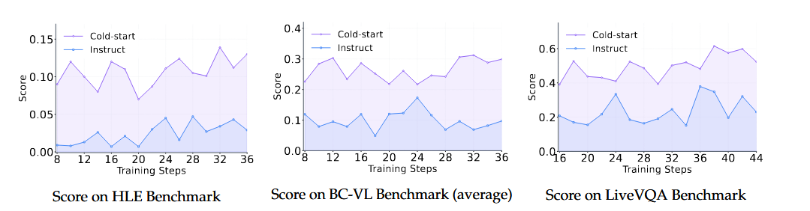
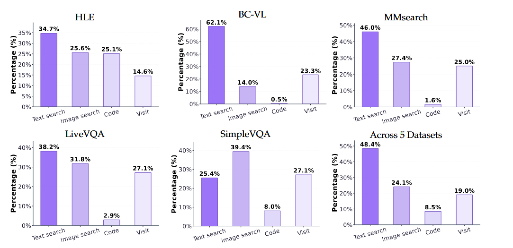

# WebWatcher: Breaking New Frontiers of Vision-Language Deep Research Agent 
WebWatcher: 突破视觉语言深度研究智能体的新前沿

- **Authors**: Xinyu Geng, Peng Xia, Zhen Zhang, Xinyu Wang, 等 (阿里巴巴集团通义实验室)
- **Venue & Year**: arXiv, 2025
- **URL / DOI**: https://arxiv.org/abs/2508.05748

---

## 1. 动机

- **研究问题**  `   `如何构建一个能够整合视觉与文本信息、并熟练运用多种工具（如网页浏览、代码执行）来完成复杂、多跳、知识密集型信息寻求任务的多模态深度研究智能体？

- **背景与意义**  `   `现有的深度研究智能体虽然在文本信息处理上表现出色，但大多忽略了现实世界中无处不在的视觉信息，导致其无法处理图文并茂的复杂任务。同时，现有的视觉语言（VL）智能体往往局限于简单的感知任务或固定的工作流，缺乏解决开放式、需要深度推理和动态规划问题的能力。因此，开发一个真正具备多模态深度研究能力的智能体，对于推动AI解决真实世界复杂问题具有重要意义。

## 2. 核心贡献

- **提出了WebWatcher**: 一个专为deep research设计的多模态智能体，它能够整合视觉-语言推理与多工具交互，有效解决复杂的图文信息寻求任务。
- **构建了BrowseComp-VL基准**: 提出了一个全新的、高难度的多模态VQA（视觉问答）基准。这个基准模仿BrowseComp风格，包含大量需要多步推理、跨网页信息整合和细粒度视觉理解的混淆性问题。
- **设计了可扩展的数据与训练流程**:
    1.  **数据生成**: 创建了一套将复杂的纯文本QA对自动转换为高质量、带视觉上下文的VQA对的流程。
    2.  **轨迹生成与训练**: 开发了一个全自动的推理轨迹生成管道，能够为智能体提供高质量的“思考-行动-观察”式训练数据，并采用“SFT冷启动 + GRPO”的范式进行高效训练。

## 3. 方法论

- **模型概述**  `   ` WebWatcher的核心是一个基于预训练视觉语言模型（Qwen2.5-VL）构建的智能体。通过一套“数据-训练”流程赋予处理图文任务的能力。该流程首先通过一个复杂的管道生成高质量、多跳、多模态的VQA数据。然后，利用教师模型（GPT-4o）在这些数据上生成“专家解决轨迹”。喂给学生模型吃，完成“冷启动”以掌握基本的工具使用和推理模式。最后，通过GRPO进行在线微调，进一步提升其决策能力和任务成功率。

- **流程说明**:
  `   `论文的核心创新之一是其**高质量、可扩展的多模态数据生成流程**，旨在创建兼具**深度推理复杂性**和**丰富视觉上下文**的VQA数据（即BrowseComp-VL基准）。该流程摒弃了直接从图像生成简单问题的传统做法，而是采用“**先文后图**”的策略，确保了问题的推理深度。整个流程可分解为以下三大步骤：
  
    `   `
  **第一步：生成高难度、多跳的纯文本QA对**
  此步骤旨在构建具有复杂推理链的文本问题，分为两个难度级别：
  - **Level 1 (显式实体)**:
    1.  **内容聚合**: 效仿WebDancer，从arXiv、Wikipedia等权威信源出发，通过递归爬取超链接的方式，模拟人类浏览行为，聚合大量富含知识的文本内容。
    2.  **QA合成**: 利用GPT-4o在聚合的内容上生成需要多步信息整合才能回答的问题。此级别的问题虽然复杂，但涉及的实体名称是明确的。
  - **Level 2 (模糊实体)**: 这是更具挑战性的级别，旨在迫使智能体进行真正的推理而非关键词匹配。
    1.  **构建推理路径 (节点选择)**:
        - 从一个Wikipedia页面（根实体）开始，通过其超链接构建一个深度为3、分支因子为3的知识树。
        - 从该树中随机采样包含N个实体的子图，每一条从根节点到目标节点的路径都构成一个独特的、多跳的**推理路径**。
    2.  **生成模糊化问题 (查询生成)**:
        - 首先，让GPT-4o根据推理路径生成一个标准的、实体明确的问题。
        - 接着，进行**关键的模糊化（Fuzzing）处理**：将问题中的关键实体、具体日期、精确数值等替换为模糊、定性或上下文相关的描述（例如，将“詹姆斯·罗伊·金霍恩”替换为“图示地点的牧师家庭中出生的一位杰出动物学家”）。
  
    `   `**第二步：将文本QA转换为多模态VQA (QA-to-VQA)**
  此步骤将上一步生成的复杂文本问题与视觉信息进行锚定。
  1.  **视觉上下文构建**:
      - **实体筛选**: 过滤掉那些难以视觉化呈现的抽象实体（如时间概念）。
      - **图像检索**: 对于每个有效的实体，通过Google SerpApi检索`K=2`张真实的（authentic）网络图片，拒绝使用合成或拼接图像，以确保与现实世界任务的相关性。
  2.  **问题转换与配对**:
      - **实体掩码**: 在文本问题中，将对目标实体的直接引用（如实体名称）替换为一个视觉指代词（例如，“图中的物体”、“这个实体”）。
      - **实例生成**: 将这条经过修改的、包含视觉指代的问题，与检索到的K张图片分别配对，从而一个纯文本QA可以生成K个多模态VQA实例。
  
    `   `**第三步：严格的多阶段质量控制**
  为了确保最终生成的数据集是高质量且可解的，论文设计了一个精密的“**筛选器-检验器 (Selector-Examiner)**”自动化过滤管道：
  - **筛选器 (Selector) 阶段**:
    1.  **语法检查**: 剔除实体掩码失败（问题中仍残留实体名称）的样本。
    2.  **图文相关性评估**: 使用GPT-4o评估图片与原始问题、新VQA问题的上下文关联度，过滤掉低分样本，确保图像是问题的有效视觉载体。
  - **检验器 (Examiner) 阶段**:
    1.  **可解性验证**: 这是最关键的一步。让GPT-4o**仅凭图像和其附带的网页标题/说明文字**尝试回答VQA问题。
    2.  **过滤不可解样本**: 如果GPT-4o无法仅凭视觉信息和有限文本上下文回答问题，则认为该样本对于智能体而言也是不公平或不可解的（即使允许使用外部工具），因此将其剔除。这一步保证了最终数据集中的每个问题都有一个能通过“视觉感知+工具使用”找到答案的清晰路径。

  `   `通过以上三个步骤，论文构建了一个既有深度推理挑战，又有可靠视觉基础的大规模、高质量多模态数据集，为后续智能体的有效训练奠定了坚实基础。
- **智能体训练流程**
    - **轨迹生成**: 使用GPT-4o为VQA数据生成详细的ReAct风格（思考-行动-观察）的解决步骤，形成专家轨迹。
    - **SFT冷启动**: 在这些高质量轨迹上对WebWatcher进行监督微调，使其模仿专家行为。
    - **RL微调**: 使用GRPO算法，让智能体在环境中自主探索，并根据任务完成情况（奖励）进行策略优化，以超越模仿学习的局限。
- **智能体推理流程**:
    - 智能体接收一个多模态问题后，进入一个“思考-行动-观察”的循环。
    - **思考(Think)**: 分析当前状态，制定下一步计划。
    - **行动(Act)**: 从工具箱（Web图像/文本搜索、网页访问、代码解释器、OCR）中选择并执行一个工具。
    - **观察(Observe)**: 获取工具执行返回的结果，并更新状态，进入下一轮循环，直至问题解决。

---

## 4. 实验与数据

- **数据集 & 任务设置**:
  - **训练数据构成**: WebWatcher的训练数据是一个精心设计的多源混合体，旨在同时提升其深度研究能力和通用视觉推理能力。其构成如下：
    1.  **核心研究数据 (50%)**: 来自本文提出的**BrowseComp-VL**训练集，包含60,000个Level-1和40,000个Level-2的高质量样本，专门用于培养多跳、跨网页的图文信息综合能力。
    2.  **长尾知识数据 (30%)**: 包含了5,000个从与SimpleVQA分布相似的数据集中采样并转换而来的VQA样本，用于拓宽模型的知识面。
    3.  **困难感知/推理数据 (20%)**: 抽取自多个现有高难度VQA基准，包括**InfoSeek, VQAv2.0, LogicVista, Encyclopedic VQA**等，并特别加入了需要OCR能力的样本，以强化模型在复杂视觉感知和逻辑推理上的“硬实力”。
    *   最终，从这个混合数据集中生成了**8,000条**高质量的工具使用轨迹用于SFT，另有**2,000条**样本保留用于GRPO阶段。

  - **评估基准与具体设置**: 实验在五个异构且具有挑战性的基准上进行，每个基准都抽取了特定的子集进行评测：
    - **BrowseComp-VL**: 测试集包含**300个**实例（100个Level 1, 200个Level 2），所有样本均经过博士级专家的人工验证，确保了极高的难度和质量。
    - **HLE-VL**: 从完整数据集中抽取了**330个**多模态问题，专注于评估在科学、工程等学术领域的深度推理能力。
    - **LiveVQA**: 使用了一个包含**300个**样本的子集，评估模型获取和理解最新视觉知识的能力。
    - **MMSearch**: 使用了其中带图像的**171个**样本，专注于评估在罕见知识和新闻事件上的多模态搜索能力。
    - **SimpleVQA**: 随机抽取了**300个**英文样本，用于评估模型的基础事实性VQA能力。
  - **训练模型**: 论文中的WebWatcher智能体是基于**Qwen2.5-VL-7B**和**Qwen2.5-VL-32B**两个模型进行SFT和RL训练的。

- **对比方法 & 评价指标**:
  - **对比方法**:
    - **直接推理 (Direct Inference)**: GPT-4o, Gemini-2.5-flash, Claude-3.7-Sonnet, 以及Qwen-2.5-VL系列（7B/32B/72B）。
    - **RAG工作流 (RAG Workflow)**: 上述模型外挂一个检索器，形成“检索-生成”两阶段流程。
    - **推理基线 (Reasoning Baselines)**: 代表了当时最强的多步推理能力，包括Gemini-2.5-Pro和o4-mini。
    - **开源智能体 (Open Source Agents)**: 以搜索为核心的智能体OmniSearch (其核心为GPT-4o)。
  - **评价指标**:
    - **主要指标**: **Pass@k**，衡量k次尝试内成功解决问题的概率。实验主要报告**Pass@1**作为核心性能指标。
    - **评估方式**: 采用**LLM-as-Judges**方法，即使用一个更强大的LLM（如GPT-4o）作为裁判来自动评判答案的正确性，以实现大规模、一致的评估。
    - **生成超参数**: 在进行Pass@k评估时，模型的生成参数被固定为`temperature=0.6`和`top-p=0.95`，以鼓励生成多样性，从而更好地探索解题路径。

---

## 5. 实验结果

- **性能指标对比表 / 图**:
  
  
  - WebWatcher-32B在所有五个基准测试中均表现出色，全面超越了直接推理和RAG工作流。
  - 在最困难的**BrowseComp-VL**基准上，WebWatcher-32B取得了**27.0%** 的平均分，而最强的RAG基线仅为13.4%，展现了压倒性优势。
  - 在**HLE-VL**上，WebWatcher-32B获得**13.6%** 的平均分，与专用的强推理模型（Gemini-2.5-Pro为15.8%）处于同一水平，并远超其他方法。
  - 在**LiveVQA**和**MMSearch**上，WebWatcher-32B分别以**58.7%** 和**55.3%** 的成绩夺冠，证明了其在动态信息获取和视觉搜索任务上的强大能力。

- **消融研究要点**:
  
  - **RL训练冷启动的必要性**:如果没有SFT冷启动阶段，直接进行RL训练，智能体的性能几乎为零且难以提升。而经过SFT冷启动后，智能体拥有了一个很高的初始性能，并能在RL阶段稳定提升。这证明了**SFT阶段对于教会智能体基本工具使用和推理范式至关重要**。
  
  - **工具使用策略的适应性**: WebWatcher能根据任务特性灵活调整工具使用策略。例如，在信息检索密集的BrowseComp-VL中，它主要使用“Web文本搜索”；而在视觉内容丰富的LiveVQA中，则更多地使用“Web图像搜索”，体现了其智能决策能力。

## 6. 优缺点分析 

- **优势**:
  - **性能卓越**: 在多个高难度、异构的多模态基准上实现了当前最佳性能，显著提升了解决复杂视觉信息寻求任务的能力上限。
  - **方法系统且通用**: 提出了一套从数据生成、轨迹合成到“SFT+RL”训练的完整且可复现的智能体构建方案，为未来的多模态智能体研究提供了宝贵范本。
  - **贡献了宝贵资源**: 开源了极具挑战性的BrowseComp-VL基准，将推动社区在该领域的发展。

- **局限性**:
  - **工具集的局限性**: 智能体的能力受限于预定义的工具集。对于需要工具箱之外能力的任务（例如，与需要复杂API认证的网站交互），它可能无能为力。
  - **推理过程的稳定性**: 尽管性能强大，但长链条的工具调用仍然面临错误累积的风险，一次关键步骤的失败可能导致整个任务失败。

## 7. 个人思考 

- **灵感or疑问**:
  
  - 当前的agent的奖励函数相对简单，只在任务结束时评估。在长链条任务中，这种稀疏奖励是否足以引导智能体学会复杂的中间决策？引入更细粒度的过程性奖励（如步骤正确性、信息增益）是否会进一步提升性能？

- **可能的改进方向**:
  - **智能体自我进化**: 可以设计一个自我改进循环。当WebWatcher成功解决一个新问题或通过多次尝试找到更优解法时，可以将这个新的成功轨迹加入到训练数据中，用于下一轮的SFT或RL训练，从而实现智能体的持续自我进化，减少对外部教师模型的依赖。

## 8.本论文分类Tag（个人观点）

- **标签**: 多模态智能体, 视觉语言模型, deep research, 工具使用, RL , GRPO

## 9. 本论文笔记知乎链接
* 敬请期待
