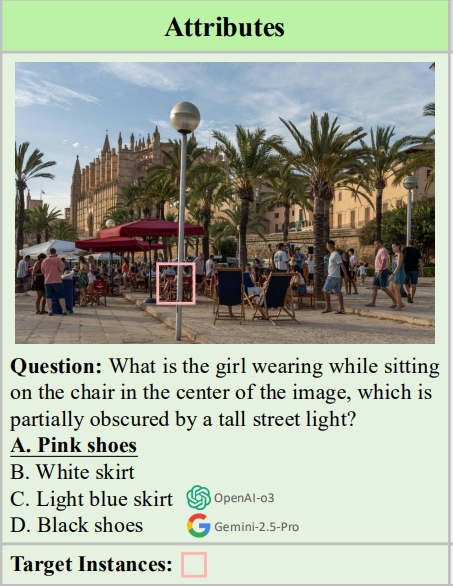
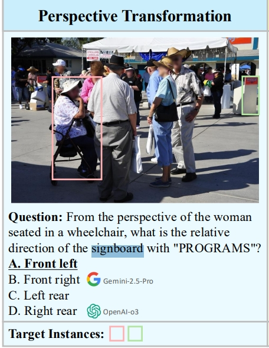
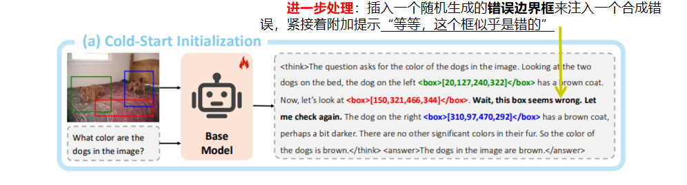
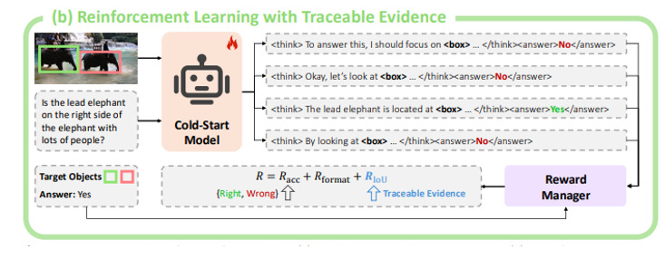
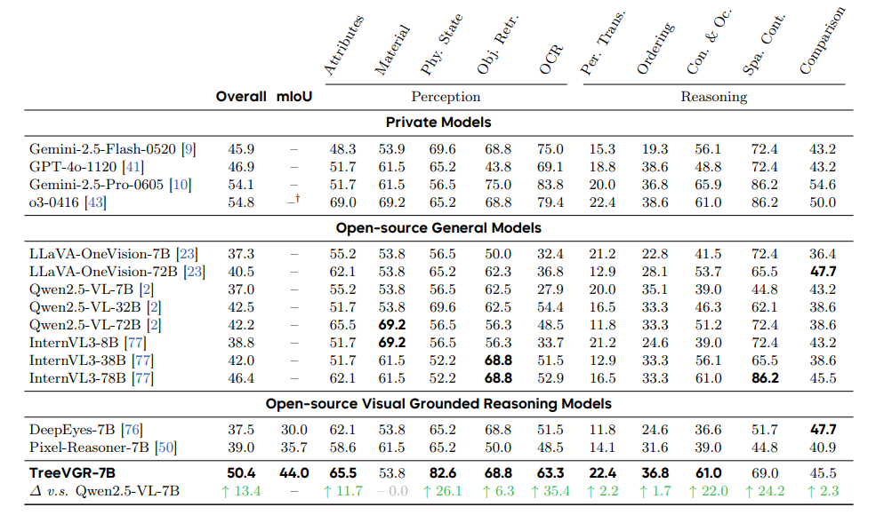
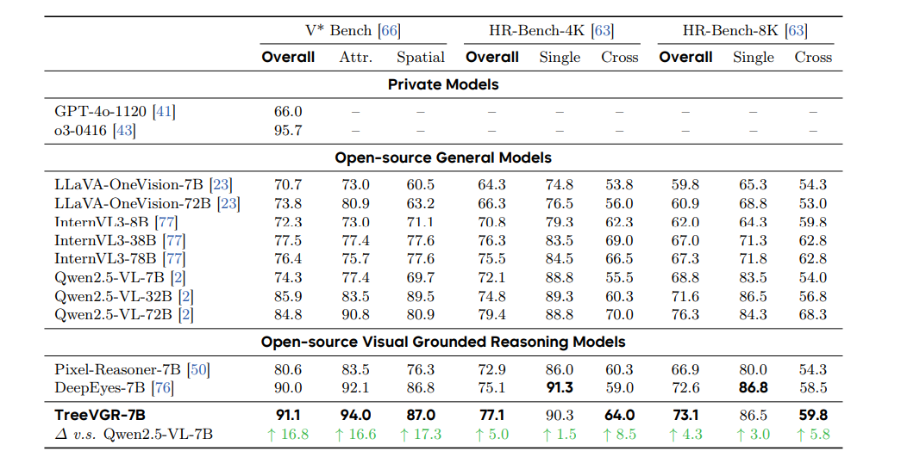
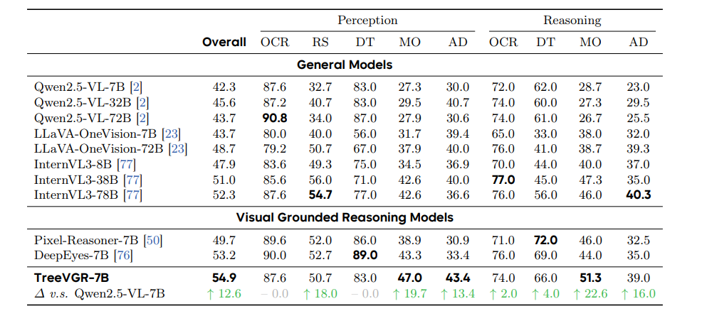
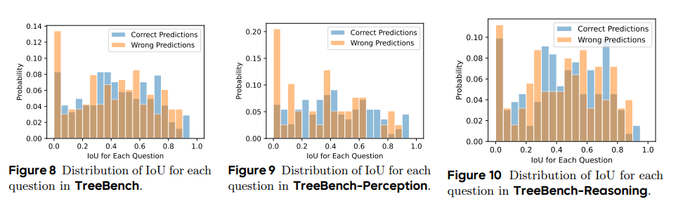
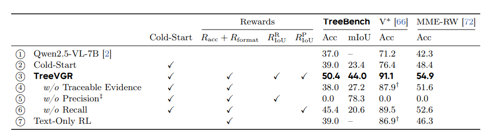

# 可溯源证据的视觉推理

**Traceable Evidence Enhanced Visual Grounded Reasoning: Evaluation and Methodology**

* ​**作者**: Haochen Wang, Xiangtai Li, Zilong Huang, Anran Wang, Jiacong Wang, Tao Zhang, Jiani Zheng, Sule Bai, Zijian Kang, Jiashi Feng, Zhuochen Wang, Zhaoxiang Zhang​
* ​**Venue & Year**: arXiv, 2025
* ​**URL / DOI**: [https://arxiv.org/abs/2507.07999v1](https://www.google.com/url?sa=E&q=https%3A%2F%2Farxiv.org%2Fabs%2F2507.07999v1)

---

## 1. 动机

* ​**研究问题** 
  `   `这一篇论文主要解决了如何全面评估和有效提升大多模态模型进行“带图像思考”（thinking with images）的能力，特别是如何使其**推理过程（即定位图像关键区域的步骤）变得可追溯、可解释**。
  ​
* ​**背景与意义** `   `尽管现代多模态模型在文本推理上表现出色，但在处理依赖精细视觉感知的任务时仍有局限。像GPT-o3这样的模型开创了通过动态引用图像区域进行推理的新范式，但学术界缺乏一个能够全面评估这种“视觉溯源推理”能力的基准。现有基准要么忽略了推理过程的可追溯性，要么任务过于简单，无法衡量模型在复杂场景下的多步、分层推理能力。  `   `因此，论文构建一个了能评估可追溯推理链的基准并提出相应提升模型能力的方法，对推动多模态模型实现更可靠、更可解释的视觉智能至关重要。
  
  ​

## 2. 论文核心贡献

* ​​​​**提出了一个名为TreeBench的新型评估基准**：这个基准围绕三大原则设计：(1) 聚焦于复杂场景中细微目标的**专注视觉感知**(如下图例子中，问被电线杆挡住的那个女孩穿了啥)
   
   (2) 通过边界框（bounding box）评估实现**可追溯的证据链**；(3) 测试超越简单定位的**二阶推理能力**（如物体交互、空间层级关系）。(如下图例子中，问站在轮椅老奶奶视角上，那个路牌在她的什么方向)
   
  ​​​​
* ​**构建了一个高质量、高难度的视觉问答数据集**：TreeBench包含405个极具挑战性的图文问答对。所有样本均由人类专家在多轮质量控制下标注，专注于真实世界图像中的微小目标（平均占图像面积的3.05%），确保了问题的难度和标注的准确性。
  ​
* ​**提出了一个名为TreeVGR的训练范式**：这是一个旨在增强模型视觉溯源推理能力的两阶段框架，它通过SFT进行冷启动初始化，然后利用RL对模型的定位和推理过程进行联合优化。
  ​
* ​**在强化学习中设计了一种新颖的双IoU奖励机制 (dual IoU reward)**：该奖励机制同时考虑了预测边界框的精确率和召回率，有效引导模型生成准确且完整的视觉证据，避免了模型为追求高召回率而生成大量无效框的问题。
  ​
* ​**通过实验验证了方法的有效性**：TreeVGR在自建的TreeBench以及V\* Bench、MME-RealWorld等多个公开基准上均取得了显著性能提升，证明了**可追溯性**是提升视觉溯源推理能力的关键。
  
  ​

## 3. 方法论

* ​​**模型、算法概述** `   `
  论文中提出了**TreeVGR**，一个两阶段的训练范式，用于提升多模态模型的视觉推理能力。

  ​​​**阶段一：冷启动初始化**
   `   `首先，使用一个包含图像、问题、带有边界框的推理轨迹和答案的结构化数据集，此外，一个很重要的改进是，**在推理轨迹中插入一个随机生成的错误边界框来注入一个合成错误，并附加提示“等等，这个框似乎是错的”**，紧接着对一个预训练的多模态模型（如Qwen2.5-VL-7B）进行SFT。这个阶段的目的是让模型学会按 “**&lt;think&gt;...&lt;box&gt;...&lt;/box&gt;...&lt;/think&gt;&lt;answer&gt;...&lt;/answer&gt;**” 的格式进行思考和回答，并且训练模型检测和纠正错误的视觉定位
。这个冷启动为后续的强化学习奠定基础，解决了RL从零开始学习的低效问题。
  
  ​
  
  ​​**阶段二：带可追溯证据的强化学习** `   `在SFT模型的基础上，使用RL进一步优化。模型生成的推理轨迹（包含边界框）和最终答案会由三个指标同时进行评估。不仅包括答案的准确性（**R\_acc**）和格式正确性（**R\_format**），还包含一个核心的**双IoU奖励**（**R\_IoU**），用于直接监督生成的边界框的质量。
  
  
  ​​
​**关键奖励函数设计**:
  TreeVGR的核心在于其RL阶段的奖励函数设计。总奖励**R**由三部分组成：
  
  ​**R = R\_acc + R\_format + R\_IoU**
  
  **其中：**
  
  * **R\_acc**: 准确率奖励，判断最终答案是否正确。
  * **R\_format**: 格式奖励，确保模型的输出遵循预定义的&lt;think&gt;和&lt;answer&gt;标签。
  * ​**R\_IoU**:，是论文的关键创新，用于评估预测边界框的质量。它由一个召回率项和一个精确率项组成：
    
    ​**R\_IoU = 1/2 \* (R\_recall\_IoU + R\_precision\_IoU)**
    
    * ​​**召回率项 (R\_recall\_IoU)**：确保每个真实的**目标边界框**都能被至少一个**预测边界框**所覆盖，鼓励模型找到所有相关证据。
      ​​
    * ​​**精确率项 (R\_precision\_IoU)**：确保每个**预测边界框**都能匹配到至少一个真实的**目标边界框**，惩罚模型生成与问题无关的“幻觉”边界框。
      
      
## 4. 实验与数据

* ​**数据集**

  
  * ​**训练数据**
    
    ​**SFT阶段**: 使用了VGR-158K数据集的一个子集（35K样本），并注入了合成错误以训练模型的纠错能力。
    
    **RL阶段**: 使用了TreeVGR-RL-37K数据集，包含来自V\* 的30K样本和来自VisDrone的7K样本。

    
  * **测试基准** ​
  
    ​**自建基准**: **TreeBench**，包含405个高质量VQA对，图像源自SA-1B，专注于高密度、小目标的真实场景。 **其他评估基准**: V\* Bench, HR-Bench, MME-RealWorld-Lite, 以及MMBench, POPE等传统多模态基准。
    ​
* ​**评价指标**:
    
    * ​**Accuracy**: 最终答案的准确率。

    * ​**mIoU (mean Intersection over Union)**: 衡量模型生成的边界框与真实边界框的平均重合度，用于量化推理过程的**可追溯性**和定位精度。
      
      ​

## 5. 实验结果

* ​**性能指标对比**
   
    `   `**在**TreeBench**上，论文提出的**TreeVGR-7B**在准确率（50.4%）和mIoU（44.0%）上均显著优于其基座模型Qwen2.5-VL-7B（37% Acc）以及同类VGR模型DeepEyes-7B（37.5% Acc, 30.0% mIoU）。其综合性能甚至可与更大规模的开源模型InternVL3-78B（46.4% Acc）相媲美。**

   `   `​**在**V\* Bench**上，TreeVGR-7B相较于其基座Qwen2.5-VL-7B，性能提升了**16.8%**，达到了91.1%,在其他指标上也是如此。**

    ​
   `   `​**在MME-RealWorld**上，TreeVGR-7B相较于基座模型提升了**12.6%**，达到了**54.9%**
    
    ​
   `   `​**上图表明，**mIoU（定位精度）与最终准确率之间存在正相关性**，模型的定位精度（mIoU）越高，其最终任务的准确率也越高。
证明了精确的视觉溯源是实现高阶推理的基础。**
 `   `但值得注意的一点就是，对于感知任务，定位精度和任务性能**强相关**。看准了，就能答对。而对于推理任务，**相关性较弱**。看准了只是第一步，还需要更高层次的逻辑。

 * ​**消融实验**:
 
  消融实验清晰地证明了TreeVGR各个组件的必要性：
  
   * ​**冷启动阶段是有效的**：与不带冷启动直接进行RL相比，SFT初始化能为模型提供良好的起点，显著提升性能。
  
   * ​**可追溯的IoU奖励至关重要**：移除双IoU奖励（即**R\_IoU**=0）后，模型在TreeBench上的准确率从50.4%下降到38.0%，mIoU从44.0%下降到27.2%，证明了显式监督中间步骤的必要性。
    ​
   * ​**双IoU中的精确率和召回率项缺一不可**：若移除精确率项，模型会倾向于生成大量无关边界框以“刷高”召回率，导致推理失效；若移除召回率项，模型定位会不完整，mIoU仅为20.6%。
    ​
   * ​**Visual Grounded RL优于纯文本RL**：与只用文本进行RL相比，整合了可追溯视觉证据的RL框架性能增益更加显著。
    ​

## 6. 优缺点分析

* ​**优势**:
  
  * ​**新的基准与训练范式**: 首次系统性地提出了评估和训练“可追溯视觉推理”的框架，TreeBench在一定程度上填补了现有基准的空白，TreeVGR为训练此类能力提供了有效范本。
  
  * ​**可解释性好**: TreeVGR生成的推理路径包含明确的边界框，使用户能够理解模型做出决策的视觉依据，增强了模型的透明度和可靠性。
    ​
  * ​**性能优越**: 实验证明，通过强化可追溯性，TreeVGR在多个高难度、高分辨率基准上取得了显著的性能提升，甚至超过了部分更大参数量的模型。
    ​
* ​**局限性**:
  
  * ​**模型规模限制**: 当前的TreeVGR实现基于7B参数模型，其方法能否有效扩展到更大规模的架构（如百亿或千亿参数模型）有待进一步验证。
  
  * ​**基准数据规模**: TreeBench虽然质量高、难度大，但仅包含405个样本。扩大基准的样本量和领域覆盖范围将有助于更全面地评估模型能力和鲁棒性。
    
    ​

## 7. 个人思考

* ​**点子🤓👆**
   `   `双IoU奖励机制的设计很巧妙。这种将中间过程的“质量”量化并纳入奖励函数的设计思想，能否被迁移到其他需要复杂、多步推理的任务中？例如，在代码生成任务中，能否奖励生成结构良好、模块清晰的中间伪代码？在数学题解答中，能否奖励逻辑清晰、步骤正确的解题过程？
  

* **疑惑👀**
     `   `论文发现mIoU与感知任务的性能强相关，但与推理任务的性能弱相关。这是否意味着对于复杂的推理，精确的定位只是“必要非充分”条件？更高阶的认知能力（如抽象、类比）是否需要在定位之后由LLM的核心能力来主导，而这部分能力无法仅通过定位奖励来提升？

## 8. 本论文分类Tag（个人观点）

* 视觉推理溯源, 可追溯推理, 大型多模态模型, 强化学习

## 9. 本论文笔记知乎链接
* 敬请期待
