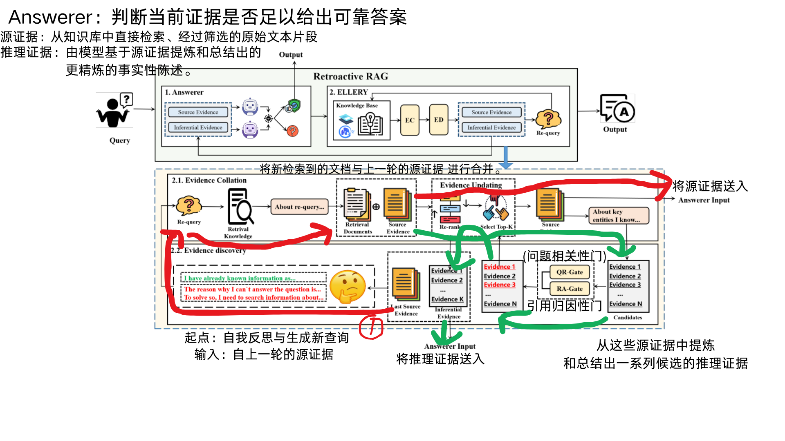
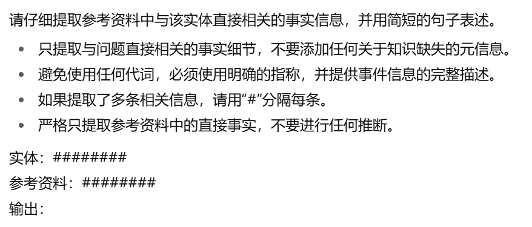
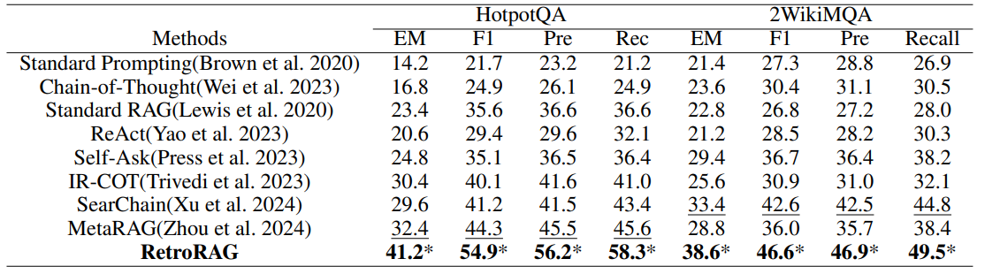
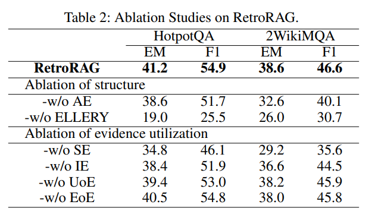

# Retrieval-Augmented Generation by Evidence Retroactivity in LLMS

- **Authors**: Liang Xiao¹, Wen Dai², Shuai Chen², Bin Qin², Chongyang Shi¹†, Haopeng Jing¹, Tianyu Guo¹
- **Venue & Year**: arXiv, 2025 
- **URL / DOI**: https://arxiv.org/abs/2501.05475

---

## 1. 动机

- **研究问题**<br> `   `现有的RAG方法中固有的“单向正向推理”范式所导致的错误不可逆问题。即在多跳复杂问答中，一旦早期推理步骤出错（如检索到不相关信息），错误会持续影响并破坏整个推理链。
- **背景与意义**<br> `   `为了解决幻觉问题，RAG通过引入外部知识来提升回答的准确性。对于复杂问题，现有方法通常将问题分解为多个子问题并按序进行“检索-生成”的迭代。然而，这种线性的、单向的流程非常脆弱，早期步骤的微小失误会误导后续所有步骤，且难以或无法被纠正。因此，构建一种能够像侦探一样回顾、修正并重构推理链的“追溯性”RAG框架，对于提升复杂问答的鲁棒性和准确性至关重要。

## 2. 核心贡献

- 提出了一个名为 **RetroRAG** 的创新性RAG框架，采用“追溯性推理”范式，能够修正和重构推理链，从而生成幻觉更少的有效答案。
- 设计并实现了一个名为 **ELLERY** (Evidence-coLLation-and-discovERY) 的证据核对与发现框架。这个框架能动态地检索、生成、筛选和更新证据，以支持推理过程，显著提升了在问答任务中知识检索的性能。

## 3. 方法论

- **框架概述**：
  
  <br> `   `RetroRAG 的核心思想是模拟侦探办案的追溯式调查过程。它主要由两个交替工作的核心模块组成：**Answerer (回答器)** 和 **ELLERY (证据核对与发现框架)**。
  1.  **Answerer**: 基于当前收集到的证据（包括源证据和推断性证据）生成答案，并采用自洽性（Self-Consistency）检查机制来评估当前知识是否足以生成可靠答案。如果答案可靠，则终止迭代并输出结果。
  2.  **ELLERY**: 如果 Answerer 判定当前知识不足，则启动 ELLERY 框架。
      - **证据核对 (Evidence Collation)**: 检索新的文档作为“源证据”，并与已有证据合并、重排，以更新并维护一个高质量的源证据池。
      - **证据发现 (Evidence Discovery)**: 从源证据中提炼出关键信息，形成“推断性证据”。通过“问题相关性(QR)”和“引用归属性(RA)”两个门控机制进行筛选，确保推断性证据的有效性，并更新推断性证据池。
  3.  **迭代与修正**: 更新后的证据集会返回给 Answerer 进行新一轮的回答尝试。如果知识依然不足，系统会生成一个新的检索查询（Re-query），以更有针对性地弥补信息鸿沟，不断迭代直至获得可靠答案。这个过程使得模型可以根据新发现的证据来“推翻”或“修正”之前的结论，从而实现追溯性推理。

- **关键概念解释**：
  - **自洽性评估**<br> `   `Answerer 通过比较两种不同方法（CoT prompt 和 direct-answering prompt+高温度）生成的答案 `a` 和 `asc` 的相似度来判断当前回答是否可靠。该过程由一个LLM评估器完成，其输出'yes'的概率即为自洽性得分 `Ssc`。当 `Ssc` 大于阈值 `t` 时，停止迭代。
    ```
    Ssc = P(output='yes' | [answer_a, answer_asc, question], M_sc)
    ```
    其中 `M_sc` 是用于评估相似度的prompt。

  - **追溯查询生成**<br> `   `当 Answerer 失败时，为了获取缺失信息，系统会综合当前的所有证据（源证据 `E_s` 和推断性证据 `E_i`）、失败原因 `r` 以及原始问题 `q`，生成一个新的、更具针对性的搜索查询 `q(L)`。
    ```
    q(L) = LLM([E_s(L), E_i(L), r, q], M_R)
    ```
    其中 `M_R` 是用于生成新查询的prompt。
  - **推断性证据**<br> `   `通过设计好的 prompt，让模型基于已有事实证据，尽可能多地演绎出与初始问题相关的推理线索。prompr如下所示（中文版）：
  

## 4. 实验与数据 

- **评测数据集**：
  
    1. **HotpotQA**
    2. **2WikiMQA**
    - 实验均在每个数据集验证集的500个样本上进行（实验成本限制）。

- **对比方法 & 评价指标**：
  - **对比方法 (Baselines)**: Standard Prompting, Chain-of-Thought (CoT), Standard RAG, ReAct, Self-Ask, IR-COT, SearChain, MetaRAG。这些方法涵盖了从简单提示到复杂迭代式RAG的多种技术。
  - **评价指标 (Metrics)**:
    1. **Exact Match (EM)**: 答案级别的精确匹配率。
    2. **Token-level F1, Precision, Recall**: 词元级别的综合评价指标。

## 5. 实验结果

- **性能指标对比表**：
  
  - 在 **HotpotQA** 数据集上，RetroRAG 的 EM 分数达到 **41.2%**，相较于最强的基线模型 MetaRAG (32.4%)，提升了 **8.8%**。F1 分数达到 **54.9%**，提升了 **10.6%**。
  - 在 **2WikiMQA** 数据集上，RetroRAG 的 EM 分数达到 **38.6%**，相较于最强的基线模型 SearChain (33.4%)，提升了 **5.2%**。F1 分数达到 **46.6%**，提升了 **4.0%**。


- **消融研究要点**：
  
  - **框架结构**: 移除 **ELLERY 框架**会导致性能急剧下降，证明了外部知识和动态证据管理是成功的关键。移除 **Answerer 评估机制 (AE)** 也会损害性能，因为它能有效防止模型过度推理。
  - **证据类型**: 同时使用 **源证据 (SE)** 和 **推断性证据 (IE)** 是最有效的。移除SE比移除IE对性能的影响更大，说明原始的、未经处理的源证据是基础，而经过提炼的推断性证据则提供了有效的补充和总结，二者相辅相成。
  - **证据处理**: 移除 **证据更新 (UoE)** 和 **证据评估 (EoE)** 环节均会导致性能下降，这证明了动态筛选和重排证据对于抑制噪声、保证推理方向正确性的重要作用。

## 6. 优缺点分析 

- **优势**：
  - **范式创新**: 提出了新颖的“追溯性”推理范式，从根本上解决了传统RAG方法中错误不可逆的问题，鲁棒性更强。
  - **性能强大**: 无需任何模型微调，仅通过框架设计就在两个标准多跳问答任务上取得了SOTA性能。
  - **抗干扰性强**: 通过精细的证据核对与发现机制，能够有效过滤噪声信息，缓解了其他迭代式RAG方法中常见的“过度推理”问题。
  - **可解释性好**: 迭代式的证据更新过程提供了一个清晰可追溯的推理路径，可以理解模型是如何一步步得出结论的。

- **局限性**：
  - **计算成本高**: 整个框架涉及多次LLM调用（回答生成、自洽性评估、证据评估等），迭代过程可能导致较高的计算开销和延迟。
  - **对提示工程敏感**: 我看提示词都好短，真的好吗？框架的有效性在很大程度上依赖于为各个子任务（如证据筛选、查询生成等）精心设计的Prompt。
  - **超参数调优**: 框架的性能受到多个超参数的影响，如迭代次数、证据数量、自洽性阈值等，这些参数可能需要针对不同数据集进行细致调优。

## 7. 个人思考 


- **可能的改进方向**：
  暂无

## 8. 本论文分类Tag（个人观点）

-  RAG, 知识溯源, 追溯式推理
  
## 9. 本论文笔记知乎链接

* 敬请期待

