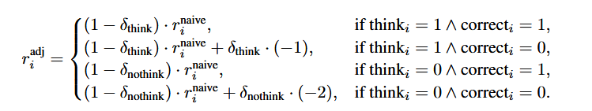
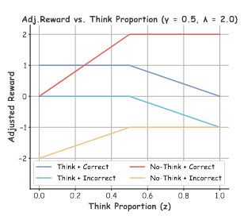
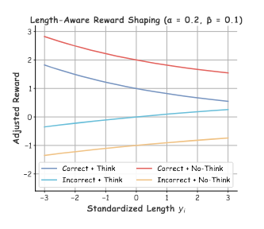
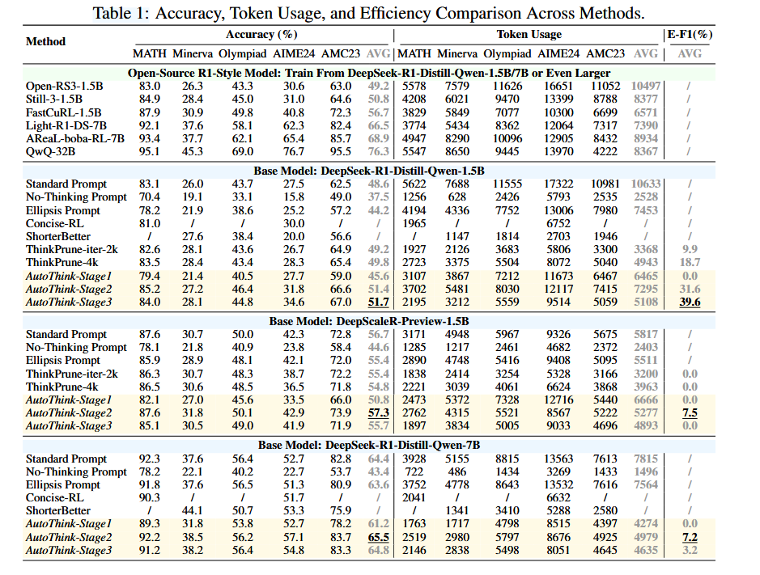
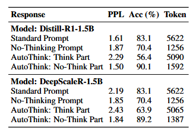
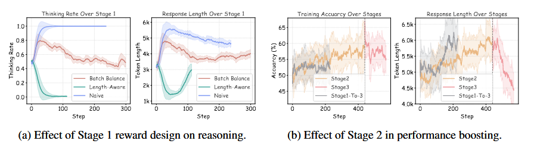

# Learning When to Think: Shaping Adaptive Reasoning in R1-Style Models via Multi-Stage RL
学习何时思考：通过多阶段强化学习塑造R1风格模型中的自适应推理能力

- **Authors**: Songjun Tu, Jiahao Lin, Qichao Zhang, Xiangyu Tian, Linjing Li, Xiangyuan Lan, Dongbin Zhao
- **Venue & Year**: arXiv, 2025 
- **URL / DOI**: https://arxiv.org/abs/2505.10832v2

---

## 1. 动机

- **研究问题**  `   `本文旨在解决大型推理模型（LRMs）在解决所有问题时都采用冗长、分步推理导致的“过度思考”问题，该问题会带来巨大的计算开销和延迟，尤其是在处理简单问题时。
- **背景与意义**  `   `现有的大型推理模型（特别是R1风格模型，如DeepSeek-R1）通过生成详细的思维链（CoT）来提升复杂任务的准确率。然而，这种“一刀切”的推理模式效率低下。因此，赋予模型根据问题难度**自适应地决定是否进行详细思考**的能力，对于在保证准确率的同时提升推理效率、降低计算成本具有重要意义。

## 2. 核心贡献

- 发现了一种轻量级的**“省略号提示”（Ellipsis Prompt）**，即在`<think>`标签后仅加一个“...”，可以随机激活R1风格模型在“思考”和“不思考”两种模式间的切换行为。
- 提出了一个名为**AutoThink**的多阶段RL框架，通过分阶段的奖励塑造，逐步训练模型学会根据问题难度自适应地选择推理模式。
- 实验证明，AutoThink在多个数学基准上实现了优异的**准确率-效率权衡**，在大幅降低Token使用量的同时，保持甚至超越了基线模型的准确率，验证了该方法的有效性和可扩展性。

## 3. 方法论

- **核心思想概述**: AutoThink的核心思想是利用“省略号提示”激发的随机行为作为起点，通过一个三阶段的强化学习过程，将这种随机行为塑造为有意义的、与任务难度相关的自适应策略。整个过程不依赖外部信号或教师模型，完全通过精心设计的奖励函数引导模型自主学习。

- **三阶段的强化学习**:
  - **Naive Reward**: 这是贯穿所有阶段的基础奖励信号，定义如下：
      `   ` `r_naive = +2` (if No-Think & Correct) 激励高效解决问题
      `   ` `r_naive = +1` (if Think & Correct) 标准奖励，肯定思考的价值
      `   ` `r_naive = 0`  (if Think & Incorrect)无惩罚，容忍在难题上的探索性失败
      `   ` `r_naive = -1` (if No-Think & Incorrect)惩罚，抑制鲁莽猜测
    
    - **阶段一：批次奖励平衡**
      - 核心是通过软惩罚因子 `δ_think` 和 `δ_nothink` 动态调整奖励，防止模型陷入单一模式（总是思考或总是不思考）。
      - `δ_think = min(1, max(0, (z - γ) * λ))`
      - `δ_nothink = min(1, max(0, (1 - z - γ) * λ))`
      - 其中，`z`是当前批次中“思考”样本的比例，`γ`是目标平衡比例（如0.5），`λ`是惩罚强度。当`z`偏离`γ`时，对占多数的模式进行奖励惩罚，从而将`z`推向`γ`。变换后的奖励如下所示：
       
    `   `如果模型过于偏爱某种模式（例如 `z` 远大于 `γ`），对应的 `δ` 就会变大，从而对该模式的奖励 `r_naive` 进行打折，并对错误样本施加额外惩罚,修正后的奖励可视化如下所示
         `   `
    - **强化可靠性 (Reinforce Reliability)**：
      - 这个阶段沿用Naive Reward，只要答案正确，就给予高奖励；答案错误，则给予惩罚。其中，“不思考且正确”的奖励最高，以激励模型在有把握时走捷径。唯一的优化目标就是提高准确率。
    - **阶段三：长度感知的奖励 (Length-Aware Reward)**
      - 核心是通过奖励函数鼓励简洁的正确回答和详尽的错误分析。
      - `r_adj = r_naive + (-1 + e^(-αy_i))`  (如果回答正确)
      - `r_adj = r_naive + (1 - e^(-βy_i))`  (如果回答错误)
      - 其中，`y_i`是响应的标准化长度。对于正确答案，长度越长奖励越低；对于错误答案，长度越长奖励越高（惩罚越轻）。修正后的奖励可视化如下所示
    
      

## 4. 实验与数据

- **数据集 & 任务设置**:
    - **训练数据**: DeepScaleR使用的40K数学问题数据集。
    - **评估数据**: 五个主流数学基准测试，包括 **MATH, Minerva, Olympiad, AIME24, AMC23**。
    - **基础模型**: 在三种R1风格模型上进行了验证：**Distill-R1-1.5B/7B** 和 **DeepScaleR-1.5B**。

- **对比方法 & 评价指标**:
    - **对比方法 (Baselines)**:
        - **仅提示基线**: 标准提示 (Standard Prompt)、不思考提示 (No-Thinking Prompt)、省略号提示 (Ellipsis Prompt)。
        - **RL训练基线**: Concise-RL, ShorterBetter, ThinkPrune。
    - **评价指标 (Metrics)**:
        - **准确率 (Accuracy)**: pass@1。
        - **效率 (Efficiency)**: 平均Token使用量 (Token Usage)。
        - **综合指标 (Comprehensive)**: **效率-F1分数 (E-F1 Score)**，一个综合衡量在超越标准基线前提下，准确率增益和Token减少量的指标。

## 5. 实验结果

- **性能指标对比表**:
  
    - 在`Distill-R1-1.5B`模型上，AutoThink的最终阶段（Stage3）相比标准提示，在**Token使用量减少52%**的情况下，**相对准确率提升了6.4%**（从48.6%提升到51.7%），E-F1分数高达**39.6%**，显著优于所有基线。
    - 在已经高度优化的`DeepScaleR-1.5B`模型上，AutoThink的第二阶段（Stage2）仍然能在Token使用量减少10%的同时，将准确率从56.7%提升至57.3%，证明了方法的有效性。
  
    - 表2的详细分析揭示了AutoThink的内在机制：**不思考模式**以**90.1%**的超高准确率处理简单问题，而**思考模式**则负责处理难题（准确率仅56.4%），实现了高效的内部任务分流。(图中的PPL是困惑度，衡量语言模型生成文本流畅性和连贯性的指标，越低越流畅，论文中的模型在思考模式下，困惑度比较高，但仍是可接受范围)

- **消融研究要点**:
  
    - **阶段一的必要性**: 移除批次奖励平衡机制会导致模型迅速**模式崩溃**，要么只思考，要么不思考，无法进行后续优化。
    - **阶段二的必要性**: 若跳过阶段二直接进行剪枝（阶段三），模型的准确率会停滞不前，无法有效提升。这证明了**先强化准确率基础，再进行效率优化**的必要性。

## 6. 优点分析

- **优势**:
    - **自适应性与效率**: 实现了模型根据问题难度动态分配计算资源，显著提升了推理效率，解决了“过度思考”问题。
    - **性能优越**: 在多个基准上实现了准确率和效率的双赢，效果优于现有的提示工程和RL剪枝方法。

## 7. 个人思考

- **灵感 / 疑问**:
    - AutoThink的三阶段范式（稳定->强化->优化）是否可以被视为一种通用的RL微调框架，应用于其他需要模型学习“权衡”能力的场景，例如在生成文本时权衡“创造性”与“事实性”？但是这样的话非常不好评估。
    - “省略号提示”这种极简提示能够解锁模型的潜在行为，这是否暗示着当前LLM的内部状态空间中存在大量未被发掘的、可通过微小扰动激发的隐藏能力？

- **可能的改进方向**:
    - **结合课程学习**: 在训练前对数据按难度进行排序，在不同训练阶段使用不同难度的数据。例如，在第一阶段使用简单数据稳定模式，在第二、三阶段逐步增加难题，可能会进一步提升训练效果。又或者是剔除简单题与非常难的题。

## 8.本论文分类Tag（个人观点）
- **标签**: 自适应推理, RL

## 9. 本论文笔记知乎链接
* 敬请期待