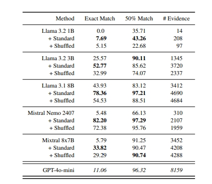
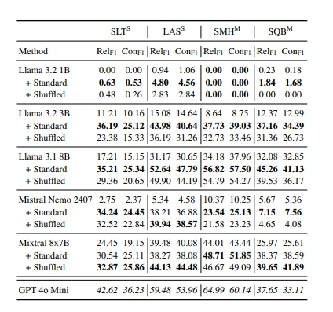
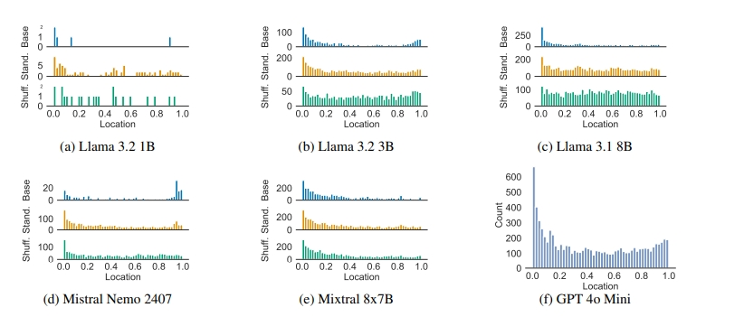
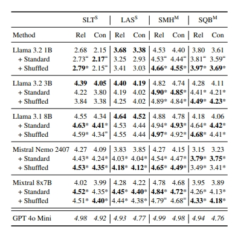
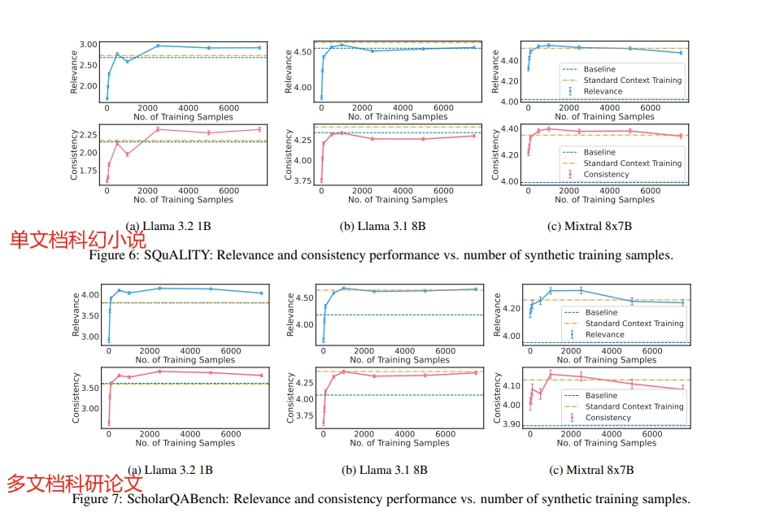

# Unstructured Evidence Attribution for Long Context Query Focused Summarization

- **Authors**: Dustin Wright, Zain Muhammad Mujahid, Lu Wang, Isabelle Augenstein, David Jurgens
- **Venue & Year**: arXiv 2025
- **URL / DOI**: https://arxiv.org/abs/2502.14409

---

## 1. 动机

- **研究问题**  `   `两个核心问题：1) 如何让大模型在处理长文本、面向查询的摘要生成任务中，能够准确地引用**非结构化**的证据片段（即任意文本跨度，而非固定的句子或段落），以增强摘要的透明度和可信度？ 2) 如何缓解LLM固有的“中间部分丢失”位置偏差问题，该偏差导致模型难以利用位于上下文中间部分的关键信息？

- **背景与意义**  `   ` 
   1. 现有 LLM 摘要往往缺乏来源标注，用户对可验证性要求高。  
  2. LLM 在长上下文中偏向首尾信息，导致中间内容难以被引用（lost-in-the-middle）。  
  3. 提升模型自身对“任意长度”证据的提取与引用能力，可增强生成结果的透明度与可信度。

## 2. 核心贡献

- 提出了**非结构化证据归因**的新任务：允许模型提取任意长度文本片段作为摘要证据，而非固定句段粒度。  
- 设计并公开了**SUnsET**合成数据集与流水线，涵盖标题→大纲→查询/摘要/证据→分节写作→精修→自动验证六阶段。  
- 提出**位置感知**（Standard）与**位置无关**（Shuffled）两种微调策略，研究其对“中部丢失”偏见的影响。  
- 在四种长文档数据集（SQuALITY、LexAbSumm、SummHay、ScholarQABench）和五款 LLM（Llama 3.2/3.1、Mistral Nemo、Mixtral、GPT-4o-mini）上实证：  
  - 训练后证据提取精确度与召回率大幅提升；  
  - 摘要相关性与一致性显著提高；  
  - 少量（1k–3k）合成样本即可达饱和效果。

## 3. 方法论

- **模型／算法概述**: 
  1. 利用 GPT-4 系 LLM 按六阶段流水线生成合成文档＋查询＋摘要＋证据三元组（SUnsET）。  
  2. 对下游模型（Llama、Mistral 等）采用LoRA微调：  
     - **Standard**：按原节顺序拼接全文，保留位置编码；  
     - **Shuffled**：打乱节序拼接，打散全局位置信息。  
  3. 推理时，模型根据“提示 + 文档”输出摘要，并内联编号引用从上下文复制的证据片段。

- **造数据流程说明**: SUnsET数据集的生成采用了一个六阶段的归纳式流程，将复杂任务分解，确保了数据质量和内部一致性：
    - **P1. 标题生成**:向 LLM 询问“请生成 100 个跨虚构/非虚构、风格各异的书籍标题”，并在生成过程中不断回填先前已出标题以防重复
    - **P2. 文档大纲生成**: 对每个标题，再让模型给出 6–8 节的章节名称或大纲要点，形成可控的“节”级单元。
    - **P3. 核心元素生成**:基于标题＋大纲，让模型生成 5 条用户查询，以及对应的长摘要（回答）和原文中要抽取的证据片段，并标注每段证据所属章节
    - **P4. 文档章节生成**: 将 P3 中的摘要支撑证据“原封不动”地嵌回对应章节，保证证据可检。对每个章节，提供该节标题＋应插入的证据列表，模型一次只写一节，最后拼接成完整文档。
    - **P5. 提炼 (Refinement)**: 摘要重写：将完稿文档当上下文，提示模型对原始摘要进行更精确、更细节化的重写，确保信息与文档一致；证据校正：若在写作过程中某个证据未能准确嵌入，还会单独用检索式 prompt 从文档中找回最接近的文本片段。
    - **P6. 验证 (Validation)**: 用 GPT-4 o mini 批量判断每条 ⟨文档、查询、摘要⟩ 是否同时满足：1.摘要里信息均源自文档；2.摘要完整回答查询。结果：仅保留“YES”样本，最终生成约 2,352 篇完整文档，11,309 组 ⟨文档+查询+摘要⟩ 
。

## 4. 实验与数据

- **数据集 & 任务设置**:
    - **训练数据**: SUnsET (本文创建的合成数据集，包含2,352个文档，11,309个问答对)。
    - **测试数据**:
        - SQUALITY (单文档, 科幻小说)
        - LexAbSumm (单文档, 法律文书)
        - SummHay (多文档, 合成对话/新闻)
        - ScholarQABench (多文档, 科研论文)
    - **任务**: 长文本查询聚焦式摘要，要求输出包含非结构化证据引用的摘要。

- **对比方法 & 评价指标**:
    - **对比方法 (Baselines)**: 多个尺寸的Llama 3.2/3.1, Mistral Nemo 2407, Mixtral 8x7B的基础模型，并以GPT-4o mini作为性能上限参考。
    - **评价指标 (Metrics)**:
        - **证据提取幻觉率**: 精确匹配率 (Exact Match), 50%最长公共子串重叠率。
        - **溯源质量**: 相关性F1 (Relevance F1), 一致性F1 (Consistency F1)。
        - **摘要质量**: 相关性 (Relevance, 1-5分), 一致性 (Consistency, 1-5分)，均由GPT-4o mini作为自动评估器进行评分。

## 5. 实验结果

- **性能指标对比表**:
    `   `上面四个数据集汇总表现
    - 
     **证据提取能力**: 
        - **基础模型表现不佳**: 未经微调的基础模型难以忠实地从上下文中复制证据。即便是强大的GPT-4o mini，其精确匹配率也仅为11.06%。较小的模型如Llama 3.2 1B则完全无法完成此任务（0%精确匹配）。
        - **微调效果显著**: 使用SUnsET进行标准微调后，所有模型的证据提取能力都得到巨大提升。例如，Llama 3.1 8B的精确匹配率从43.93%跃升至78.36%，Mistral Nemo 2407从5.48%飙升至82.20%。这证明模型通过微调学会了“复制-粘贴”这一关键的引用技能。
         
  - 
     **溯源质量**
      `   `
         **基础模型引用质量差**: 基础模型生成的证据与其引用的摘要句子之间相关性(RelF1)和一致性(ConF1)得分普遍很低，说明其引用是随意且不可靠的。
          `   ` **微调后质量大幅提升**: 微调后，所有模型在所有数据集上的引用质量均有显著提升。例如，在多文档数据集SMH上，Llama 3.1 8B的RelF1/ConF1从34.18/37.96提升至56.82/57.50，在某些情况下甚至超过了未微调的GPT-4o mini。这表明模型不仅学会了提取，还学会了提取**相关且一致**的证据。
  - 
    **位置偏差分析**:
          `   ` **普遍存在"U型"偏差**: 所有未经微调的基础模型都表现出强烈的“中间部分丢失”现象，即提取的证据绝大多数来自上下文的开头和结尾部分，形成一个明显的“U型”分布。
          `   ` **乱序训练有效缓解偏差**: 与标准微调相比，采用乱序（Shuffled）训练策略的模型，其证据提取位置分布明显更均匀，显著缓解了“U型”偏差。这证明通过打乱文档内部结构，可以迫使模型更平均地关注整个上下文，而不是依赖于固定的位置线索。
  - 
     **摘要质量**:
          `   ` **摘要质量全面提升**: 学习引用非结构化证据对最终的摘要质量产生了积极的连锁反应。在所有四个测试集上，经过SUnsET微调的模型（包括标准和乱序训练）在相关性（Rel）和一致性（Con）评分上几乎都**显著优于**其基础模型。例如，在ScholarQABench上，Mixtral 8x7B的相关性/一致性得分从3.95/3.89提升至4.26/4.13（标准）和4.33/4.18（乱序）。
          `   ` **缩小与顶尖模型差距**: 微调显著缩小了中小型模型与GPT-4o mini之间的性能差距，证明了该数据驱动方法的有效性。

- **消融研究要点**:
    1.  **SUnsET微调的必要性**: 基础模型与微调后模型的巨大性能差异，直接证明了SUnsET数据集对于教会LLM进行非结构化证据溯源是必要且高效的。
    2.  **训练策略的权衡 (Standard vs. Shuffled)**: 实验揭示了一个重要的权衡。**标准训练**在提升**引用质量本身**上通常表现更优，而**乱序训练**在**缓解位置偏差**上效果更佳。这表明，如果首要目标是减少位置偏差以利用更全面的信息，乱序训练是更好的选择；如果目标是确保每次引用的内在质量最高，标准训练可能更合适。
    3.  **训练数据量的影响**: 实验显示，摘要质量的提升并不需要海量的训练数据。性能通常在训练1k-3k个样本后就达到峰值或饱和，之后增长缓慢甚至略有下降。这表明该方法具有很高的**数据效率**，可以用相对较低的成本实现模型能力的适配。
   

## 6. 优缺点分析

- **优势**:
    1.  **创新性强**: 定义了一个实际且有价值的新任务，并指出了现有方法的关键短板。
    2.  **方法实用**: 提出的SUnsET数据集生成流程是领域无关的，可扩展性强，为解决类似的数据稀缺问题提供了有效范例。
    3.  **解决中间丢失问题**: 直接针对LLM的“中间丢失”和“不可靠”两大核心痛点提出了有效的、训练时的解决方案，推理成本低。
    

- **局限性**:
    1.  **幻觉问题未根除**: 直接生成证据的方式虽然灵活，但仍无法完全避免幻觉。作者承认更精确的RAG方法可能有所帮助。
    2.  **训练策略的权衡**: 乱序训练在缓解位置偏差和保持最高引用质量之间存在权衡。
    3.  **合成数据局限**: SUnsET数据虽然多样，但仍是合成的，可能与真实世界数据的复杂分布存在差距。此外，合成数据也带来了版权和伦理方面的考量。
    

## 7. 个人思考

- **灵感**:
    正如论文所说的，结合RAG双管齐下会不会更好呢？
    

## 8.本论文分类Tag（个人观点）

- **标签**: 长文本摘要, 知识溯源, 位置偏见缓解,非结构化证据归因

## 9. 本论文笔记知乎链接
* 敬请期待

